# DESIGN AND DEVELOPMENT OF A NIGERIAN PUBLIC ECONOMIC DATA AGGREGATION AND ANALYTICS PLATFORM WITH OPEN API ACCESS: A 2020–2026 CASE STUDY

> **Draft project report, fill the bracketed placeholders `[ ]` and reformat to your
> department's exact style guide (font, spacing, margins, chapter numbering, referencing
> style) before submission. Diagrams are embedded as rendered images (sources included in docs/figures and as
> Mermaid in this file). Nothing here is fabricated about the system; verify the
> external citations against the actual sources and format them per your school's guide.**

---

## FRONT MATTER

### Title Page
DESIGN AND DEVELOPMENT OF A NIGERIAN PUBLIC ECONOMIC DATA AGGREGATION AND ANALYTICS PLATFORM WITH OPEN API ACCESS: A 2020–2026 CASE STUDY

BY

TAOHEED ABDULMANAN OLAOSEBIKAN

22/10267

A PROJECT SUBMITTED TO THE DEPARTMENT OF

COMPUTER SCIENCE, COLLEGE OF SCIENCE AND INFORMATION

SCIENCE (COSIS), CALEB UNIVERSITY, LAGOS

IN PARTIAL FULFILLMENT OF THE REQUIREMENTS

FOR THE AWARD OF B.Sc. DEGREE

IN COMPUTER SCIENCE.

JULY 2026

### Declaration
I, TAOHEED ABDULMANAN OLAOSEBIKAN, with matriculation number 22/10267, hereby declare that this project titled "DESIGN AND DEVELOPMENT OF A NIGERIAN PUBLIC ECONOMIC DATA AGGREGATION AND ANALYTICS PLATFORM WITH OPEN API ACCESS: A 2020–2026 CASE STUDY" is a record of my own original work. It was carried out under the supervision of Miss Ilori Deborah in the Department of Computer Science, College of Science and Information Science (COSIS), Caleb University, Lagos. To the best of my knowledge, it has not been submitted, in whole or in part, for the award of any degree or diploma in this or any other institution, and all sources of information used have been duly acknowledged.

_______________________________

TAOHEED ABDULMANAN OLAOSEBIKAN

Signature and Date

### Certification
This is to certify that this project titled "DESIGN AND DEVELOPMENT OF A NIGERIAN PUBLIC ECONOMIC DATA AGGREGATION AND ANALYTICS PLATFORM WITH OPEN API ACCESS: A 2020–2026 CASE STUDY" was carried out by TAOHEED ABDULMANAN OLAOSEBIKAN, with matriculation number 22/10267, in partial fulfilment of the requirements for the award of the Bachelor of Science (B.Sc.) degree in Computer Science, in the Department of Computer Science, College of Science and Information Science (COSIS), Caleb University, Lagos. This project has been read and approved as meeting the requirements of the Department.

_______________________________

Miss Ilori Deborah, Project Supervisor

Signature and Date

_______________________________

Dr. Ayorinde Oduroye, Head of Department

Signature and Date

_______________________________

External Examiner

Signature and Date

### Dedication
I dedicate this project first to Almighty Allah, for His blessing and grace over its
completion and over every part of the process. I also dedicate it to my supervisor, Miss
Ilori Deborah; to my Head of Department, Dr. Ayorinde Oduroye, for his calmness and advice; and to Dr.
Pappy Jae, for the time and correction he committed to guiding me. Finally, I dedicate this
project to my father, Lamidi Taoheed Ayankojo, and my mother, Lamidi Wakilat Idowu; to my
sisters, Taoheed Naheemat and Taoheed Zainab; and to my brothers, Taoheed Abdulrasheed, Lasisi
David and Ayowole Abraham.

### Acknowledgements
I acknowledge my uncle, Lasisi Adedoyin, and my aunty, Lasisi Kehinde, and the whole Lasisi
family, for their support. I thank my level adviser, Dr. Ajilore; my aunties Alaba and Lara;
and my relative, Hakeem "The Law" Mujidat. I thank Caleb University's Master's Chapel and
Counselling Department; my roommates Michael Keston, Sam Odetayo, Kunle Fasanya, Korede and
Mayowa; and my friends Salako Priscilia, Muogho Matilda, Mosunmola, Oreoluwa, Mojisola,
Adewale, Mohammed, Abdul Azeez, Timileyin, Nogho Precious and Monica Divine. I am grateful to
my tutor, Silas Bankole, and to Lasisi Hammed.

I further acknowledge Moses D Great, Scholar Steve, Akintunde Praise, Jedidiah, Chosen,
Venture, Caviar Humphrey, Ife, Katule, Benji, hypeman CallMeAjay, Akintunde Raph, Moweta Sean,
Osas, BMAX Ugochukwu, RXN Charmy, RXN Dave, Tobi, Tumise, Dipson, Oluwaseyi, Animashaun
Abimbola, Machinery FX, Al Ameen, Joker, King Richard, Nico Stonz, Akinmulaye Blessing,
Akinmulaye Elizabeth, Michael Ani, Henry, Deon, Iteoluwa, Vicman, Pappy Media, Nathan Kelly,
Njoku Sunday, Osebor and Rashford.

I also acknowledge Fidelity Bank for the internship experience that shaped this project, and
Mr Basit; the Lagos State Ministry of Science and Technology for the exposure it gave me, and
Mr Bravo and Mr Sam for their guidance on networking; Ola Bello ("Mildey"); Prince Imona ("Wall
Street Boi"); Pastor Yomi; and Alfa Sultan.

Beyond those who guided me directly, this project was shaped by the discipline and example of
Ayodeji Ibrahim Balogun (Wizkid) and Cristiano Ronaldo; by the nation-building examples of
Olusegun Obasanjo, Obafemi Awolowo and MKO Abiola; and by the thinking of Isaac Newton, Warren
Buffett, Charlie Munger (mental models), Michael Bloomberg, Peter Thiel, Stanley Druckenmiller,
Jamie Dimon and Baltasar Gracián. I acknowledge the Federal Republic of Nigeria, may Allah
bless Nigeria, and its policymakers, and the financial journalists whose coverage informed
this work: Aruoture Oddiri, Reuben Abati and Rufai Oseni of Arise TV; and President Asiwaju
Bola Ahmed Adekunle Tinubu, GCFR, for the reminder that anything is possible once you say it,
accept where you stand, and contend with reality.

Finally, to every student of the Federal Republic of Nigeria working to understand this
economy, and to myself, Taoheed Abdulmanan Olaosebikan, this project is for you too.

### Abstract
Nigeria's official economic data is published by several institutions, the Central Bank
of Nigeria (CBN), the National Bureau of Statistics (NBS), and the World Bank, in
fragmented formats (PDF bulletins, spreadsheets and disparate web portals) that are
difficult for students, researchers, developers and the public to access, compare and
consume programmatically. This project designed and implemented **NPEDATA**, a web-based
platform that aggregates public Nigerian economic data into a single standardised
database, presents it through an interactive analytical dashboard, and exposes it through
a **free, open REST API** requiring no authentication. The system was built as a
seven-stage pipeline (collection, validation, standardisation, storage, analytics, API and
presentation) using an iterative prototyping methodology. The backend was implemented in
Python with the FastAPI framework and a Supabase (PostgreSQL) database; the frontend is a
static dashboard built with HTML, CSS and vanilla JavaScript using Chart.js for
visualisation. The API implements hypermedia controls at Richardson Maturity Model Level 3
(HATEOAS). The resulting platform holds **122 indicators** and approximately **12, 100
observations** spanning 1960–2026, including exchange rates, inflation, GDP, monetary
policy rate, foreign reserves, multi-currency rates and CBN balance-sheet data. The system
was tested through unit tests, functional testing and web accessibility audits. The work
demonstrates that fragmented national economic data can be consolidated into an accessible,
correct and programmatically consumable resource using free and open-source tools.

**Keywords:** data aggregation, open data, REST API, HATEOAS, economic analytics, Nigeria,
FastAPI, data visualisation.

### Table of Contents

### List of Figures
- Figure 3.1 Seven-stage system architecture
- Figure 3.2 Deployment view
- Figure 3.3 Use-case diagram
- Figure 3.4 Sequence diagram, loading an indicator page
- Figure 3.5 Sequence diagram, validating a CSV through the Open API
- Figure 3.6 Entity-relationship diagram
- Figures 4.1–4.13 System screenshots (deployed system)
- Figure 4.14 Correlation Matrix, 12 headline indicators, computed live
- Figure 4.15 Reform Impact, before/after June 2023 averages
- Figure 4.16 Reform Impact, purchasing-power erosion, chained live
- Figure 4.17 Reform Impact, real GDP growth by sector, before/after

### List of Tables
- Table 1.1 Data coverage summary
- Table 1.2 Definition of terms
- Table 2.1 Feature-level gap analysis
- Table 2.2 Summary of the review of related literature
- Table 3.1 Methodology comparison
- Table 3.2 Weaknesses of the existing workflow
- Table 3.3 Existing vs proposed system
- Table 3.4 Functional requirements
- Table 3.5 Non-functional requirements with measurable targets
- Table 3.6 Use-case descriptions
- Table 3.7 Database schema (core tables)
- Table 3.8 Data dictionary
- Table 4.1 Test cases and results
- Table 5.1 Achievement of objectives

---

## CHAPTER ONE, INTRODUCTION

### 1.1 Background to the Study
Reliable economic data underpins decision-making by government, businesses, researchers and
the general public, and its usefulness depends substantially on how accessible and
machine-processable it is. Open data, data that anyone may access, use, modify and share, 
is widely regarded as a public good that converts the cost of publication into broad public
value, because each downstream user is spared the effort of repeating the same collection and
cleaning work (Open Knowledge Foundation, n.d.; Open Government Working Group, 2007). In
Nigeria, the principal producers of official economic statistics are the Central Bank of
Nigeria (CBN) and the National Bureau of Statistics (NBS), supplemented by international
bodies such as the World Bank. These figures are, however, published across several
institutional websites in formats designed for human reading rather than computation, 
Portable Document Format (PDF) bulletins, individual spreadsheets and web tables whose
structure differs from one indicator to the next.

This fragmentation is not merely incidental. Analyses of Nigeria's public-sector information
systems attribute the persistence of siloed, non-interoperable data to institutional rather
than technical factors, observing that agencies frequently treat the data they hold as a
source of value and are consequently reluctant to share it (Eleanya, 2026). Although the
Freedom of Information Act has, since 2011, mandated the proactive publication of public
information, compliance across federal ministries, departments and agencies remains low
(Ogunyale & Osho, 2023). The result is a considerable cost to any user who wishes to combine
indicators, since each dataset must be located separately, its date formats and units
reconciled by hand, and the series aligned manually before analysis can begin.

The difficulty is compounded by the absence of a programmatic interface. Neither the CBN nor
the NBS exposes a public Application Programming Interface (API) for the indicators
considered in this study, so that developers and researchers are unable to retrieve the data
automatically and must instead re-extract it from published documents. The principle of tidy
data, one observation per row, with descriptive metadata held separately, provides a
well-established basis for consolidating series of differing frequency and unit into a single
analysable structure (Wickham, 2014), yet no freely accessible platform applies it to
Nigerian public economic data. It is against this background that the present study designs
and develops a web-based platform which aggregates Nigeria's public economic data into a
single standardised repository and republishes it through an interactive analytical dashboard
for human users and a free, open API for programmatic consumers.

### 1.2 Statement of the Problem
Public Nigerian economic data is fragmented across several institutional websites and
documents, with no common point of access. A substantial proportion of it is published in
formats that are not machine-readable, such as PDF bulletins and inconsistently structured
spreadsheets, so that every reuse begins with manual extraction. The data is further
characterised by inconsistent structure and units: individual series are reported at daily,
monthly, quarterly or annual frequencies and are expressed in differing units, including
naira thousands, naira millions, percentages and United States dollars, with no unified
schema relating them to one another. There is, in addition, no free, documented and
authentication-free API through which the data may be queried programmatically, and the
existing presentation of the data seldom extends beyond isolated static figures, offering
little of the comparison or plain-language interpretation required by non-specialist users.
Taken together, these shortcomings place the effective use of Nigeria's public economic data
beyond the convenient reach of students, researchers, journalists and independent developers,
and give rise to duplicated effort as each user repeats the same collection and cleaning
tasks.

### 1.3 Aim and Objectives
The aim of this study is to design and develop a web-based platform that aggregates Nigeria's
public economic data into a single, standardised data store and makes it accessible through
an interactive analytical dashboard and a free, open Application Programming Interface (API).

In pursuit of this aim, the study has six specific objectives. The first is to collect public
economic indicators from the Central Bank of Nigeria, the National Bureau of Statistics and
the World Bank, and to ingest them into a single repository. The second is to design a
unified relational data model that standardises indicators, sources and observations
irrespective of their frequency or unit. The third is to implement server-side analytical
functions, including period change, year-on-year comparison, trend estimation and
correlation, over the stored data. The fourth is to develop a free, documented REST API
incorporating hypermedia controls (HATEOAS) and requiring no authentication. The fifth is to
develop an interactive web dashboard that presents the indicators through clear and accurate
visualisations. The sixth is to test and evaluate the platform for correctness, usability and
accessibility.

### 1.4 Scope and Limitations of the Study
The scope of this study encompasses the collection, standardisation, storage, analysis,
exposure through an API and visualisation of a defined set of Nigerian public economic
indicators. At present the platform holds 122 indicators and approximately 12, 100
observations across the domains summarised in Table 1.1. The dataset constitutes a controlled
case study rather than an exhaustive representation of all data published in Nigeria; the
architecture is nevertheless designed to accommodate additional data through
comma-separated-value (CSV) or API ingestion as it becomes available.

**Table 1.1, Data coverage summary**

| Domain | Frequency | Range | Source |
|---|---|---|---|
| Exchange rate (NGN/USD) | Monthly | 2020–2026 | CBN |
| Multi-currency (11 currencies, buy/central/sell) | Monthly | 2020–2026 | CBN |
| NFEM daily interbank rates | Daily | 2024–2026 (348 sessions) | CBN |
| Monetary Policy Rate | Per MPC meeting | 2020–2025 | CBN |
| Foreign reserves (gross/liquid/blocked) | Monthly | 2020–2026 | CBN |
| CBN balance sheet | Monthly | 2005–2023 | CBN |
| Annual financial statement | Annual | 1960–2012 | CBN |
| Currency in circulation | Monthly | 2002–2024 | CBN |
| Inflation (headline/food/core) | Monthly | 2003–2026 | NBS |
| GDP growth | Quarterly | 2020–2024 | NBS |
| Real GDP by sector (47 sectors) | Quarterly/Annual | 1981–2024 | NBS |
| Nominal GDP (USD) | Annual | 2020–2024 | World Bank |

The study is subject to a number of limitations. Data collection is performed manually, by
downloading and ingesting published source files, rather than through an automated real-time
feed; consequently, the figures presented reflect the most recently ingested snapshot rather
than live values. Coverage is bounded by what the source institutions publish, the CBN
annual financial statement series, for example, ends in 2012, and cannot be extended by the
platform itself. The analytical component employs classical statistical methods, namely
correlation, ordinary-least-squares trend estimation and linear forecasting, and does not
apply machine-learning techniques; the rationale for this decision is discussed in Section
2.3. Finally, the platform does not attempt automated data collection, does not employ
artificial intelligence, and is not presented as official government or national
infrastructure; it is a reference implementation developed within the constraints of an
academic project.

### 1.5 Significance of the Study
The study is of value to several categories of user. For students and researchers, it
provides a single, comparable and downloadable dataset in place of numerous disconnected
sources, thereby reducing the time and effort required before analysis can begin. For
software developers, it offers a free and openly documented API upon which third-party
applications may be built without authentication or cost. For journalists and members of the
public, it presents the data through accessible visualisations accompanied by plain-language
interpretation. More broadly, by demonstrating that a standardised and reproducible platform
for Nigerian public economic data can be constructed entirely from free and open-source
tools, the study provides a practical reference for the wider adoption of open-data practices
among the institutions that produce such data.

### 1.6 Definition of Terms
The principal technical terms used throughout this report are defined in Table 1.2.

**Table 1.2, Definition of terms**

| Term | Definition |
|---|---|
| Aggregation | The collection of data from multiple sources into a single store. |
| API (Application Programming Interface) | A defined means by which software programs request and exchange data. |
| REST | An architectural style for web APIs based on standard HTTP methods and resources. |
| HATEOAS | Hypermedia as the Engine of Application State; the embedding, within REST responses, of links that direct a client to related resources. |
| CBN | Central Bank of Nigeria. |
| NBS | National Bureau of Statistics. |
| NFEM | Nigerian Foreign Exchange Market. |
| MPR | Monetary Policy Rate; the benchmark interest rate set by the CBN. |
| Indicator | A measured economic series, for example inflation. |
| Observation | A single value of an indicator on a specified date. |

---

## CHAPTER TWO, LITERATURE REVIEW

### 2.1 Introduction
Before the design presented in Chapter Three could be settled, it was necessary to confirm
that the problem is real rather than a matter of personal inconvenience, and that the
proposed solution does not merely reinvent something already in existence. This chapter
provides that groundwork. It works through the ideas
the platform rests on (open data, aggregation and standardisation, data quality, REST and
hypermedia, honest visualisation, and the classical statistics behind the analytics layer),
then states the theoretical framework adopted, reviews the systems already publishing
economic data (both international and Nigerian) to establish where they fall short, and
closes with the technology choices from which the implementation is built. By its close, the
gaps that Chapter Three's design must answer should be concrete rather than assumed.

### 2.2 Conceptual Review

**2.2.1 Open data and open government data.** Open data is data anyone can access, use,
modify and share for any purpose, at most subject to attribution (Open Knowledge
Foundation, n.d.). For government data specifically, the widely cited principles hold that
it should be complete, primary, timely, accessible, machine-processable, non-discriminatory,
non-proprietary and licence-free (Open Government Working Group, 2007). Two of those do
most of the work here. Machine-processability matters because a PDF table is technically
"published" while being practically closed to computation. Accessibility matters because
data spread across fragmented portals carries a real cost to reach even when it is
nominally free. The economic case for open data, in short, is that it turns publication
from a cost centre into public value, every downstream user, researcher, journalist or
start-up, stops repeating the same cleaning work someone before them already did. That is
essentially the same argument the Nigerian scenario in Section 3.3 makes, just stated more
formally.

**2.2.2 Data aggregation, standardisation and tidy data.** Gathering series from disparate
sources is only useful once they are standardised into a common structure, and for that the
study adopts the "tidy data" principle (Wickham, 2014): one observation per row, one variable
per column, with metadata such as unit, source and frequency kept separate from the values
themselves. What this buys in practice is that series of any frequency at all, daily NFEM
fixings, monthly CPI, quarterly GDP, even the CBN's 1960–2012 annual financial statement, 
can sit in one relational table and be queried by the same engine. The alternative, a
bespoke table per dataset mirroring each source file's own layout, would just reproduce the
fragmentation this project is trying to remove, only now inside the database instead of
across it. The relational model itself (Codd, 1970) is what makes that safe: typed columns,
foreign keys tying observations back to indicator metadata, and a uniqueness constraint
that makes duplicate ingestion structurally impossible rather than merely discouraged.

**2.2.3 Data quality.** The data-quality literature usually judges datasets against
accuracy, completeness, consistency, timeliness and validity, and three of those mattered a
great deal here. On consistency: the same institution often publishes related series in
different units, the CBN's monthly balance sheet in thousands of naira, its annual
statement in millions, so a platform merging them has to carry that unit metadata
explicitly, or it will silently mislead. Chapter Four documents a case where exactly this
went wrong before it was caught. On accuracy and validity: aggregation multiplies the
places an error can creep in, which is why validation became a first-class pipeline stage
rather than an afterthought, and why it is unusually exposed as a public service anyone can
try. On completeness: no source is complete, services-sector GDP, for instance, simply
ends earlier than its sibling series, and the response adopted here is to state that
coverage plainly rather than obscure it.

**2.2.4 Web APIs, REST and the Richardson Maturity Model.** Representational State
Transfer (REST), introduced by Fielding (2000), remains the dominant architectural style
for web APIs: data as resources addressed by URLs, manipulated with standard HTTP verbs.
The Richardson Maturity Model (Richardson & Ruby, 2007; Fowler, 2010) grades how far an API
actually goes with that idea, across three levels. Level 1 introduces distinct resources;
Level 2 uses HTTP verbs and status codes properly; Level 3, HATEOAS (Hypermedia As The
Engine Of Application State), embeds links in every response so a client can discover
related actions instead of hard-coding URLs. Very few APIs bother reaching Level 3, but it
is disproportionately useful for an open API whose consumers are strangers, because the API
ends up describing itself, navigable from the root with no documentation required. For
non-JSON responses the equivalent mechanism is the standard Link header (Nottingham, 2017).
This project implements Level 3 end-to-end and, unusually, provides an interactive means of
observing it in operation (the HATEOAS Explorer in Chapter Four) rather than merely asserting
it in a specification.

**2.2.5 Honest data visualisation.** At its core, the visualisation literature is a
literature about not misleading people. Tufte (1983) argued for maximising the share of ink
that actually carries data and against decoration that distorts it, and a long line of
practitioner criticism singles out dual-axis charts as a particular hazard, since two
independent y-scales allow a designer to manufacture or exaggerate a correlation simply by
sliding one scale. Anscombe (1973) made the underlying point unavoidable with four datasets
that share identical summary statistics yet look entirely different when plotted, summary
numbers require a trustworthy plot alongside them, not in place of one. These findings are
translated into concrete design rules rather than general intentions: no dual axes appear
anywhere on the platform (differing scales are shown instead as aligned panels or
standardised z-scores), axes are never truncated to exaggerate a movement, units are always
stated, and every chart carries a plain-language note, since a technically correct chart
that a non-specialist cannot interpret is only partially honest.

**2.2.6 Statistical foundations of the analytics layer.** The analytics on this platform
are deliberately classical rather than fashionable. The Pearson product-moment correlation
coefficient measures linear association between paired series, and its significance is
assessed with a two-tailed Student-t test computed via the regularised incomplete beta
function (Press et al., 2007). Ordinary least squares supplies the trend line, reported
alongside R². Two cautions that the statistics literature usually leaves as footnotes are
instead built into the product itself: correlation is not causation, and two series that
both simply trend over time will correlate even when nothing connects them (Granger &
Newbold, 1974), so the platform recomputes correlation on first differences and warns the
user when that detrended figure collapses relative to the headline one. Significance is
also kept visually separate from strength, since the two are easily conflated: a weak
correlation can still be highly significant in a large enough sample, and the interface is
designed to preserve that distinction.

### 2.3 Theoretical Framework
Both the design and the evaluation of this project are organised around two established
frameworks rather than criteria invented along the way.

The first is the FAIR data principles: data should be Findable, Accessible, Interoperable
and Reusable (Wilkinson et al., 2016). FAIR is the yardstick for the data side of the
platform specifically. Findability is served by one catalogue of 122 indicators with
searchable metadata; accessibility by a free dashboard and a no-authentication API;
interoperability by one tidy schema with ISO-8601 dates and stated units throughout;
reusability by CSV export, citation generation, provenance fields and a reproducible seed
snapshot.

The second is the Richardson Maturity Model from Section 2.2.4, which does the equivalent job for
the interface side: the Open API was designed to reach Level 3, and Chapter Four verifies
that it actually does rather than just claiming it.

Between the two, the underlying thesis of the project is straightforward: fragmentation
is not solved by building yet another website, but by making the data itself FAIR
and making its interface hypermedia-driven.

### 2.4 Review of Related Systems
**FRED (Federal Reserve Economic Data, St. Louis Fed).** This is the reference point for
what a national economic-data platform can look like: hundreds of thousands of series, a
documented API, charting, downloads, citations, all of it. Its relevance to Nigeria is thin
though, since Nigerian coverage is limited to coarse international aggregates. What FRED
really demonstrates is the category this project belongs to, while underlining that no
Nigerian equivalent of it exists yet.

**World Bank Open Data.** Fully open, with a long-standing public API and standardised
indicator codes, and this project both reviews it and consumes it directly for nominal GDP.
Its limitation is granularity, mostly annual, country-level aggregates, published with a
lag, so it simply cannot answer intra-year questions like monthly inflation dynamics or
daily FX behaviour, which is exactly where the domestic sources have to take over.

**IMF Data.** Authoritative macroeconomic and financial statistics with programmatic
access, but like the World Bank it's oriented toward cross-country aggregates rather than
the granular domestic series (NFEM daily fixings, individual CBN balance-sheet lines) this
project carries.

**Our World in Data.** Not an API platform, but probably the strongest model available of
explanatory data publication: every chart sits inside plain-language narrative, with
sources and methods disclosed alongside it. Its storytelling pattern (what happened, why it
matters, how to read it) is adopted on every indicator page of this platform. Nigerian
macroeconomic coverage there is, again, limited to international aggregates.

**Trading Economics and Statista.** Broad commercial aggregators with polished interfaces,
both largely paywalled, and both ultimately re-selling the same CBN and NBS publications
underneath. If anything they're proof that commercial demand exists for exactly the kind of
aggregation this project performs, it's just that their pricing model becomes part of the
access problem for the students and journalists this project is actually aimed at.

**Central Bank of Nigeria (CBN) publications.** The authoritative source for monetary and
financial data, and the clearest illustration of the machine-readability gap this
project responds to: statistics spread across web pages, PDF bulletins and per-topic
Excel files, with layouts and units that vary between documents and no public API in sight
(Section 3.3 walks through the workflow this forces on anyone trying to use it).

**National Bureau of Statistics (NBS).** The authoritative source for CPI and GDP.
Publications are report-oriented, PDF with accompanying tables, series get rebased
periodically, and there's no unified programmatic interface for any of the indicators this
project covers.

**data.gov.ng and Nigerian open-data initiatives.** Nigeria does have an official open-data
portal and has taken part in international open-government initiatives, and civic-tech
organisations, BudgIT in particular, which visualises public budgets, show there's a real
domestic appetite for usable public data. But these efforts centre on budgets, spending and
static dataset publication rather than continuously usable, API-accessible economic time
series, which is the specific niche this project sits in.

**Why has the Federal Government not already built this?** This is a fair question, and the
answer is, on balance, not a technical one. Nigeria has had an official e-Government
Interoperability Framework since 2018, setting out exactly how ministries, departments and
agencies are supposed to exchange data with each other (National Information Technology
Development Agency [NITDA], 2018), and adoption has still lagged badly enough that, as of
2026, government databases as fundamental as the National Identity Management Commission's
NIN registry and the CBN's own BVN system still don't talk to each other (Eleanya, 2026).
The reasons people who actually work on this problem give are institutional, not
technological: agencies tend to see the data they hold as a source of value and influence,
and sharing it can feel like giving that up, while different agencies also classify and
manage the same kind of information differently, which makes harmonising it harder than it
needs to be (Eleanya, 2026). BudgIT's own analysis is blunter still, arguing that Nigeria's
fragmented systems persist "not because of an engineering failure" but because fragmentation
is useful to whoever benefits from the resulting opacity, and that fixing it is a governance
choice before it is a technical one (Anintah, n.d.). A final-year project cannot resolve
that governance problem, and no such claim is made here. What a project of this kind can do
is remove the technical excuse: it demonstrates that one student, with no budget and no
institutional authority, can stand up a working, standardised, publicly queryable version of
this data using entirely free tools within an academic year. If that is achievable at this
scale, the claim that unifying Nigeria's economic data is infeasible does not hold, what is
absent is the will to do it, not the means.

**Is this, then, a legislative problem or an institutional one?** It is both, and the answer
does not simplify neatly. There is a real legislative gap: Nigeria's Freedom of
Information Act has legally mandated proactive publication of exactly this kind of public
data since 2011, yet a six-organisation civil-society audit, including BudgIT and the
International Centre for Investigative Reporting, found that of 250 federal MDAs surveyed,
153 still scored below a basic compliance benchmark in 2022 alone (Ogunyale & Osho, 2023).
That is not a case of no rule existing; it is a case of a rule existing and being routinely
ignored, which points to enforcement rather than legislation as the deeper gap. Nigeria has
closed an analogous gap before, though. The 2019 data-protection framework (the NDPR) relied
on NITDA, a technology-development agency with no actual legal power to penalise anyone, 
to police compliance, and when the Nigeria Data Protection Act replaced it in 2023, it
created an independent regulator, the Nigeria Data Protection Commission, with real
investigative and fining powers (Falore & Jidda, 2026). No equivalent body exists yet for
government-data interoperability specifically: Ne-GIF is guidance, not law, and ignoring it
carries no consequence, the same way ignoring the FOI Act mostly hasn't. If there is a
legislative fix available here, on this evidence it probably isn't another framework
document, Nigeria already has one of those, but a body with the same enforcement teeth the
NDPC was given, empowered specifically to make interoperability mandatory rather than merely
recommended.

### 2.5 Gap Analysis
The review above may be summarised as a feature-level comparison of the platform against the
principal existing systems, shown in Table 2.1.

**Table 2.1, Feature-level gap analysis**

| Capability | FRED | World Bank | Trading Econ. | CBN | NBS | **NPEDATA** |
|---|---|---|---|---|---|---|
| Granular Nigerian series (daily/monthly) | No | No | Partial | Source | Source | **Yes (aggregated)** |
| Free, no-authentication API | Key req. | Yes | No | No | No | **Yes** |
| Hypermedia (HATEOAS L3) API | No | No | No | N/A | N/A | **Yes** |
| One standardised schema across sources | Yes | Yes | Yes | No | No | **Yes** |
| Correlation with significance (R², p) | No | No | No | N/A | N/A | **Yes** |
| Spurious-correlation warnings | No | No | No | N/A | N/A | **Yes** |
| Plain-language interpretation per series | No | Partial | No | No | No | **Yes** |
| Public validation-as-a-service | No | No | No | N/A | N/A | **Yes** |
| Citable exports (CSV/PNG/APA) | Yes | Yes | Partial | No | No | **Yes** |

**The gap.** A clear pattern emerges once the comparison is laid out in a table. The systems
with excellent programmatic access (FRED, the World Bank and the IMF) lack granular Nigerian
data, while the systems that hold the Nigerian data (the CBN and NBS) lack any form of machine
access. More significantly, none of the systems reviewed, at any scale, combines three
properties in a single, freely accessible platform: granular Nigerian coverage, open
machine-readable access, and built-in statistical-integrity features such as significance
testing and spurious-correlation detection presented with plain-language interpretation for
the non-specialist reader. It is that combination, rather than any single feature, that is
absent from the existing landscape.

**How this project addresses the gap.** The design developed in Chapter Three and implemented
in Chapter Four is directed specifically at closing each element of this gap. The absence of
granular Nigerian data behind an open interface is addressed by the aggregation pipeline,
which standardises daily, monthly, quarterly and annual series from the CBN, NBS and World
Bank into one tidy observations model and republishes them through a free, no-authentication
REST API operating at HATEOAS Level 3. The absence of statistical-integrity features is
addressed by the analytics layer, which reports Pearson correlation together with an R² value
and a two-tailed significance p-value, and which additionally recomputes each correlation on
first differences and warns the user when the relationship is driven mainly by a shared trend.
The absence of interpretation for non-specialists is addressed by the plain-language
storytelling attached to every indicator, and the lack of trust in third-party data is
addressed by exposing the validation layer itself as a public service and by providing
citable CSV, image and APA-formatted exports. In combination, these design decisions convert
the gap identified in this chapter into the concrete set of requirements specified in
Chapter Three.

### 2.6 Review of Enabling Technologies
Choosing the stack meant weighing several genuine alternatives rather than defaulting to
whatever was familiar; the choice made at each layer, and what was set aside, is set out
below.

For the **API framework**, FastAPI was chosen over Flask and Django REST Framework. It
gives automatic OpenAPI/Swagger documentation and Pydantic request validation almost for
free, which matters more than it might sound, since the ingestion layer's type checks ride
on the same validation, plus async support, all at a fraction of Django's footprint. An
auto-documented API isn't just a nice-to-have here; the API is itself one of the two
deliverables, so documenting it well is part of the product, not an add-on.

For the **database**, PostgreSQL via Supabase, over MySQL, MongoDB and Firebase. The data
is inherently relational, sources feed indicators feed observations, and integrity
constraints are doing real work in that chain, which argues against a document store from
the start. Supabase adds a managed free tier and an auto-generated REST layer with
row-level security on top, which allows the dashboard to read the database directly and
safely without a hand-rolled API in between, while remaining standard PostgreSQL underneath
should migration off it ever be required.

For **visualisation**, Chart.js v4 over D3.js and the commercial options. D3 gives
unlimited control but at a steep cost in code volume for what are, mostly, standard chart
types here; the commercial libraries conflict with the project's open ethos on principle.
Chart.js's plugin system turned out to be enough for the honesty-driven customisations the
project actually needed, annotations, crosshairs, end-of-line labels.

For the **frontend**, static HTML, CSS and vanilla JavaScript over React or Vue. No build
step, free static hosting, and full view-source auditability, anyone can open the page
source and see exactly what's running, which fits an "open" project better than a bundled
framework output would. The known weakness of this approach, code drifting apart across
pages, is given a deliberate mitigation (a single shared library) that is assessed
quantitatively later, in Section 4.9.

For **hosting**, GitHub Pages, Render and Supabase together, which is an entirely free and
reproducible deployment. It does have a real trade-off, the free-tier API has cold starts, 
and rather than hide that, Section 4.9 measures it and shows what was done about it.

Finally, for **machine-consumer interfaces**, support was added for MCP and llms.txt. The
Model Context Protocol allows AI assistants to call the API as tools, and llms.txt provides
machine-readable platform discovery, extending "open" a step further than human developers
alone, to automated consumers as well.

### 2.7 Summary
Four conclusions carry forward into the design in Chapter Three. First, open,
machine-processable economic data is under-supplied in Nigeria, because the authoritative
sources publish for reading rather than for computation. Second, the conceptual tools needed
to address this already exist and are mature, tidy data for standardisation, FAIR for
openness, REST Level 3 for the interface, so the task is one of disciplined application
rather than invention. Third, the visualisation and statistics literature provides concrete
integrity rules (no dual axes, significance kept separate from strength, a detrending check
on correlations) that can be built directly into a product rather than left as caveats in a
footnote. Fourth, none of the systems reviewed, Nigerian or international, combines granular
Nigerian coverage, open machine access and built-in statistical integrity in one place.
Chapter Three sets out to design the system that does.

### 2.8 Review of Related Literature
The literature reviewed in this chapter is drawn together in Table 2.2, which sets each principal source against its area of concern, its central contribution, and the way that contribution is applied in the present project. Taken together, the conceptual and theoretical sources supply the design vocabulary of the platform, tidy data, the relational model, REST and the Richardson Maturity Model, FAIR, and the visualisation and statistics literature, while the Nigerian policy sources establish that the barrier to open economic data in Nigeria is one of enforcement and governance rather than of technology.

**Table 2.2, Summary of the review of related literature**

| Source (Author, Year) | Area of concern | Central contribution | Application in this project |
|---|---|---|---|
| Open Government Working Group (2007); Open Knowledge Foundation (n.d.) | Open data | Principles of open government data, including machine-processability and accessibility | Machine-readable access and low-friction reach adopted as core design targets |
| Wickham (2014) | Data standardisation | The tidy-data principle: one observation per row, one variable per column | A single tidy observations schema that unifies series of every frequency |
| Codd (1970) | Data modelling | The relational model with typed columns and integrity constraints | Foreign keys and a uniqueness constraint that make duplicate ingestion impossible |
| Fielding (2000) | Web architecture | REST as the architectural style for web APIs | Data exposed as resources addressed by URL and manipulated with standard HTTP verbs |
| Richardson and Ruby (2007); Fowler (2010) | API maturity | The Richardson Maturity Model, whose Level 3 is HATEOAS | An API implemented end-to-end at Level 3 with an interactive HATEOAS Explorer |
| Nottingham (2017) | Hypermedia | The standard Link header for non-JSON responses | Link headers applied to the platform's non-JSON endpoints |
| Wilkinson et al. (2016) | Data governance | The FAIR principles: Findable, Accessible, Interoperable, Reusable | The evaluation yardstick for the data layer of the platform |
| Tufte (1983) | Data visualisation | Maximising data-ink and rejecting distorting decoration | No dual axes, no truncated axes, and units stated on every chart |
| Anscombe (1973) | Data visualisation | Identical summary statistics can conceal very different data | Every reported statistic is paired with a trustworthy plot |
| Press et al. (2007) | Statistics | Two-tailed Student-t significance via the regularised incomplete beta function | A significance p-value reported alongside each correlation |
| Granger and Newbold (1974) | Statistics | Spurious correlation between independently trending series | Correlations recomputed on first differences, with a warning when the relationship collapses |
| National Information Technology Development Agency (2018) | Nigerian e-government | The e-Government Interoperability Framework (Ne-GIF) | Evidence that interoperability guidance exists but is non-binding |
| Ogunyale and Osho (2023) | Nigerian open data | An audit finding 153 of 250 federal agencies below a basic Freedom of Information benchmark | Evidence that the access gap is one of enforcement, not of missing law |
| Eleanya (2026); Anintah (n.d.) | Nigerian data fragmentation | Fragmentation framed as institutional and governance failure rather than a technical one | Motivates a working proof that low-cost aggregation is nonetheless feasible |
| Falore and Jidda (2026) | Nigerian data regulation | The Nigeria Data Protection Act creating an independent regulator with enforcement powers | A precedent for an interoperability regulator with comparable enforcement teeth |

The related operational systems, from FRED and the World Bank to the CBN and NBS, were compared separately in the feature-level analysis of Table 2.1, and are therefore not repeated here. The consistent message across both the scholarly literature and those systems is the same: the individual building blocks required for open, machine-readable, statistically honest Nigerian economic data are all mature and well understood, yet no existing platform brings them together, which is the space this project occupies.

---

## CHAPTER THREE, SYSTEM ANALYSIS AND DESIGN

### 3.1 Introduction
This chapter presents the analysis and design of the proposed system. It builds directly on
the problem established in Chapter One and the review of existing approaches in Chapter Two,
translating them into a concrete specification and architecture for the platform. The purpose
of the chapter is to make explicit, before implementation, both what the system is required
to do and how it is structured to do it.

The chapter first sets out the research and development methodology adopted, together with
the reasons for selecting it in preference to the alternatives considered. It then analyses
the existing system, that is, the manual workflow through which Nigerian public economic data
is presently obtained, and contrasts it with the proposed system, before specifying the
functional and non-functional requirements that the system must satisfy. The remainder of the
chapter develops the design in detail: the overall system architecture, the use-case,
data-flow and sequence models, the database design and data dictionary, the design of the
Open API, the core algorithms, the input and output design, the security and data-integrity
design, and the user-interface design. Throughout, each design decision is related to a
specific characteristic of the Nigerian data landscape identified in the preceding chapters,
so that the design remains grounded in the realities of the problem rather than presented in
the abstract.

### 3.2 Research and Development Methodology
The system was built iteratively and incrementally rather than planned in full at the outset.
The data model and ingestion scripts came first, followed by the Open API, the dashboard
pages, the analytics engine, and finally a set of refinement passes on visualisation
integrity, accessibility and the different stakeholder views. Each increment was reviewed and
checked against the stored data before the next was begun.

**Why not another approach.** Two other candidate methodologies were considered before this
one was adopted.

**Table 3.1, Methodology comparison**

| Methodology | Strength | Why it was unsuitable here |
|---|---|---|
| Waterfall | Strong documentation discipline; predictable phases | Assumes requirements are fully known up front, which was not the case here: the structure, units and quirks of the CBN and NBS publications only became clear once ingestion was under way (the CBN balance sheet, for example, is published in ₦'000 while its annual statement uses ₦ millions), so a frozen upfront specification would have been incorrect within the first weeks. |
| Scrum/agile (team-oriented) | Responsive to change; strong feedback cadence | Built around a multi-person team with defined roles such as product owner and scrum master; that ceremony would have been overhead for a single developer. |
| **Iterative prototyping (chosen)** | Working software early; each cycle absorbs what the previous one taught | Suited a single developer, data sources that continually revealed new quirks, and a supervisor-feedback loop. Every iteration ended with a data-truthfulness check, re-verifying that what the screens claimed matched what the database held. |

The habit maintained throughout the process was treating verification as part of every
iteration rather than reserving it for the end: after each increment, the figures displayed
by the frontend were cross-checked against the database itself, and any discrepancies
(several of which Chapter Four documents) were corrected before new work began. This is why
this chapter and the testing chapter are so closely connected.

### 3.3 Analysis of the Existing System
The term "existing system" here refers not to a single piece of software, none exists, but
to the manual workflow that any user of Nigerian public economic data must follow today,
shaped by how three institutions each publish their figures:

The Central Bank of Nigeria (CBN) publishes exchange rates, money and credit statistics and
its Statistical Bulletin through its website, mostly as PDF documents and per-topic Excel
downloads; different datasets sit on different pages, with different layouts, date formats and
units that change between publications, thousands of naira in one table, millions in the next, and there is no public API. The National Bureau of Statistics (NBS) publishes the monthly
Consumer Price Index and quarterly GDP reports as PDF documents with spreadsheet tables
attached; the sector-GDP tables alone run to dozens of columns, are rebased periodically, and
are laid out for reading rather than for computation, and again expose no public API. The
World Bank does offer a proper API for its indicators, but its Nigerian coverage is coarse, 
mostly annual, national-level aggregates, so it cannot substitute for the domestic sources
where monthly or daily granularity is required.

**A concrete scenario.** Consider a final-year economics student in Lagos attempting to
answer a question that is actively debated: how did the June 2023 foreign-exchange
unification relate to the inflation surge that followed it? Under the existing system, the
student must locate the CBN exchange-rate page and download the monthly rates, separately
locate the NBS CPI report archive and extract headline inflation month by month, reconcile
the two by hand across differing date formats and file layouts, align them in a spreadsheet
and compute a correlation manually with no guidance on whether the result is statistically
meaningful, and then repeat the entire exercise each time a new month is published. In
practice this represents hours, sometimes days, of preparation before analysis can begin;
every manual step is an opportunity for error; and the exercise is effectively out of reach
for a journalist working to a deadline, a secondary-school teacher, or a developer who
requires the figures inside a program.

**Table 3.2, Weaknesses of the existing workflow**

| # | Weakness | Consequence |
|---|---|---|
| 1 | Data scattered across institutions and pages | High search cost; no single point of access |
| 2 | PDF/spreadsheet formats designed for reading | Not machine-readable; manual re-typing and extraction |
| 3 | Inconsistent date formats, layouts and units | Reconciliation errors; silent unit mistakes (₦'000 vs ₦m) |
| 4 | No public API at CBN/NBS | Programmatic and third-party use effectively impossible |
| 5 | No built-in analysis or interpretation | Non-experts cannot judge trends or correlation reliability |
| 6 | Work is repeated by every user, every month | Nationally duplicated effort; no shared cleaned dataset |

### 3.4 Analysis of the Proposed System
NPEDATA replaces that manual workflow with a maintained pipeline behind two access paths, 
an interactive dashboard for people, and a free Open API for programs.

**The same scenario, replayed on NPEDATA.** The same student now opens the Compare
Indicators page, picks Headline Inflation and Exchange Rate NGN/USD, and clicks Compare. In
under a minute she has both series date-aligned automatically, a single honest chart
(z-score standardised rather than a misleading dual axis), the Pearson correlation together
with its R² and statistical-significance p-value, a warning if the relationship looks like a
shared trend rather than a real association, the full paired data table, and a citable CSV
export. Should a document be required, Briefing Studio composes a cited, print-ready brief
of the same indicators. Because this particular question, how the reform relates to what
followed, is one that is actively debated rather than merely studied, the dedicated Reform
Impact page addresses it directly: every headline indicator is split into a before-June-2023
average and an after-June-2023 average, computed live from the same database, with neither
side of the argument favoured in the presentation. A critic of the reform and a supporter of
it can both point to real figures on that single page (Section 4.6, Figure 4.15). What
previously required days of error-prone preparation now takes minutes; the statistical
caveats are supplied rather than left to chance; and the platform itself takes no side in
the argument for which its figures are used.

**Table 3.3, Existing vs proposed system**

| Dimension | Existing workflow | NPEDATA |
|---|---|---|
| Access | Many sites, many files | One dashboard + one API |
| Format | PDF/Excel for reading | Standardised machine-readable series |
| Units/dates | Inconsistent, error-prone | One schema: ISO dates, stated units |
| Programmatic use | None (CBN/NBS) | Free REST API, HATEOAS Level 3, no key |
| Analysis | Do-it-yourself | Built-in stats with significance + honesty guards |
| Interpretation | None | Plain-language storytelling per indicator |
| Cost & repetition | Every user repeats the work | Cleaned once, shared by all |

### 3.5 System Requirements
Requirements were gathered from the scenario analysis in Section 3.3, the project objectives in
Chapter One, and supervisor feedback across iterations. They are stated per stakeholder
group where relevant.

**Table 3.4, Functional requirements**

| ID | Requirement | Primary stakeholder |
|---|---|---|
| FR1 | Ingest indicators and observations from CSV/Excel source files into the database | Maintainer |
| FR2 | Validate incoming data (ISO dates, numeric finite values, duplicates, future dates) before storage | Maintainer / data quality |
| FR3 | Standardise all series, any frequency, any unit, into one observations schema | All |
| FR4 | Serve every indicator's series through documented REST endpoints, no authentication | Developers |
| FR5 | Embed hypermedia controls (`_links`, RFC 8288 `Link` header) so the API is navigable from the root (HATEOAS Level 3) | Developers |
| FR6 | Provide per-indicator analytics for the full catalogue: latest, period change, year-on-year, range, mean, volatility, OLS trend with R² and p-value, illustrative forecast | Researchers |
| FR7 | Provide cross-indicator comparison with Pearson r, R², significance p-value, and reliability warnings (short overlap, mixed frequency, shared-trend/detrended check) | Researchers |
| FR8 | Display interactive charts with plain-language storytelling (what happened / why it matters / how to read it) | Public / students |
| FR9 | Allow date-range filtering, range presets (1Y/3Y/5Y/All), and event-context markers on charts | All |
| FR10 | Export any indicator as CSV; download any chart as an attributed image; generate an APA citation | Researchers / students |
| FR11 | Offer two reading depths, plain-language Reader view and statistics-rich Analyst view, from one codebase | All |
| FR12 | Compose a cited, print-ready multi-indicator briefing, shareable as a regenerating link | Journalists / policymakers |
| FR13 | Expose the validation layer as a public service returning per-row verdicts, guaranteed never to write | Developers / demonstration |
| FR14 | Provide embeddable live chart widgets for third-party sites | Publishers |
| FR15 | Provide machine-readable platform discovery for AI agents (llms.txt; MCP server) | AI agents |

**Table 3.5, Non-functional requirements (with measurable targets)**

| ID | Requirement | Target | Achieved (evidence in Ch. 4) |
|---|---|---|---|
| NFR1 | Correctness | Every displayed figure matches the stored data exactly | Systematic audit; defects found were fixed and documented |
| NFR2 | Accessibility | WCAG 2.1 AA contrast (≥ 4.5:1) | Lighthouse accessibility 100/100 |
| NFR3 | Performance | Interactive charts on consumer hardware; API responses in low seconds when warm | Warm endpoints ≈0.7–3 s; repeat reads cached to ≈1 s |
| NFR4 | Availability | Publicly hosted, free to access | GitHub Pages + Render + Supabase, all free tiers |
| NFR5 | Honesty | No misleading visual encodings; uncertainty stated | Single-axis policy, significance reporting, warning system |
| NFR6 | Portability/reproducibility | Rebuildable from the repository alone | Seed snapshot + setup.sql + pinned dependencies |
| NFR7 | Robustness | Malformed input never corrupts data or crashes the API | Adversarial test suite (incl. NaN/∞, 5, 000-row floods) passes |

**Hardware and software requirements.** Development: a standard laptop, Python 3.10+, a
modern browser, internet access. Deployment: GitHub Pages (static frontend), Render
(FastAPI service), Supabase (managed PostgreSQL). End users need only a browser, including
on mobile; API consumers need any HTTP client.

### 3.6 System Architecture
The system is organised as a seven-stage pipeline (Figure 3.1).

**Figure 3.1, Seven-stage architecture**

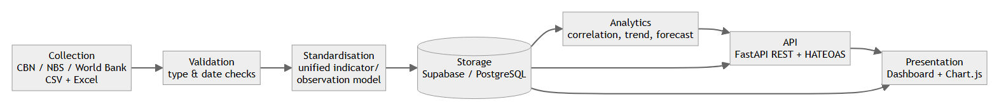

Each stage performs a distinct function within this project. In the **collect** stage, source
files are obtained from the three institutions' published outputs, CBN statistical pages, NBS
CPI and GDP report tables, and World Bank indicators, as CSV or Excel. In the **validate**
stage, loader scripts type-check every row, normalise dates to ISO 8601, and reject malformed
records; during the build this stage caught and removed 1, 435 duplicate records introduced by
repeated ETL runs, reducing 13, 535 raw rows to the 12, 100 clean observations in production,
which is evidence that the stage performs real work. In the **standardise** stage, every
series, whether daily NFEM rates or the 1960–2012 annual financial statement, is reduced to
the same `(indicator_id, obs_date, value)` shape, with unit and source held as metadata. In
the **store** stage, the data resides in Supabase-hosted PostgreSQL with a uniqueness
constraint preventing re-duplication, and public read access is gated by row-level security.
In the **analyse** stage, classical statistics (descriptives, OLS trend, and Pearson
correlation with a Student-t significance test) are computed in the API and, for interactive
pages, in the browser from the same data. In the **API** stage, a FastAPI service exposes the
catalogue as versioned REST with hypermedia controls, its ingestion endpoints demo-safe by
default. Finally, in the **present** stage, the static dashboard deliberately reads the
database's REST layer directly, so that the primary user experience does not depend on the
API host being awake.

**Figure 3.2, Deployment view**

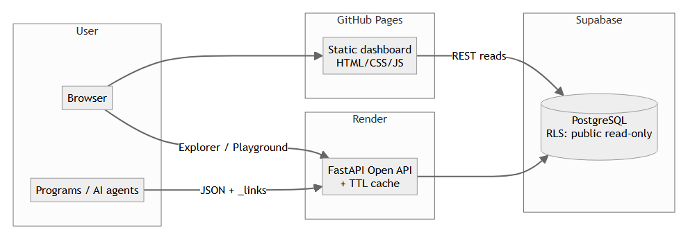

The two data paths are intentional: the dashboard's independence from the API host is an
availability decision (assessed further in Section 4.9).

### 3.7 System Design

**3.7.1 Use-case design (Figure 3.3)**

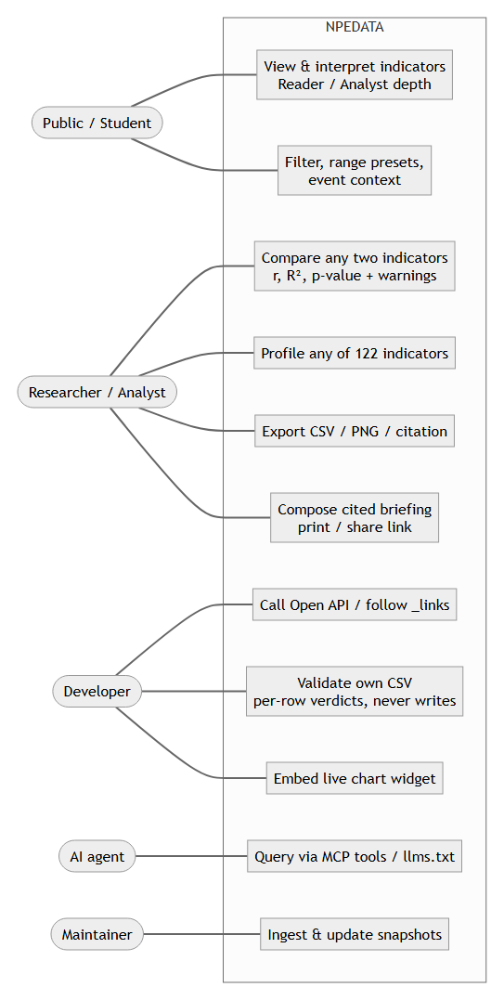

**Table 3.6, Use-case descriptions (three representative cases in full)**

**UC-1: Interpret an indicator (Public/Student).**
*Precondition:* none, public site. *Main flow:* (1) user opens an indicator page, e.g.
Inflation; (2) system fetches the series and renders the headline stat, the plain-language
story blocks, and the chart with event markers; (3) user narrows the window with a range
preset; (4) optionally flips the navbar dial to *Analyst*, revealing the statistical panel
(range, mean, σ, OLS trend with R² and p-value). *Postcondition:* none (read-only).
*Alternative flow:* data unavailable → a labelled error state with retry, never a blank chart.

**UC-2: Test a correlation hypothesis (Researcher).**
*Precondition:* none. *Main flow:* (1) researcher opens Compare Indicators and selects any
two of the 122 indicators; (2) system date-aligns the two series on their common
observations; (3) system computes Pearson r, R², and a two-tailed p-value, and plots both
series z-score-standardised on one axis; (4) system runs the reliability guards, if the
overlap is short, the frequencies differ, or the detrended (month-to-month change)
correlation collapses relative to the level correlation, a visible warning explains the
caveat; (5) researcher exports the paired table as CSV or copies the citation.
*Postcondition:* none. *Alternative flow:* no overlapping dates → explanatory notice, no
correlation shown.

**UC-3: Validate a dataset via the API (Developer).**
*Precondition:* developer has a CSV with `obs_date, value` columns. *Main flow:* (1) client
POSTs the file with a target `indicator_id` to `/api/v1/validate/csv` (or uses the Pipeline
Playground UI); (2) system checks the header, then judges every row, ISO date, numeric and
finite value, no in-file duplicate date, no future date; (3) system returns a per-row
verdict report with reasons and normalised values, plus `written_to_database: false`.
*Postcondition:* **no state change ever**, the endpoint is validation-only by design.
*Alternative flows:* unknown indicator → 404 listing valid ids; non-UTF-8 file or missing
columns → 400 with the specific message.

**3.7.2 Data-flow and interaction design.** At Level 0, external sources supply raw data to
the NPEDATA process, which stores standardised observations and returns charts, JSON and
CSV to users. At Level 1 the process decomposes into *Ingest → Validate → Store → Query →
Analyse → Serve*. Two representative interactions are shown as sequence diagrams.

**Figure 3.4, Sequence: loading an indicator page**

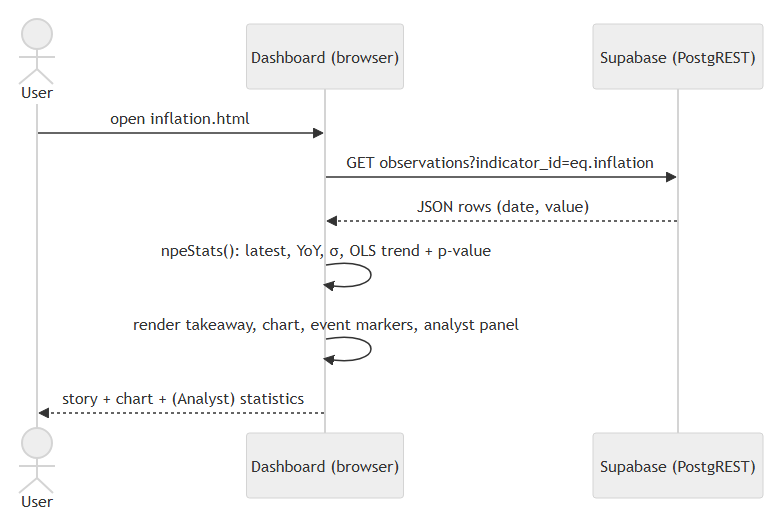

**Figure 3.5, Sequence: validating a CSV through the Open API**

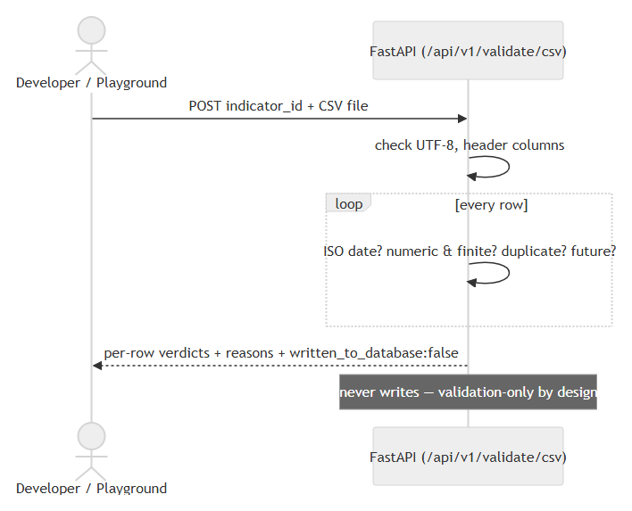

**3.7.3 Database design (Figure 3.6, ERD)**

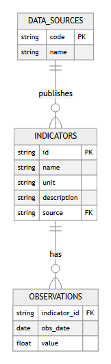

**Table 3.7, Database schema (core tables)**

| Table | Key columns | Purpose |
|---|---|---|
| `data_sources` | code, name | The publishing institutions (CBN, NBS, World Bank) |
| `indicators` | id, name, unit, description, source | Metadata for each series |
| `observations` | indicator_id, obs_date, value | One value per indicator per date (tidy/long form) |

The long/tidy `observations` table lets indicators of any frequency or unit coexist in one
structure, the key standardisation decision of the project.

**Table 3.8, Data dictionary**

*Table `data_sources`*
| Field | Type | Constraints | Description | Example |
|---|---|---|---|---|
| code | text | PK | Short institution code | `CBN` |
| name | text | not null | Full institution name | Central Bank of Nigeria |

*Table `indicators`*
| Field | Type | Constraints | Description | Example |
|---|---|---|---|---|
| id | text | PK, snake_case | Stable series identifier | `exchange_rate` |
| name | text | not null | Human-readable name | Exchange Rate NGN/USD |
| unit | text | not null | Unit **as stored** (critical, see note) | Naira per USD |
| description | text |, | What the series measures | … |
| source | text | FK → data_sources.code | Publishing institution | `CBN` |

*Table `observations`*
| Field | Type | Constraints | Description | Example |
|---|---|---|---|---|
| indicator_id | text | FK → indicators.id; unique with obs_date | Which series | `inflation` |
| obs_date | date | ISO 8601; unique with indicator_id | Observation date | 2024-12-01 |
| value | numeric | not null, finite | The observation, in the indicator's stored unit | 34.80 |
| source | text |, | Provenance tag for the row | `NBS` |

*Unit note (a genuine design lesson of this project):* stored units differ by series, the
CBN monthly balance sheet is in ₦'000, its annual statement in ₦ millions, GDP sectors in
₦ billions. The presentation layer therefore carries a single scale-aware formatter so that
values are always displayed accurately (for example, ₦81.04T); Chapter Four documents the
defects this discipline caught.

**3.7.4 API design.** The API is versioned under `/api/v1/` and returns JSON with an
embedded `_links` object (HATEOAS). Representative endpoints include `/summary`, per-indicator
series endpoints (`/gdp`, `/inflation`, `/exchange-rate`, `/fx-reserves`, `/nfem`,
`/multicurrency`, …), `/analytics/{indicator_id}`, `/coverage`, `/export/{indicator_id}`
(CSV, with an RFC 8288 `Link` header), and `/validate/csv` (the validation layer as a
service). Four design rules govern every endpoint: (1) **versioned paths** so future changes
cannot break consumers; (2) **hypermedia everywhere**, every JSON response includes
`_links` (self, index, docs, related resources, per-indicator analytics/export), making the
whole API navigable from the root; (3) **no authentication, open CORS**, the mission is
access; (4) **writes are demo-safe by default**, ingestion validates and normalises but
persists nothing unless the server-side `ALLOW_DATA_WRITES` flag *and* an explicit
`commit=true` are both set.

**3.7.5 Algorithm design.** The three core computations, as implemented:

*Validation (per CSV row):*
```
for each row (r = 2, 3, …):
 problems ← []
 if obs_date does not parse as YYYY-MM-DD: problems += "ISO date required"
 if value does not parse as a number: problems += "numeric required"
 else if value is NaN or ±Infinity: problems += "finite number required"
 if obs_date parsed:
 if obs_date > today: problems += "future date"
 if obs_date already seen in this file: problems += "duplicate date"
 emit {row, status: valid|rejected, reasons, normalized}
never write; return counts + verdicts
```

*Pearson correlation with significance:*
```
align the two series on common dates → x[], y[] (n pairs)
r ← Σ(xᵢ−x̄)(yᵢ−ȳ) / √(Σ(xᵢ−x̄)² · Σ(yᵢ−ȳ)²)
t² ← r²(n−2)/(1−r²)
p ← I_{(n−2)/((n−2)+t²)}((n−2)/2, 1/2) # regularised incomplete beta (two-tailed)
report r, R² = r², p; warn if n < 8, frequencies differ,
or |r_detrended| (on month-to-month changes) ≪ |r|
```

*OLS trend and illustrative forecast:*
```
slope ← Σ(i−ī)(vᵢ−v̄) / Σ(i−ī)² over index i = 0…n−1
intercept ← v̄ − slope·ī
trend line ← slope·i + intercept; extrapolate k periods, labelled "illustrative only"
```

**3.7.6 Input and output design.** *Inputs:* date-range pickers (From/To) on every data
page; range-preset chips (1Y/3Y/5Y/All); grouped indicator selectors driven by the live
catalogue (single-select for profiles, multi-select for briefings); a currency-converter
amount field; CSV upload/paste in the Playground; URL query parameters (`?from=&to=&view=`,
`?ids=`) so any composed view is shareable and regenerable. All inputs are validated
client-side and, for the API, server-side. *Outputs:* interactive charts with plain-language
captions; statistic tiles; sortable data tables; CSV downloads; attributed PNG chart
exports; APA citations; the print-ready briefing document; and machine outputs (JSON with
`_links`, the llms.txt discovery file).

**3.7.7 Security and data-integrity design.** Because the system is public-read by design,
the relevant security question is one of integrity rather than secrecy, ensuring that
nothing is corrupted or duplicated, rather than concealing anything. The browser-side
database credential is a public anonymous key gated by PostgreSQL row-level security, and is
therefore read-only by construction; it cannot modify data, which is what makes shipping it
client-side safe rather than reckless. Every write path is demo-safe by default
(`ALLOW_DATA_WRITES=false`), and the public validation endpoint is structurally incapable of
writing at all, not merely configured not to. A uniqueness constraint on `(indicator_id,
obs_date)` prevents duplicate ingestion at the database level regardless of the application
code. Any user-supplied content echoed back by the frontend, such as Playground verdicts, is
HTML-escaped, and adversarial inputs, script tags, NaN/Infinity, and a 5, 000-row flood, 
were added to the test suite specifically to confirm that those paths hold. Real secrets,
namely the service keys, exist only as server-side environment variables and never enter the
repository.

**3.7.8 User-interface design.** The dashboard uses a dark "Lagos Noir" theme with the same
storytelling pattern repeated on every indicator page, a headline statistic, three short
blocks covering what happened, why it matters and how to read the chart, the chart itself,
and a data table underneath, plus a "markets-terminal" treatment on the charts themselves:
range selectors, a hover crosshair, end-of-line value tags, event markers. Two things here
are treated as requirements rather than aesthetic preference. The first is honest encoding:
no dual y-axes anywhere (differing scales become aligned panels or z-scores instead), no
data-censoring transforms, and units always stated plainly. The second is layered depth, the
Reader/Analyst dial allows the general public and a researcher to use the same page rather
than forking the interface into two separate products for two separate audiences.
Accessibility (WCAG 2.1 AA contrast, keyboard focus, aria labelling and reduced-motion
support) was maintained as a constraint throughout, rather than addressed in a final review.

---

## CHAPTER FOUR, SYSTEM IMPLEMENTATION AND TESTING

### 4.1 Introduction
Chapter Three set out what was to be built. This chapter is the account of building it, the
tools used, how the seven-stage pipeline came together in practice, the points at which
implementation forced a decision the design had not anticipated, and how the result was
tested and evaluated.

### 4.2 Development Tools and Technologies
The backend was implemented in Python 3 using the FastAPI framework, served by the Uvicorn
ASGI server, with `supabase-py` for database access. Data resides in Supabase (managed
PostgreSQL), accessed under row-level security. The frontend was built with HTML5, CSS3 and
vanilla JavaScript, using Chart.js v4 together with its annotation and zoom plugins for
visualisation. Version control, continuous integration and deployment were handled through
GitHub and GitHub Actions, with the dashboard hosted on GitHub Pages and the API on Render.
Testing employed Pytest, browser-based functional testing, and Lighthouse accessibility
audits.

### 4.3 Implementation of the Pipeline
The pipeline was implemented stage by stage. Collection obtained source data from CBN, NBS and
World Bank publications, arranged into CSV and Excel inputs that loader scripts
(`project/etl/`, `project/database/seed/`) read into the database, with a reproducible seed
snapshot (`observations.csv`, approximately 12, 100 rows) allowing the whole dataset to be
recreated. Validation checks each row's types and dates and normalises fields before any
write, rejecting invalid rows with clear errors. Standardisation reduces all series to the
common `(indicator_id, obs_date, value)` observation form, with indicator metadata (unit,
source and frequency) held separately. Storage places the data in three PostgreSQL tables on
Supabase, where the anonymous key is public and read-only under row-level security. The
analytics layer computes the latest value, period and year-on-year change, trend direction, a
simple ordinary-least-squares forecast, and Pearson correlation (for example, inflation
against the exchange rate), with the compare and analytics pages replicating the correlation
client-side in JavaScript. The API is provided by FastAPI, which exposes the versioned
endpoints, auto-generates OpenAPI/Swagger documentation at `/docs`, and adds HATEOAS `_links`
to every response, running with proxy headers in production so that hypermedia links honour
HTTPS. Finally, presentation is handled by the static dashboard, which fetches data directly
from Supabase for the charts and renders it with Chart.js, applying the storytelling and
terminal-chart patterns.

### 4.4 Key Implementation Highlights
A few decisions from the build warrant separate attention, since they became apparent only
on encountering the problems they solve.

The whole API consolidates into one canonical `main.py` rather than being scattered across
files that drift apart, with credentials read from the environment and safe fallbacks if
they are missing. Unit correctness became a first-class concern rather than a detail,
because raw balance-sheet values are stored in naira thousands while financial-statement
values are stored in naira millions, mixing those up anywhere in the UI would silently
misstate a figure by orders of magnitude, so both get converted and clearly labelled (naira
trillions, for instance) before they ever reach a chart. And the charting logic itself
(`shared.js`) is one shared, reusable set of utilities, the takeaway stat, the range
selector, the crosshair, the end-of-line labels, used the same way on every page, rather
than each page reinventing its own version.

### 4.5 Analytical Methods and Their Limitations
Every analytic on the platform is computed transparently in the browser, directly from the
aggregated data, across the full catalogue of indicators. The methods are deliberately
classical and explainable rather than resembling a black box, so that any result a user sees
can be reproduced and checked by hand. This reflects a guiding principle of the project:
correctness and honesty are valued above impressiveness, and where a result is unreliable,
the platform states as much rather than concealing it.

Several analytical methods are implemented. Descriptive statistics cover the latest value,
period and year-on-year change, the minimum and maximum with their dates, the mean, the
standard deviation as a volatility measure, and the coefficient of variation. Trend estimation
uses Ordinary Least Squares (OLS) linear regression, reporting the slope, the coefficient of
determination (R²), and the correlation of the series with time. Correlation analysis computes
the Pearson product-moment correlation coefficient on two series' date-aligned observations,
reported together with R² (the share of variance explained) and a two-tailed
statistical-significance p-value derived from the Student-t distribution via the regularised
incomplete beta function. Standardisation applies z-score normalisation, standard deviations
from each series' own mean, so that two indicators measured in different units can be
compared on a single, honest axis rather than a misleading dual axis. A trend-robustness, or
spurious-correlation, check compares the detrended first-difference correlation with the level
correlation in order to flag relationships driven mainly by a shared trend rather than a
direct association. Forecasting extrapolates the OLS trend linearly a few periods ahead and is
presented explicitly as illustrative only. Finally, reliability guards issue automatic
warnings for correlations computed over very few overlapping observations or between series of
differing reporting frequency.

The analytical layer is subject to several acknowledged limitations. The figures are not
real-time, since they represent a manually ingested snapshot rather than an automated live
pipeline. No seasonal adjustment is applied; monthly and quarterly series are presented as
reported. The forecast is a straight-line OLS extrapolation without a confidence or prediction
interval, and no ARIMA, exponential-smoothing or other time-series model is used. The platform
measures association rather than causation: it computes correlation only, and performs no
causality testing (such as Granger causality) or lead/lag cross-correlation analysis. Short or
mixed-frequency comparisons are weaker, and although flagged to the user they remain
available. Coverage is bounded by the sources, so that some series end earlier than others, 
the annual financial statement, for example, ends in 2012. These limitations are presented
deliberately, on the principle that a smaller, correct and trustworthy platform is preferable
to a larger one that overstates its capabilities, and each is a candidate for the future work
discussed in Chapter Five.

### 4.6 System Screenshots
The figures below are actual captures of the deployed system.

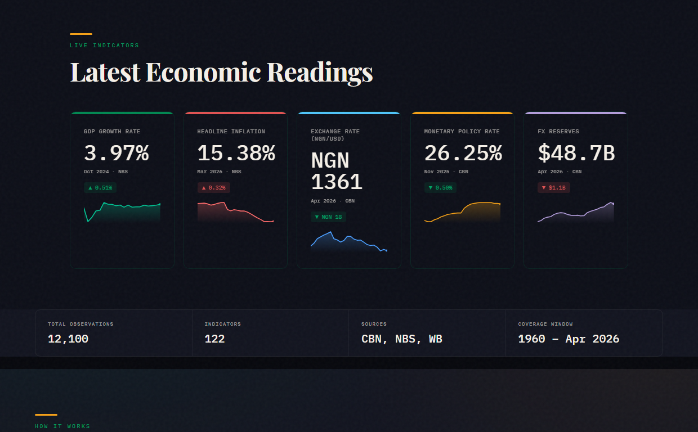

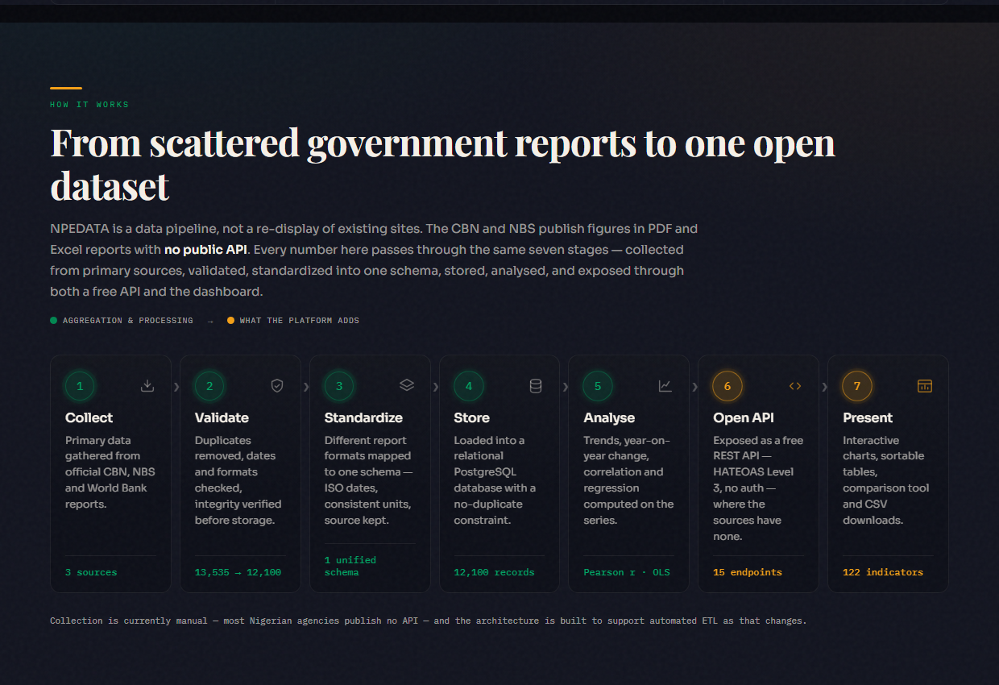

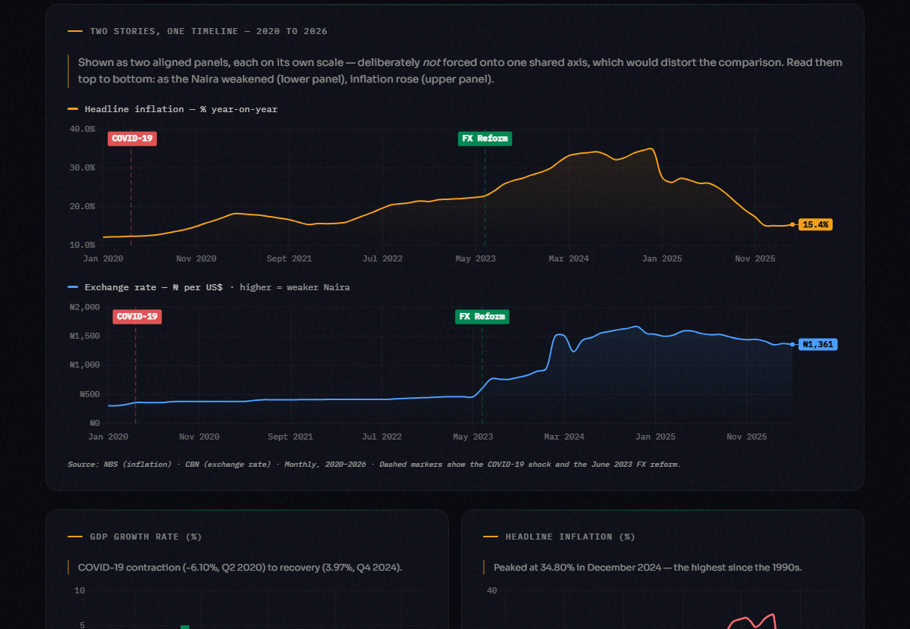

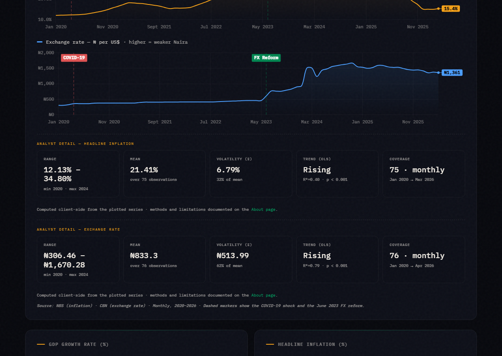

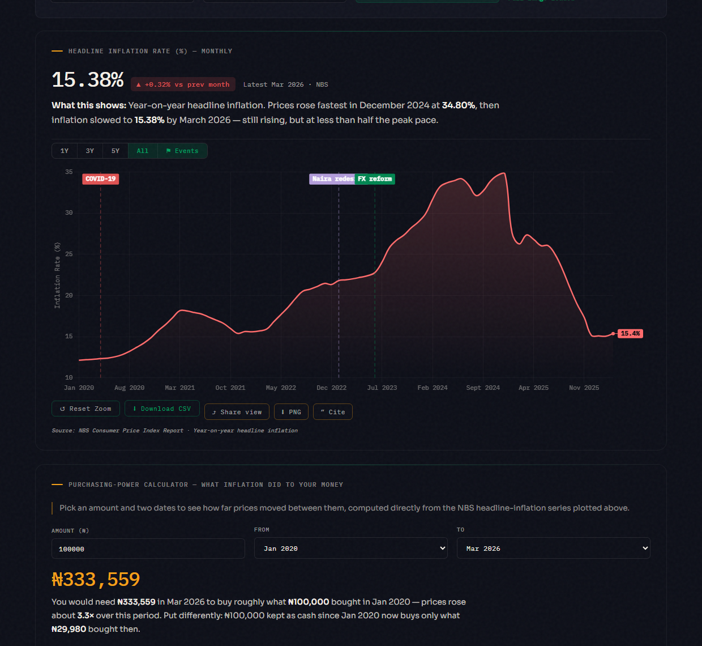

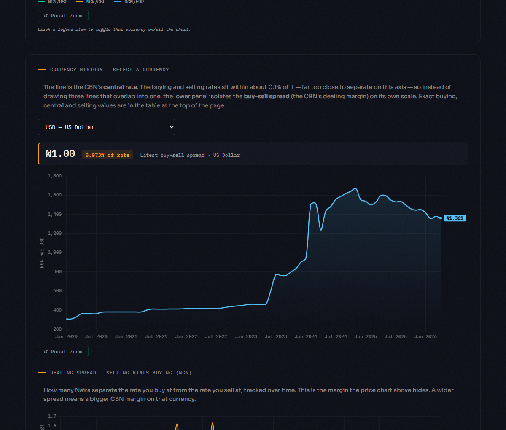

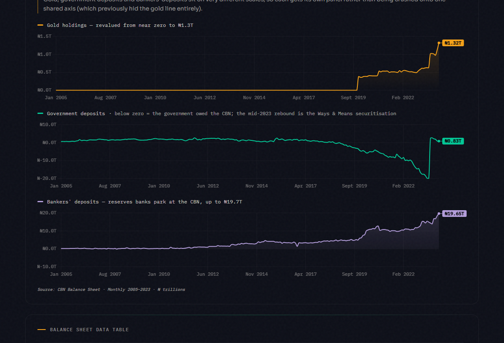

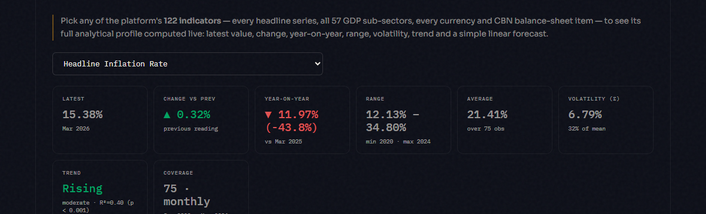

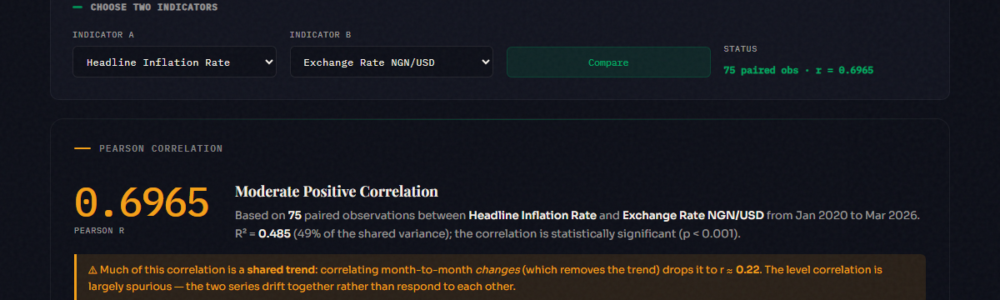

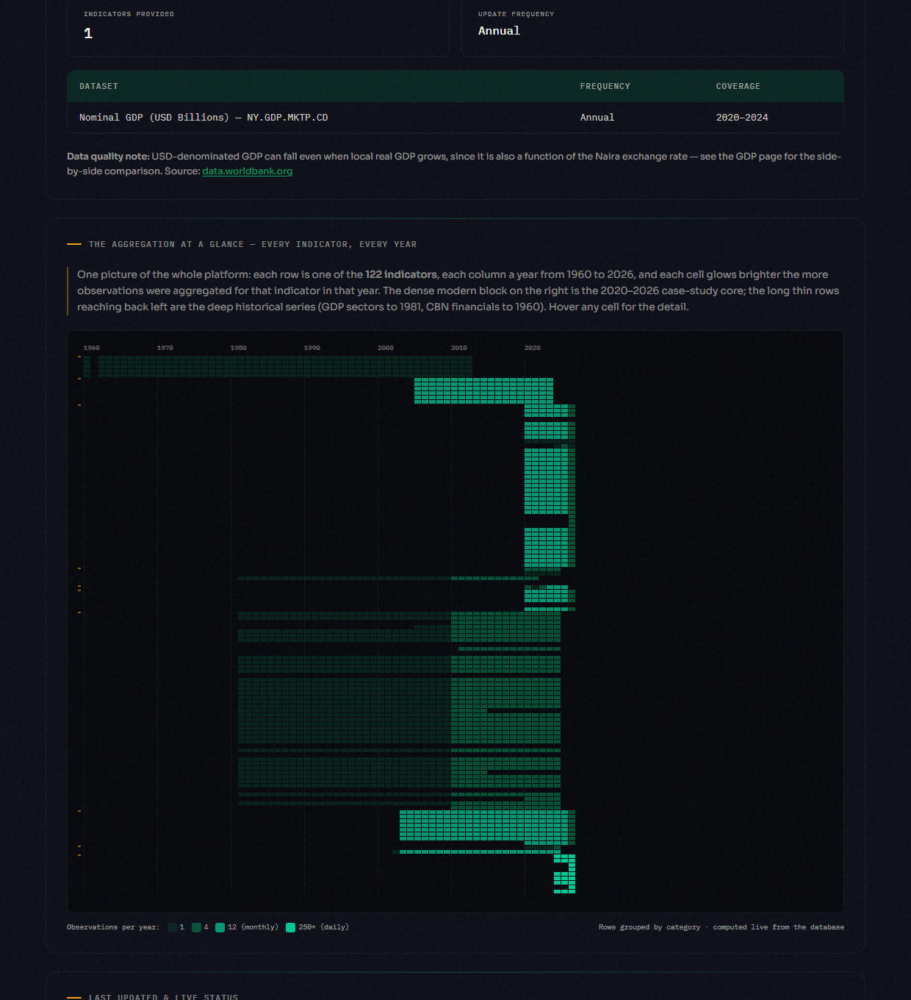

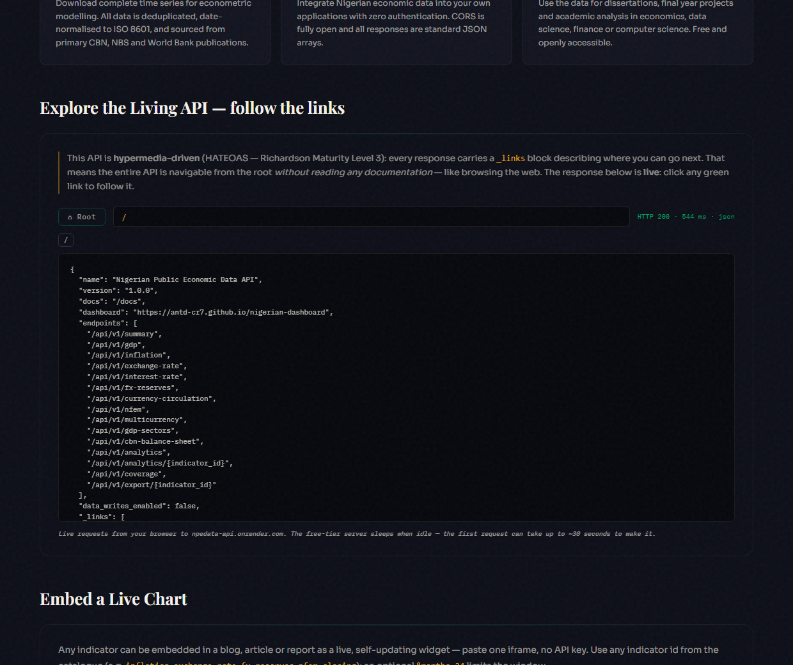

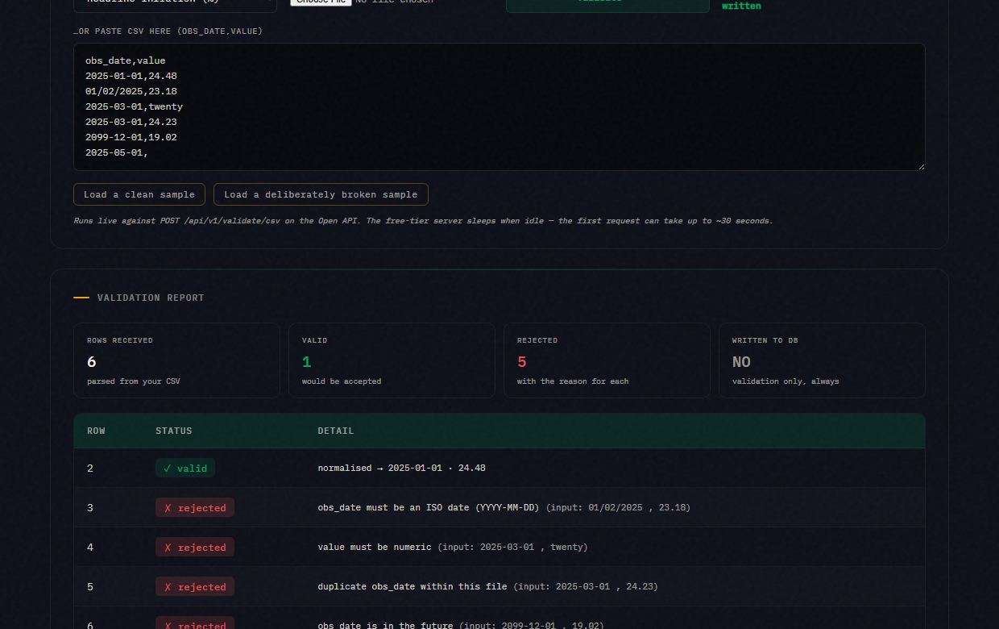

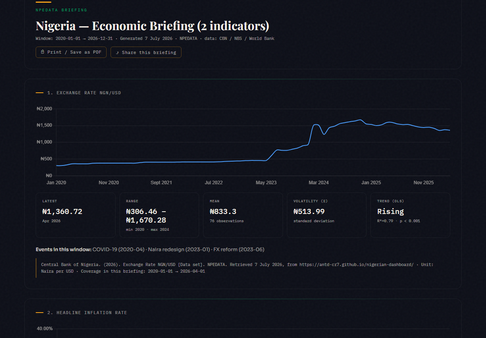

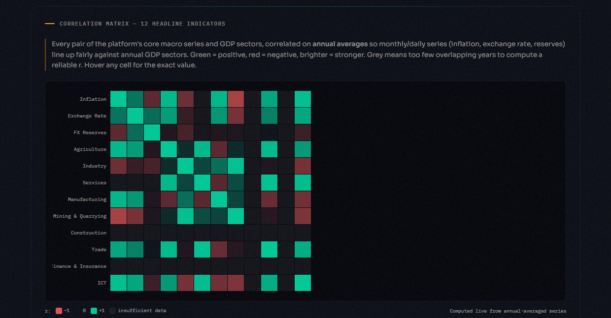

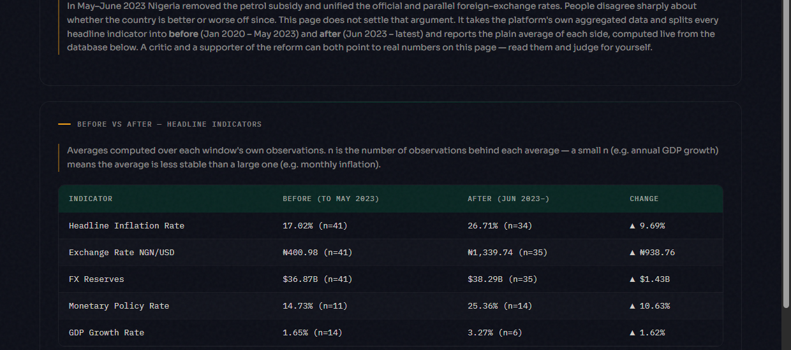

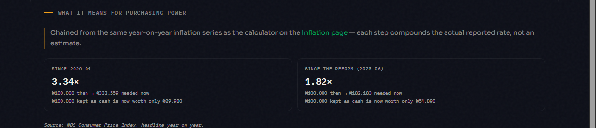

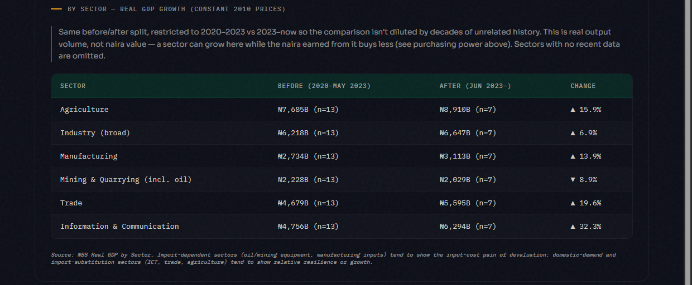

The Reform Impact page also carries a "Who this affects, and why" section covering global
and institutional investors, entrepreneurs and MSMEs, domestic Nigerian investors, and why
foreign direct investment might follow the reform, explicitly labelled as economic
reasoning applied to the numbers above rather than a further live computation, so the
distinction between what the platform computed and what it is arguing stays honest.

### 4.7 Testing and Validation
The platform was validated through several complementary strands rather than any one alone:
automated tests, independent statistical validation, and a systematic audit of the data
itself.

**Automated unit testing (Pytest).** The Open API is covered by a suite of **24 unit
tests** in `tests/test_main.py`, exercising the read endpoints, the demo-safe ingestion path,
the TTL cache (round-trip, expiry and size-cap eviction), and, importantly, asserting the
presence and correctness of the HATEOAS `_links` blocks that make the API Level 3. All 24
tests pass.

**Statistical validation.** Because the analytics report inferential statistics, the
underlying mathematics was validated independently of the user interface. The
correlation-significance function, a two-tailed Student-t p-value computed via the
regularised incomplete beta function, was checked against known reference cases; for example,
r = 0.70 over n = 75 yields p ≈ 4 × 10⁻¹², while r = 0.20 over n = 20 yields p ≈ 0.40, which
is correctly *not* significant. The scale-aware value formatter was unit-tested across every
unit type in the catalogue (percentages, exchange rates, USD billions, and the naira
thousands, millions and billions scales), confirming, for instance, that CBN total assets
render as ₦81.04T rather than as a raw or mislabelled figure. The analytics engine was also
exercised against deliberately awkward real series, a daily series (NFEM), a series
containing negative values (government deposits), a sparse four-point series (AED rates), a
count series, and a series whose coverage ends early (services GDP), confirming correct
output and no crashes on these edge cases.

**Data-truthfulness auditing.** Every chart's stated figures, ranges and units were
cross-checked against the stored data, and this is the strand that surfaced genuine problems
rather than merely confirming that matters were already sound. The audit identified a
data-censoring routine that had been silently capping some balance-sheet series, hiding the
gold revaluation and understating bankers' deposits; unit mislabels that mis-scaled monetary
values by a factor of a thousand; a chart titled an "inverse relationship" that the data in
fact showed to be a weak positive one (r ≈ 0.33), the opposite of its own caption; and a
sector comparison that had inadvertently placed figures from two different years side by side
as though they were comparable. Each defect was traced back to the original source figures
and corrected, and the process is documented here rather than presenting the first version as
though it had been correct throughout.

**Functional and visual verification.** Every dashboard page was loaded against the live
database and inspected, including through automated screenshots, to confirm that charts,
date filters, indicator comparisons, table sorting and CSV downloads behave correctly, and
that the responsive layout holds across screen widths.

**Accessibility testing.** Colour contrast and related criteria were checked against the
WCAG 2.1 AA standard (contrast ratio ≥ 4.5:1) using Lighthouse audits; contrast defects
found during development were corrected.

**API testing.** Endpoints were exercised manually through the browser, the
auto-generated Swagger UI at `/docs`, and `curl`, confirming correct payloads, CSV export
with the RFC 8288 `Link` header, and the demo-safe behaviour of the ingestion endpoints.

**Table 4.1, Representative test cases**

| # | Test | Expected | Result |
|---|---|---|---|
| 1 | `GET /api/v1/summary` | 5 headline indicators + `_links` | Pass |
| 2 | `GET /api/v1/analytics/inflation` | latest, change, trend, forecast | Pass |
| 3 | `GET /api/v1/export/exchange_rate` | CSV + RFC 8288 `Link` header | Pass |
| 4 | `POST /api/v1/ingest/csv` (demo mode) | validated, not written to DB | Pass |
| 5 | Full Pytest suite | 24 / 24 tests pass | Pass |
| 6 | Correlation p-value vs known cases | matches reference values | Pass |
| 7 | Value formatter across all unit types | correct scale and symbol | Pass |
| 8 | Analytics engine on edge-case series | no crash, correct output | Pass |
| 9 | Chart figures vs stored data | exact match, correct units | Pass (after fixes) |
| 10 | Accessibility contrast | ≥ 4.5:1 (WCAG 2.1 AA) | Pass |

### 4.8 Results and Discussion
The result is a platform that aggregates 122 indicators and approximately 12, 100
observations into one queryable store, serves them through a documented open API with
hypermedia controls, and presents them through a dashboard that is accessible in practice
rather than only in principle. Testing confirmed this: the API behaves as specified, and the
visualisations proved to be both correct and clearly explained once the unit-correctness
audit had been completed. That audit is arguably the most significant part of Chapter Four,
since it marks the difference between a platform that merely appears trustworthy and one
that is.

---

### 4.9 Technology-Stack Assessment
Once the build was largely complete, the stack was re-evaluated against a single question:
is any of these technology choices limiting the platform? To keep the assessment
evidence-based rather than a matter of taste, it draws on the measurements gathered during
stress testing rather than on opinion.

Two choices proved themselves and were kept deliberately. The static HTML, CSS and vanilla
JavaScript frontend, with no framework and no build step, delivered a 100/100 Lighthouse
accessibility score at this scale, together with zero build or dependency maintenance, free
hosting, and complete auditability, since the entire implementation can be read directly from
source. The known weakness of the approach, namely duplicated code drifting apart across
pages, was addressed architecturally with a single shared library (`shared.js`) carrying all
chart, analytics and UI logic, so that a fix in one place applies everywhere. The FastAPI and
Supabase (PostgreSQL) combination likewise handled every stress-test scenario, including a
5, 000-row adversarial CSV, with all 17 live endpoints passing, while the relational
tidy-observations model absorbed daily, monthly, quarterly and annual series in a single
schema.

Three limitations were measured, and each was addressed. First, the free-tier API exhibits
cold starts of around 30 seconds, because Render's free tier sleeps after idle; this was
mitigated in three ways, a scheduled keep-alive workflow pings the service every ten minutes,
every API-dependent page shows an explicit "server waking" state instead of appearing broken,
and the dashboard is architecturally independent of the API (reading the database's REST layer
directly), so that the primary user experience cannot be taken down by the API host. Second,
repeated-query latency on the multi-currency endpoint (33 series) reached about 5.4 seconds per
request, because every call repeated 33 database round-trips; a size-capped, five-minute-TTL
in-process cache was added at the data-access layer, appropriate because the dataset changes
only at ingestion time, cutting repeat responses to well under a second and reducing database
load, which is the standard first scaling step of caching applied within the existing stack
rather than replacing it. Third, PostgREST imposes row-window limits, returning at most around
1, 000 rows per request, so the coverage heatmap fetches the full 12, 100-observation dataset
through paged parallel requests; this is acceptable at the present scale, and a server-side
aggregate endpoint is the documented next step should the dataset grow.

**Scaling path (if requirements outgrow the stack):** the layers are decoupled, so each can
be upgraded independently without a rewrite, the database is already PostgreSQL (scales to
a paid tier unchanged); the API is containerisable FastAPI (moves to an always-on host,
gaining zero-cold-start); and because all data access goes through the documented Open API
or the database's REST layer, the frontend could be rebuilt in any framework without
touching the backend. The conclusion of the assessment is that the stack is not the
limiting factor at the platform's current scope; where friction was measured, it was
engineered around within the stack, and the upgrade path for each layer is documented.

## CHAPTER FIVE, SUMMARY, CONCLUSION AND RECOMMENDATIONS

### 5.1 Summary
This project set out to address the fragmentation and inaccessibility of public Nigerian
economic data, and the result is NPEDATA, a seven-stage platform that collects, validates,
standardises, stores, analyses and publishes economic indicators through both a dashboard
and a free open API. Measured against the objectives in Chapter One, all six were
substantively met rather than nominally satisfied: the data is aggregated into one unified
model, the analytics are implemented and functioning, the API is HATEOAS-compliant and
documented, the dashboard is accessible and explanatory rather than merely decorative, and
the system has been tested for both correctness and accessibility rather than assumed to be
sound.

**Table 5.1, Achievement of objectives**

| # | Objective (Ch. 1) | Delivered evidence |
|---|---|---|
| 1 | Collect indicators from CBN, NBS, World Bank | 122 indicators, ~12, 100 observations; reproducible seed snapshot |
| 2 | Unified standardised data model | One tidy observations schema holding daily-to-annual series; data dictionary Section 3.7.3 |
| 3 | Server-side analytics | Descriptives, YoY, OLS trend, correlation with R²/p-value; TTL-cached API |
| 4 | Free documented HATEOAS API | Versioned endpoints, _links throughout, RFC 8288 on CSV; interactive Explorer |
| 5 | Clear, truthful dashboard | Storytelling pattern, single-axis policy, Reader/Analyst dial, WCAG AA 100/100 |
| 6 | Test and evaluate | 24-test suite, statistical validation, adversarial stress test, live sweeps (Section 4.7) |

### 5.2 Conclusion
The central demonstration of this project is that Nigeria's scattered, non-machine-readable
public economic data need not remain in that state: it can be consolidated into a resource
that is correct and programmatically usable using only free and open-source tools, without a
government contract or a commercial budget. In doing so, it lowers the barrier to using this
data for students, researchers, developers and the public, and offers a reasonably candid
reference for what open-data practice could look like in a Nigerian context, including the
limitations documented rather than concealed in Chapter Four.

### 5.3 Recommendations and Future Work
The project is not finished, and an undertaking of this scope should not present itself as
such. Several directions are recommended for future work, whether by the author or by others.
The most immediate is to automate collection, using scheduled scrapers or connectors to the
source portals, so that freshness no longer depends on manual re-ingestion. Coverage could
then be expanded to include more indicators, state-level rather than only national data, and
longer historical series where the sources allow. Authentication tiers and rate limiting
could be introduced once there are API consumers heavy enough to require them. Richer
analytics, such as seasonal adjustment or additional forecasting methods, could be added
without sacrificing the transparency of the current classical approach. Client software
development kits, a Python or JavaScript package, would lower the remaining friction in
adopting the API. Finally, the data-quality workflow itself could be formalised, with
automated validation dashboards and clearer provenance tracking, rather than relying on the
kind of manual audit described in Section 4.7.

None of these recommendations addresses the deeper barrier discussed in Section 2.4, the
institutional reluctance to share data that has kept the CBN, NBS and other agencies from
undertaking this themselves. A student project cannot legislate that away, and nothing in
this report resolves it. If, however, a reference implementation of this kind is used,
cited, or simply noticed, it becomes one small piece of evidence for the argument that
BudgIT and others already advance: that unifying this data was always a governance choice
rather than an engineering problem (Anintah, n.d.). That, more than any single feature, is
the contribution this project would ultimately hope to make.

### 5.4 Contribution to Knowledge
The concrete contribution of this project is a working, reproducible, openly licensed
reference implementation of a unified Nigerian public-economic-data platform with a fully
HATEOAS-level open API, an artefact that, as far as the review in Chapter Two could
establish, did not previously exist in freely accessible form, together with a
demonstration that such a platform is achievable using entirely free tooling, by a single
student, within one academic year.

---

## REFERENCES

- Anintah, C. (n.d.). *Interoperability is the anti-corruption reform Nigeria continues to overlook*. BudgIT Foundation. https://budgit.org/interoperability-is-the-anti-corruption-reform-nigeria-continues-to-overlook/
- Anscombe, F. J. (1973). Graphs in statistical analysis. *The American Statistician, 27*(1), 17–21.
- Falore, O., & Jidda, S. (2026, April 27). *Written policy, broken practice: The data protection gap*. Syntegral Legal Practice, via Mondaq. https://www.mondaq.com/nigeria/data-protection/1778574/written-policy-broken-practice-the-data-protection-gap
- BudgIT. (n.d.). *BudgIT, making public data meaningful*. https://www.budgit.org
- Codd, E. F. (1970). A relational model of data for large shared data banks. *Communications of the ACM, 13*(6), 377–387.
- Eleanya, F. (2026, June 17). *Why Nigeria's AI future depends on breaking government data silos*. TechCabal. https://techcabal.com/2026/06/17/why-nigerias-ai-future-depends-on-breaking-government-data-silos/
- Federal Reserve Bank of St. Louis. (n.d.). *FRED, Federal Reserve Economic Data*. https://fred.stlouisfed.org
- Fielding, R. T. (2000). *Architectural Styles and the Design of Network-based Software Architectures* (Doctoral dissertation). University of California, Irvine.
- Richardson, L., & Ruby, S. (2007). *RESTful Web Services*. O'Reilly Media.
- Fowler, M. (2010). *Richardson Maturity Model*. martinfowler.com.
- Central Bank of Nigeria. (n.d.). *Statistics Database*. https://www.cbn.gov.ng
- National Bureau of Statistics. (n.d.). *NBS Data Portal*. https://www.nigerianstat.gov.ng
- National Information Technology Development Agency. (2018). *Nigeria e-Government Interoperability Framework (Ne-GIF), Release V1.2*. https://nitda.gov.ng/wp-content/uploads/2020/11/Ne-GIFFinal1.pdf
- World Bank. (n.d.). *World Bank Open Data*. https://data.worldbank.org
- FastAPI. (n.d.). *FastAPI Documentation*. https://fastapi.tiangolo.com
- PostgreSQL Global Development Group. (n.d.). *PostgreSQL Documentation*. https://www.postgresql.org/docs
- Chart.js. (n.d.). *Chart.js Documentation*. https://www.chartjs.org/docs
- Granger, C. W. J., & Newbold, P. (1974). Spurious regressions in econometrics. *Journal of Econometrics, 2*(2), 111–120.
- International Monetary Fund. (n.d.). *IMF Data*. https://data.imf.org
- Nottingham, M. (2017). *Web Linking* (RFC 8288). Internet Engineering Task Force.
- Ogunyale, K., & Osho, G. (2023, September 24). *Over 150 MDAs flout Freedom of Information Act*. The International Centre for Investigative Reporting (ICIR). https://www.icirnigeria.org/over-150-mdas-flout-freedom-of-information-act/
- Open Government Working Group. (2007). *Eight principles of open government data*. https://opengovdata.org
- Open Knowledge Foundation. (n.d.). *The Open Definition*. https://opendefinition.org
- Our World in Data. (n.d.). *Our World in Data*. https://ourworldindata.org
- Press, W. H., Teukolsky, S. A., Vetterling, W. T., & Flannery, B. P. (2007). *Numerical Recipes: The Art of Scientific Computing* (3rd ed.). Cambridge University Press.
- Tufte, E. R. (1983). *The Visual Display of Quantitative Information*. Graphics Press.
- Wickham, H. (2014). Tidy data. *Journal of Statistical Software, 59*(10), 1–23.
- Wilkinson, M. D., Dumontier, M., Aalbersberg, I. J., et al. (2016). The FAIR Guiding Principles for scientific data management and stewardship. *Scientific Data, 3*, 160018.

---

## APPENDICES

### Appendix A, Sample API response (HATEOAS)
The response below is returned by `GET /api/v1/summary`. Every response of the Open API
carries an embedded `_links` block that describes the actions available next, which is what
makes the interface navigable from its root without prior documentation (HATEOAS, Richardson
Maturity Level 3).

```
GET /api/v1/summary
{
  "gdp_growth":    { "obs_date": "2024-10-01", "value": 3.97,    "source": "NBS" },
  "inflation":     { "obs_date": "2026-03-01", "value": 15.38,   "source": "NBS" },
  "exchange_rate": { "obs_date": "2026-04-01", "value": 1360.72, "source": "CBN" },
  "mpr":           { "obs_date": "2025-11-19", "value": 26.25,   "source": "CBN" },
  "fx_reserves":   { "obs_date": "2026-04-01", "value": 48.67,   "source": "CBN" },
  "_links": {
    "self":      { "href": ".../api/v1/summary" },
    "index":     { "href": ".../" },
    "inflation": { "href": ".../api/v1/inflation" },
    "analytics": { "href": ".../api/v1/analytics/inflation" },
    "coverage":  { "href": ".../api/v1/coverage" },
    "docs":      { "href": ".../docs" }
  }
}
```

### Appendix B, Selected source code
*The tidy observations model (the standardisation decision of the project):*

```
CREATE TABLE observations (
  indicator_id TEXT    NOT NULL REFERENCES indicators(id),
  obs_date     DATE    NOT NULL,
  value        NUMERIC NOT NULL,
  source       TEXT,
  UNIQUE (indicator_id, obs_date)      -- makes duplicate ingestion impossible
);
```

*A representative read endpoint (FastAPI), showing the hypermedia block:*

```
@app.get("/api/v1/inflation")
def inflation(start: str | None = None, end: str | None = None):
    rows = fetch_series("inflation", start, end)      # cached data-access layer
    return {
        "indicator": "inflation",
        "count": len(rows),
        "data": rows,
        "_links": { "self":     {"href": "/api/v1/inflation"},
                    "analytics":{"href": "/api/v1/analytics/inflation"},
                    "summary":  {"href": "/api/v1/summary"},
                    "index":    {"href": "/"} },
    }
```

*The correlation-significance function (two-tailed Student-t p-value via the regularised
incomplete beta function), computed identically on the client and server:*

```
function npeCorrP(r, n) {                        // p-value that Pearson r differs from 0
  if (n < 3 || Math.abs(r) >= 1) return null;
  var df = n - 2, t2 = r * r * df / (1 - r * r);
  return npeIbeta(df / (df + t2), df / 2, 0.5);  // I_x(a, b): regularised incomplete beta
}
```

### Appendix C, Full list of API endpoints
Read endpoints (GET), all returning JSON with a `_links` block: `/`, `/api/v1/summary`,
`/api/v1/gdp`, `/api/v1/inflation`, `/api/v1/exchange-rate`, `/api/v1/interest-rate`,
`/api/v1/fx-reserves`, `/api/v1/currency-circulation`, `/api/v1/nfem`, `/api/v1/multicurrency`,
`/api/v1/gdp-sectors`, `/api/v1/cbn-balance-sheet`, `/api/v1/analytics`,
`/api/v1/analytics/{indicator_id}`, `/api/v1/coverage`, `/api/v1/export/{indicator_id}` (CSV,
with an RFC 8288 `Link` header), and `/llms.txt` (machine-readable platform discovery).
Write endpoints (POST), demo-safe by default (validate and normalise but do not persist unless
explicitly enabled): `/api/v1/observations`, `/api/v1/ingest/csv`, and `/api/v1/validate/csv`.
Interactive Swagger documentation is generated automatically at `/docs`.

### Appendix D, Screenshots
The full set of deployed-system screenshots is presented as Figures 4.1 to 4.17 in Chapter
Four.

### Appendix E, Repository and live links
Source code: https://github.com/ANTD-CR7/nigerian-dashboard. Dashboard:
https://antd-cr7.github.io/nigerian-dashboard/. Open API: https://npedata-api.onrender.com
(interactive documentation at `/docs`).
