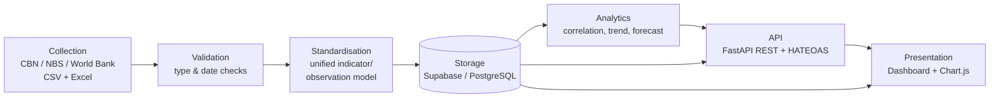
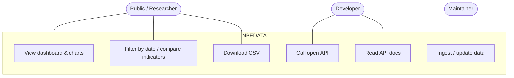
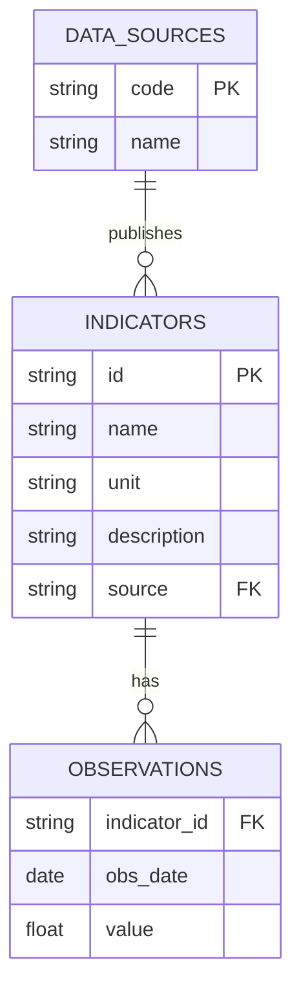

# DESIGN AND IMPLEMENTATION OF A WEB-BASED PUBLIC ECONOMIC DATA AGGREGATION AND ANALYTICS PLATFORM WITH AN OPEN API (NPEDATA)

> **Draft project report — fill the bracketed placeholders `[ ]` and reformat to your
> department's exact style guide (font, spacing, margins, chapter numbering, referencing
> style) before submission. Diagrams are provided as Mermaid/ASCII so you can render them
> in draw.io, Lucidchart or Word. Nothing here is fabricated about the system; verify the
> external citations against the actual sources and format them per your school's guide.**

---

## FRONT MATTER

### Title Page
**DESIGN AND IMPLEMENTATION OF A WEB-BASED PUBLIC ECONOMIC DATA AGGREGATION AND ANALYTICS PLATFORM WITH AN OPEN API**

BY

**TAOHEED ABDULMANAN OLAOSEBIKAN**
Matriculation Number: `[MATRIC NO.]`

A Project Submitted to the Department of Computer Science, College of `[COLLEGE]`,
**Caleb University, Imota, Lagos**, in Partial Fulfilment of the Requirements for the
Award of the Degree of Bachelor of Science (B.Sc.) in Computer Science.

Supervisor: `[SUPERVISOR NAME]` · `[MONTH, 2026]`

### Declaration
I, **Taoheed Abdulmanan Olaosebikan**, declare that this project titled *"Design and
Implementation of a Web-Based Public Economic Data Aggregation and Analytics Platform with
an Open API"* is the product of my own research effort, undertaken under supervision, and
has not been presented elsewhere for the award of any degree or certificate. All sources
have been duly acknowledged.

_____________________     _____________________
Signature                 Date

### Certification
This is to certify that this project was carried out by **Taoheed Abdulmanan Olaosebikan**
`[MATRIC NO.]` and has been read and approved as meeting the requirements of the Department
of Computer Science, Caleb University, Imota, Lagos.

`[SUPERVISOR NAME]` (Supervisor) — Signature / Date
`[HOD NAME]` (Head of Department) — Signature / Date
`[EXTERNAL EXAMINER]` — Signature / Date

### Dedication
`[Your dedication.]`

### Acknowledgements
`[Acknowledge God, supervisor, family, friends, department.]`

### Abstract
Nigeria's official economic data is published by several institutions — the Central Bank
of Nigeria (CBN), the National Bureau of Statistics (NBS), and the World Bank — in
fragmented formats (PDF bulletins, spreadsheets and disparate web portals) that are
difficult for students, researchers, developers and the public to access, compare and
consume programmatically. This project designed and implemented **NPEDATA**, a web-based
platform that aggregates public Nigerian economic data into a single standardised
database, presents it through an interactive analytical dashboard, and exposes it through
a **free, open REST API** requiring no authentication. The system was built as a
seven-stage pipeline (collection, validation, standardisation, storage, analytics, API and
presentation) using an iterative prototyping methodology. The backend was implemented in
Python with the FastAPI framework and a Supabase (PostgreSQL) database; the frontend is a
static dashboard built with HTML, CSS and vanilla JavaScript using Chart.js for
visualisation. The API implements hypermedia controls at Richardson Maturity Model Level 3
(HATEOAS). The resulting platform holds **122 indicators** and approximately **12,100
observations** spanning 1960–2026, including exchange rates, inflation, GDP, monetary
policy rate, foreign reserves, multi-currency rates and CBN balance-sheet data. The system
was tested through unit tests, functional testing and web accessibility audits. The work
demonstrates that fragmented national economic data can be consolidated into an accessible,
correct and programmatically consumable resource using free and open-source tools.

**Keywords:** data aggregation, open data, REST API, HATEOAS, economic analytics, Nigeria,
FastAPI, data visualisation.

### Table of Contents
*(Generate automatically in your word processor once formatted.)*
Chapter One — Introduction · Chapter Two — Literature Review · Chapter Three — System
Analysis and Design · Chapter Four — System Implementation and Testing · Chapter Five —
Summary, Conclusion and Recommendations · References · Appendices.

### List of Figures
- Figure 3.1 Seven-stage system architecture
- Figure 3.2 Use-case diagram
- Figure 3.3 Data-flow diagram (Level 0 / Level 1)
- Figure 3.4 Entity-relationship diagram
- Figure 4.1–4.n System screenshots

### List of Tables
- Table 1.1 Data coverage summary
- Table 2.1 Comparison of related systems
- Table 3.1 Functional requirements
- Table 3.2 Database schema
- Table 4.1 Test cases and results

---

## CHAPTER ONE — INTRODUCTION

### 1.1 Background to the Study
Economic data is a public good. Decisions by students, academic researchers, journalists,
software developers and ordinary citizens increasingly depend on timely access to reliable
figures such as the inflation rate, the naira–dollar exchange rate, gross domestic product
(GDP) and foreign reserves. In Nigeria, this data is produced by credible institutions —
principally the Central Bank of Nigeria (CBN) and the National Bureau of Statistics (NBS),
supplemented by international bodies such as the World Bank — but it is **scattered** across
many locations and **published in formats designed for reading, not for computation**:
PDF statistical bulletins, individual Excel downloads, and web tables that differ in
structure from one indicator to the next.

The consequence is a high "friction cost" to using the data. A researcher who wants to
study, for example, the relationship between the 2023 foreign-exchange reform and the
subsequent inflation surge must locate two different datasets from two different portals,
reconcile their date formats and units, and manually align them before any analysis can
begin. A developer who wishes to build an application on top of this data has no single,
documented programming interface to call. This project addresses that gap by consolidating,
standardising and re-publishing the data through both a human-facing dashboard and a
machine-facing open Application Programming Interface (API).

### 1.2 Statement of the Problem
Public Nigerian economic data suffers from the following problems:
1. **Fragmentation** — indicators are spread across multiple institutional websites and
   documents with no common access point.
2. **Non-machine-readable formats** — much of the data is locked in PDFs and inconsistent
   spreadsheets, making programmatic use difficult.
3. **Inconsistent structure and units** — different indicators use different date
   granularities (daily, monthly, quarterly, annual) and units (naira thousands, naira
   millions, percentages, USD billions), with no unified schema.
4. **Absence of an open API** — there is no free, documented, authentication-free interface
   through which developers and researchers can retrieve this data programmatically.
5. **Limited analytical presentation** — the raw sources present tables and figures but
   little interactive, comparative or explanatory visualisation for non-expert users.

### 1.3 Aim and Objectives
**Aim:** To design and implement a web-based platform that aggregates public Nigerian
economic data into a single standardised store and makes it accessible through an
interactive analytics dashboard and a free open API.

**Objectives:** The specific objectives are to:
1. Collect public economic indicators from the CBN, NBS and World Bank and ingest them into
   a single repository.
2. Design a unified relational data model that standardises indicators, sources and
   observations regardless of frequency or unit.
3. Implement server-side analytics (period change, year-on-year comparison, trend and
   correlation) over the stored data.
4. Develop a free, documented REST API — with hypermedia controls (HATEOAS) — that requires
   no authentication.
5. Build an interactive web dashboard that visualises the indicators with clear,
   truthful, explanatory charts.
6. Test and evaluate the platform for correctness, usability and accessibility.

### 1.4 Scope of the Study
The project covers the aggregation, standardisation, storage, analysis, API exposure and
visualisation of a defined set of Nigerian public economic indicators. The current dataset
comprises **122 indicators** and approximately **12,100 observations** across the domains
summarised in Table 1.1. The dataset is a controlled case study; the architecture supports
continuing updates through CSV and API ingestion. The project does **not** attempt
automated real-time data collection, does not use artificial intelligence or machine
learning, and is not positioned as official national infrastructure.

**Table 1.1 — Data coverage summary**

| Domain | Frequency | Range | Source |
|---|---|---|---|
| Exchange rate (NGN/USD) | Monthly | 2020–2026 | CBN |
| Multi-currency (11 currencies, buy/central/sell) | Monthly | 2020–2026 | CBN |
| NFEM daily interbank rates | Daily | 2024–2026 (348 sessions) | CBN |
| Monetary Policy Rate | Per MPC meeting | 2020–2025 | CBN |
| Foreign reserves (gross/liquid/blocked) | Monthly | 2020–2026 | CBN |
| CBN balance sheet | Monthly | 2005–2023 | CBN |
| Annual financial statement | Annual | 1960–2012 | CBN |
| Currency in circulation | Monthly | 2002–2024 | CBN |
| Inflation (headline/food/core) | Monthly | 2003–2026 | NBS |
| GDP growth | Quarterly | 2020–2024 | NBS |
| Real GDP by sector (47 sectors) | Quarterly/Annual | 1981–2024 | NBS |
| Nominal GDP (USD) | Annual | 2020–2024 | World Bank |

### 1.5 Significance of the Study
The platform lowers the cost of accessing Nigerian economic data for four groups:
**students and researchers** gain a single, comparable, downloadable dataset; **developers**
gain a free open API to build upon; **journalists and the public** gain clear, explanatory
visualisations; and the **discipline of open data in Nigeria** gains a demonstrable,
reproducible reference implementation built entirely from free and open-source tools.

### 1.6 Limitations of the Study
1. Data collection is currently **manual** (downloaded from published sources and ingested),
   not an automated live feed.
2. Figures are **not real-time**; they are as current as the most recent ingested snapshot.
3. Coverage is bounded by what the sources publish (e.g. the CBN annual financial statement
   series ends in 2012).
4. Analytics are **classical statistics** (correlation, ordinary-least-squares trend and
   forecast); no machine learning is employed.
5. The project was developed and maintained by a single student within an academic
   timeframe.

### 1.7 Definition of Terms
- **Aggregation:** collecting data from multiple sources into one place.
- **API (Application Programming Interface):** a defined way for programs to request and
  exchange data.
- **REST:** an architectural style for web APIs using standard HTTP methods and resources.
- **HATEOAS:** *Hypermedia as the Engine of Application State* — REST responses that embed
  links guiding the client to related resources.
- **CBN / NBS:** Central Bank of Nigeria / National Bureau of Statistics.
- **NFEM:** Nigerian Foreign Exchange Market.
- **MPR:** Monetary Policy Rate — the CBN's benchmark interest rate.
- **Indicator / Observation:** an indicator is a measured series (e.g. inflation); an
  observation is a single value of that series on a date.

---

## CHAPTER TWO — LITERATURE REVIEW

### 2.1 Introduction
This chapter reviews the concepts underpinning the project — open data, data aggregation,
web APIs and hypermedia — and examines existing systems that publish economic data, in
order to identify the gap this project fills.

### 2.2 Conceptual Review
**Open data** is data that anyone can freely access, use and share. The open-data movement
holds that publicly-funded information, such as national statistics, should be available in
machine-readable, reusable forms. **Data aggregation** is the process of gathering data
from disparate sources and expressing it in a common structure — a prerequisite for
comparison and analysis. A **data platform** combines storage, processing, an access
interface and a presentation layer over such aggregated data.

**Web APIs and REST.** Representational State Transfer (REST), introduced by Fielding
(2000), is the dominant architectural style for web APIs; it models data as *resources*
addressed by URLs and manipulated with standard HTTP verbs. The **Richardson Maturity
Model** (Richardson & Ruby, 2007; Fowler, 2010) grades REST APIs on three levels — resources,
HTTP verbs, and hypermedia controls. Level 3, **HATEOAS**, adds links to responses so that a
client can discover related actions without hard-coding URLs, improving discoverability and
decoupling. This project targets Level 3.

### 2.3 Review of Related Systems
Several platforms publish economic data and informed this design:

**Table 2.1 — Comparison of related systems**

| System | Strength | Limitation for the Nigerian use case |
|---|---|---|
| **FRED** (US Federal Reserve, St. Louis) | Huge catalogue, excellent API and charts | US-focused; minimal Nigerian coverage |
| **World Bank Open Data** | Global, open API, standardised | Coarse (mostly annual); no CBN/NBS granularity |
| **Trading Economics** | Broad, polished visuals | Largely paywalled; not open |
| **CBN Statistics Database** | Authoritative Nigerian source | Fragmented UI; data in PDF/Excel; no open API |
| **NBS Data Portal** | Authoritative Nigerian source | Inconsistent formats; no unified API |

The review shows a clear gap: the authoritative Nigerian sources are not machine-friendly
and lack a unified open API, while the polished international platforms do not offer
granular Nigerian data for free. NPEDATA addresses precisely this gap.

### 2.4 Technologies Reviewed
- **FastAPI** — a modern, high-performance Python web framework with automatic OpenAPI
  documentation, chosen for the API layer.
- **PostgreSQL / Supabase** — a relational database and a managed backend-as-a-service that
  exposes PostgreSQL over REST with row-level security; chosen for storage.
- **Chart.js** — an open-source JavaScript charting library; chosen for visualisation.
- **GitHub Pages / Render** — free static and application hosting; chosen for deployment.

### 2.5 Summary
The literature establishes that (a) open, machine-readable economic data is valuable but
under-supplied for Nigeria, (b) REST with HATEOAS is a suitable, well-founded style for an
open API, and (c) free open-source tools are sufficient to build such a platform. This
project synthesises these findings into a working system.

---

## CHAPTER THREE — SYSTEM ANALYSIS AND DESIGN

### 3.1 Introduction
This chapter presents the methodology, the analysis of the existing and proposed systems,
the requirements, and the architectural and detailed design of NPEDATA.

### 3.2 Methodology
An **iterative and incremental prototyping** methodology was adopted. The system was built
in successive increments — first the data model and ingestion, then the API, then the
dashboard, then analytics and refinements — with each increment reviewed and improved
before the next. This suited a project with evolving data sources and a strong emphasis on
correctness and presentation, allowing the truthfulness of each visualisation to be
validated against the stored data at every iteration.

### 3.3 Analysis of the Existing System
In the "existing system", a user seeking Nigerian economic data must visit multiple
institutional websites, download PDF or Excel files individually, and manually clean, align
and reconcile them. There is no single query interface and no programmatic access. This is
slow, error-prone, and inaccessible to non-technical users and to programs.

### 3.4 Analysis of the Proposed System
The proposed system consolidates the data into one standardised store and offers two access
paths: an interactive dashboard and an open API. Its advantages over the existing system
are: single point of access; consistent schema and units; programmatic retrieval; built-in
analytics; explanatory visualisation; and free, no-authentication availability.

### 3.5 System Requirements
**Table 3.1 — Functional requirements**

| ID | Requirement |
|---|---|
| FR1 | Ingest indicators and observations from CSV/API into the database |
| FR2 | Validate and standardise incoming data (types, dates, units) |
| FR3 | Serve each indicator's series through REST endpoints |
| FR4 | Provide analytics (latest, period change, YoY, trend, forecast, correlation) |
| FR5 | Embed hypermedia links (HATEOAS) in API responses |
| FR6 | Export any indicator as CSV |
| FR7 | Display interactive charts and data tables in the dashboard |
| FR8 | Allow date-range filtering and comparison of indicators |

**Non-functional requirements:** correctness (figures must match source data),
availability (hosted and reachable), usability (clear to non-experts), accessibility
(WCAG 2.1 AA contrast), performance (responsive charts), and portability (runs on free
tiers).

**Hardware/Software:** development on a standard laptop; Python 3.10+, a modern web browser,
and internet access; deployment on GitHub Pages (frontend) and Render (API) with a Supabase
database.

### 3.6 System Architecture
The system is organised as a seven-stage pipeline (Figure 3.1).

**Figure 3.1 — Seven-stage architecture**

### 3.7 System Design

**3.7.1 Use-case design (Figure 3.2)**

**3.7.2 Data-flow design (Figure 3.3)** — At Level 0, external sources supply raw data to
the NPEDATA process, which stores standardised observations and returns charts, JSON and
CSV to users. At Level 1 the process decomposes into *Ingest → Validate → Store → Query →
Analyse → Serve*.

**3.7.3 Database design (Figure 3.4 — ERD)**

**Table 3.2 — Database schema (core tables)**

| Table | Key columns | Purpose |
|---|---|---|
| `data_sources` | code, name | The publishing institutions (CBN, NBS, World Bank) |
| `indicators` | id, name, unit, description, source | Metadata for each series |
| `observations` | indicator_id, obs_date, value | One value per indicator per date (tidy/long form) |

The long/tidy `observations` table lets indicators of any frequency or unit coexist in one
structure — the key standardisation decision of the project.

**3.7.4 API design.** The API is versioned under `/api/v1/` and returns JSON with an
embedded `_links` object (HATEOAS). Representative endpoints include `/summary`, per-indicator
series endpoints (`/gdp`, `/inflation`, `/exchange-rate`, `/fx-reserves`, `/nfem`,
`/multicurrency`, …), `/analytics/{indicator_id}`, `/coverage`, and `/export/{indicator_id}`
(CSV, with an RFC 8288 `Link` header). Ingestion endpoints are demo-safe by default,
validating without writing unless explicitly enabled.

**3.7.5 User-interface design.** The dashboard uses a dark "Lagos Noir" visual theme with a
consistent per-indicator storytelling pattern — a headline statistic, three short
explanatory blocks (*what happened / why it matters / how to read it*), the chart(s), and a
data table — plus a "markets-terminal" chart treatment (range selectors, hover crosshair,
end-of-line value tags). Accessibility (colour contrast, keyboard focus) is a design
constraint throughout.

---

## CHAPTER FOUR — SYSTEM IMPLEMENTATION AND TESTING

### 4.1 Introduction
This chapter describes how the design was implemented, the tools used, and how the system
was tested and evaluated.

### 4.2 Development Tools and Technologies
- **Backend:** Python 3, FastAPI, Uvicorn (ASGI server), `supabase-py`.
- **Database:** Supabase (managed PostgreSQL), accessed with row-level security.
- **Frontend:** HTML5, CSS3, vanilla JavaScript, Chart.js v4 (with annotation and zoom
  plugins).
- **Hosting/DevOps:** GitHub (version control), GitHub Actions (CI/deploy), GitHub Pages
  (dashboard), Render (API).
- **Testing:** Pytest, browser-based functional testing, Lighthouse accessibility audits.

### 4.3 Implementation of the Pipeline
1. **Collection.** Source data was obtained from CBN, NBS and World Bank publications and
   arranged into CSV/Excel inputs; loader scripts (`project/etl/`, `project/database/seed/`)
   read these into the database. A reproducible seed snapshot (`observations.csv`, ~12,100
   rows) allows the whole dataset to be recreated.
2. **Validation.** Ingestion validates each row's types and dates and normalises fields
   before any write; invalid rows are rejected with clear errors.
3. **Standardisation.** All series are reduced to the common `(indicator_id, obs_date,
   value)` observation form with indicator metadata (unit, source, frequency) held
   separately.
4. **Storage.** Data resides in three PostgreSQL tables on Supabase; the anon key is public
   and read-only via row-level security.
5. **Analytics.** The API computes latest value, period and year-on-year change, trend
   direction, a simple ordinary-least-squares forecast, and Pearson correlation (e.g.
   inflation vs exchange rate). The compare/analytics pages replicate correlation
   client-side in JavaScript.
6. **API.** FastAPI exposes the versioned endpoints, auto-generates OpenAPI/Swagger docs at
   `/docs`, and adds HATEOAS `_links` to every response. The server runs with proxy headers
   in production so hypermedia links honour HTTPS.
7. **Presentation.** The static dashboard fetches data (directly from Supabase for the
   charts) and renders it with Chart.js, applying the storytelling and terminal-chart
   patterns.

### 4.4 Key Implementation Highlights
- A **single canonical `main.py`** consolidates the API; credentials are read from the
  environment with safe fallbacks.
- **Unit correctness** was treated as a first-class concern: raw balance-sheet values
  (stored in naira thousands) and financial-statement values (naira millions) are converted
  and clearly labelled (e.g. naira trillions) in the UI, avoiding misleading axes.
- **Reusable charting utilities** (`shared.js`) provide the takeaway stat, range selector,
  crosshair and end-of-line label components used consistently across pages.

### 4.5 Analytical Methods and Their Limitations
The analytics are computed transparently in the browser, directly from the aggregated
data, and cover the full catalogue of indicators. The methods are deliberately classical
and explainable — no black-box models — so any result can be reproduced and checked. This
reflects a guiding principle of the project: to be **correct and honest over impressive**,
and to state plainly when a result is unreliable.

**Methods implemented:**
1. **Descriptive statistics** — latest value, period and year-on-year change, minimum and
   maximum with their dates, mean, standard deviation (as a volatility measure) and the
   coefficient of variation.
2. **Trend estimation** — Ordinary Least Squares (OLS) linear regression, reporting the
   slope, the coefficient of determination (R²) and the correlation of the series with time.
3. **Correlation analysis** — the Pearson product-moment correlation coefficient (r) on two
   series' date-aligned observations, reported together with R² (the share of variance
   explained) and a two-tailed statistical-significance p-value derived from the Student-t
   distribution (via the regularised incomplete beta function).
4. **Standardisation** — z-score normalisation (standard deviations from each series' own
   mean), so two indicators measured in different units can be compared on a single, honest
   axis rather than a misleading dual axis.
5. **Trend-robustness (spurious-correlation) check** — the detrended, first-difference
   correlation is compared with the level correlation to flag relationships that are driven
   mainly by a shared trend rather than a direct association.
6. **Forecasting** — linear extrapolation of the OLS trend a few periods ahead, presented
   explicitly as illustrative only.
7. **Reliability guards** — automatic warnings for correlations computed over very few
   overlapping observations, or between series of different reporting frequency.

**Acknowledged limitations of the analytical layer:**
1. **Not real-time.** Figures are a manually-ingested snapshot; collection is manual, not an
   automated live pipeline.
2. **No seasonal adjustment.** Monthly and quarterly series are presented as reported.
3. **Simple forecast.** The forecast is a straight-line OLS extrapolation without a
   confidence/prediction interval; no ARIMA, exponential-smoothing or other time-series
   model is used.
4. **Association, not causation.** The platform measures correlation only; it performs no
   causality testing (e.g. Granger causality) or lead/lag cross-correlation analysis.
5. **Short or mixed-frequency comparisons are weaker.** These are flagged to the user but
   remain available.
6. **Coverage is bounded by the sources** — some series end earlier than others (for
   example, the annual financial statement ends in 2012).

These limitations are presented deliberately: a smaller, correct and trustworthy platform is
preferred over a larger one that overstates its capabilities, and each item is a candidate
for the future work discussed in Chapter Five.

### 4.6 System Screenshots
*(Insert captured screenshots; suggested set below.)*
- Figure 4.1 — Homepage dashboard with KPIs and the "how it works" pipeline.
- Figure 4.2 — Exchange-rate page (terminal chart with range selector and end-labels).
- Figure 4.3 — Inflation page (headline/food/core comparison).
- Figure 4.4 — Multi-currency page (buying/central/selling + dealing-spread panel).
- Figure 4.5 — Assets & liabilities (naira-trillions balance sheet).
- Figure 4.6 — API documentation page and Swagger UI (`/docs`).
- Figure 4.7 — A sample JSON API response showing the `_links` (HATEOAS) block.

### 4.7 Testing and Validation
The platform was validated through several complementary strands, combining automated tests,
independent statistical validation, and systematic data auditing.

**1. Automated unit testing (Pytest).** The Open API is covered by a suite of **16 unit
tests** in `tests/test_main.py`, exercising the read endpoints, the demo-safe ingestion path,
and — importantly — asserting the presence and correctness of the HATEOAS `_links` blocks
that make the API Level 3. All 16 tests pass.

**2. Statistical validation.** Because the analytics report inferential statistics, the
underlying mathematics was validated independently of the user interface:
- the correlation-significance function (a two-tailed Student-t p-value computed via the
  regularised incomplete beta function) was checked against known reference cases — for
  example, r = 0.70 over n = 75 yields p ≈ 4 × 10⁻¹², while r = 0.20 over n = 20 yields
  p ≈ 0.40 (correctly *not* significant);
- the scale-aware value formatter was unit-tested across every unit type in the catalogue
  (percentages, exchange rates, USD billions, and the naira thousands/millions/billions
  scales), confirming for instance that CBN total assets render as ₦81.04T rather than a raw
  or mislabelled figure;
- the analytics engine was exercised against deliberately awkward real series — a daily
  series (NFEM), a series containing negative values (government deposits), a sparse
  four-point series (AED rates), a count series, and a series whose coverage ends early
  (services GDP) — confirming correct output and no crashes on these edge cases.

**3. Data-truthfulness auditing.** Every chart's stated figures, ranges and units were
cross-checked against the stored data. This systematic audit found and corrected genuine
defects, including: a data-censoring routine that silently capped some balance-sheet series
(hiding the gold revaluation and understating bankers' deposits); unit mislabels that
mis-scaled monetary values by a factor of a thousand; a chart titled an "inverse
relationship" that the data showed to be a weak *positive* one (r ≈ 0.33); and a sector
comparison that inadvertently placed figures from different years side by side. Each defect
was verified against the original source figures and corrected.

**4. Functional and visual verification.** Every dashboard page was loaded against the live
database and inspected — including through automated screenshots — to confirm that charts,
date filters, indicator comparisons, table sorting and CSV downloads behave correctly, and
that the responsive layout holds across screen widths.

**5. Accessibility testing.** Colour contrast and related criteria were checked against the
WCAG 2.1 AA standard (contrast ratio ≥ 4.5:1) using Lighthouse audits; contrast defects
found during development were corrected.

**6. API testing.** Endpoints were exercised manually through the browser, the
auto-generated Swagger UI at `/docs`, and `curl`, confirming correct payloads, CSV export
with the RFC 8288 `Link` header, and the demo-safe behaviour of the ingestion endpoints.

**Table 4.1 — Representative test cases**

| # | Test | Expected | Result |
|---|---|---|---|
| 1 | `GET /api/v1/summary` | 5 headline indicators + `_links` | Pass |
| 2 | `GET /api/v1/analytics/inflation` | latest, change, trend, forecast | Pass |
| 3 | `GET /api/v1/export/exchange_rate` | CSV + RFC 8288 `Link` header | Pass |
| 4 | `POST /api/v1/ingest/csv` (demo mode) | validated, not written to DB | Pass |
| 5 | Full Pytest suite | 16 / 16 tests pass | Pass |
| 6 | Correlation p-value vs known cases | matches reference values | Pass |
| 7 | Value formatter across all unit types | correct scale and symbol | Pass |
| 8 | Analytics engine on edge-case series | no crash, correct output | Pass |
| 9 | Chart figures vs stored data | exact match, correct units | Pass (after fixes) |
| 10 | Accessibility contrast | ≥ 4.5:1 (WCAG 2.1 AA) | Pass |

### 4.8 Results and Discussion
The implemented platform successfully aggregates 122 indicators and ~12,100 observations
into one queryable store, serves them through a documented open API with hypermedia
controls, and presents them through an accessible analytical dashboard. Testing confirmed
that the API behaves as specified and that the visualisations are both correct and
clearly explained. The unit-correctness work in particular removed a class of misleading
displays, aligning the presentation with the objective of truthful analytics.

---

## CHAPTER FIVE — SUMMARY, CONCLUSION AND RECOMMENDATIONS

### 5.1 Summary
This project set out to solve the fragmentation and inaccessibility of public Nigerian
economic data. It designed and implemented NPEDATA, a seven-stage platform that collects,
validates, standardises, stores, analyses, and publishes economic indicators through both a
dashboard and a free open API. All stated objectives were met: the data was aggregated into
a unified model; analytics were implemented; a HATEOAS-compliant API and an accessible,
explanatory dashboard were delivered; and the system was tested for correctness and
accessibility.

### 5.2 Conclusion
The work demonstrates that Nigeria's scattered, non-machine-readable public economic data
can be consolidated into a single, correct, and programmatically consumable resource using
only free and open-source tools. In doing so it lowers the barrier to using this data for
students, researchers, developers and the public, and provides a reproducible reference for
open-data practice in the Nigerian context.

### 5.3 Recommendations and Future Work
1. **Automate collection** with scheduled scrapers/connectors to the source portals to
   reduce manual effort and improve freshness.
2. **Expand coverage** to more indicators, sub-national (state-level) data, and longer
   historical series.
3. **Add authentication tiers and rate limiting** for heavier API consumers.
4. **Introduce richer analytics** (seasonality, more forecasting methods) while retaining
   transparency.
5. **Provide client SDKs** (e.g. Python/JavaScript) to further ease API adoption.
6. **Formalise data-quality workflows** (automated validation dashboards, provenance).

### 5.4 Contribution to Knowledge
The project contributes a working, reproducible, open reference implementation of a unified
Nigerian public-economic-data platform with a HATEOAS-level open API — an artefact that did
not previously exist in freely accessible form — and a demonstration that such a platform is
achievable with free tooling.

---

## REFERENCES
*(Sample list — verify each source and reformat to your department's citation style, e.g.
APA 7th. Add the specific works your report actually cites.)*

- Fielding, R. T. (2000). *Architectural Styles and the Design of Network-based Software
  Architectures* (Doctoral dissertation). University of California, Irvine.
- Richardson, L., & Ruby, S. (2007). *RESTful Web Services*. O'Reilly Media.
- Fowler, M. (2010). *Richardson Maturity Model*. martinfowler.com.
- Central Bank of Nigeria. (n.d.). *Statistics Database*. https://www.cbn.gov.ng
- National Bureau of Statistics. (n.d.). *NBS Data Portal*. https://www.nigerianstat.gov.ng
- World Bank. (n.d.). *World Bank Open Data*. https://data.worldbank.org
- FastAPI. (n.d.). *FastAPI Documentation*. https://fastapi.tiangolo.com
- PostgreSQL Global Development Group. (n.d.). *PostgreSQL Documentation*.
  https://www.postgresql.org/docs
- Chart.js. (n.d.). *Chart.js Documentation*. https://www.chartjs.org/docs
- Nottingham, M. (2017). *Web Linking* (RFC 8288). Internet Engineering Task Force.

---

## APPENDICES
- **Appendix A — Sample API response** (showing the `_links` HATEOAS block).
- **Appendix B — Selected source code** (data model, an endpoint, the analytics function).
- **Appendix C — Full list of endpoints** (see project `README.md`).
- **Appendix D — Screenshots** (full set referenced in Chapter Four).
- **Appendix E — Repository & live links:**
  - Source: https://github.com/ANTD-CR7/nigerian-dashboard
  - Dashboard: https://antd-cr7.github.io/nigerian-dashboard/
  - API: https://npedata-api.onrender.com (docs at `/docs`)
