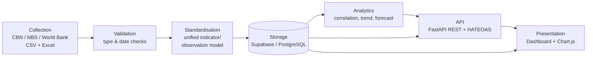
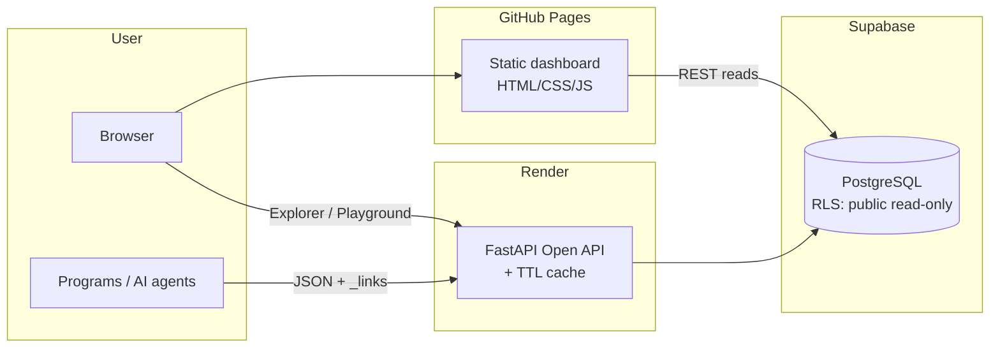
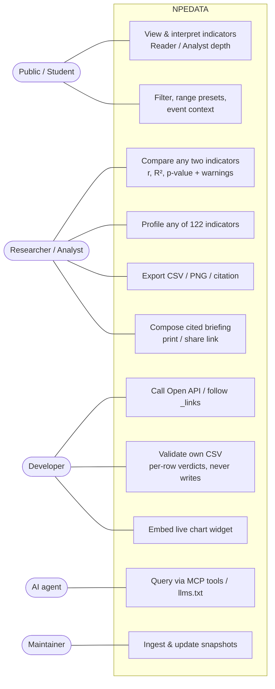
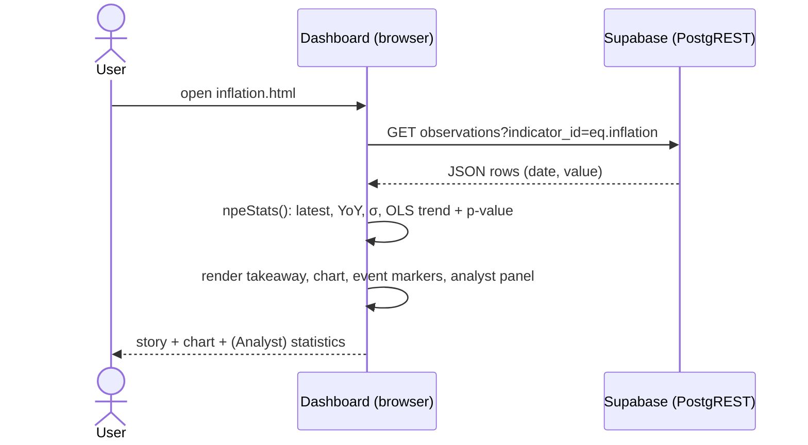
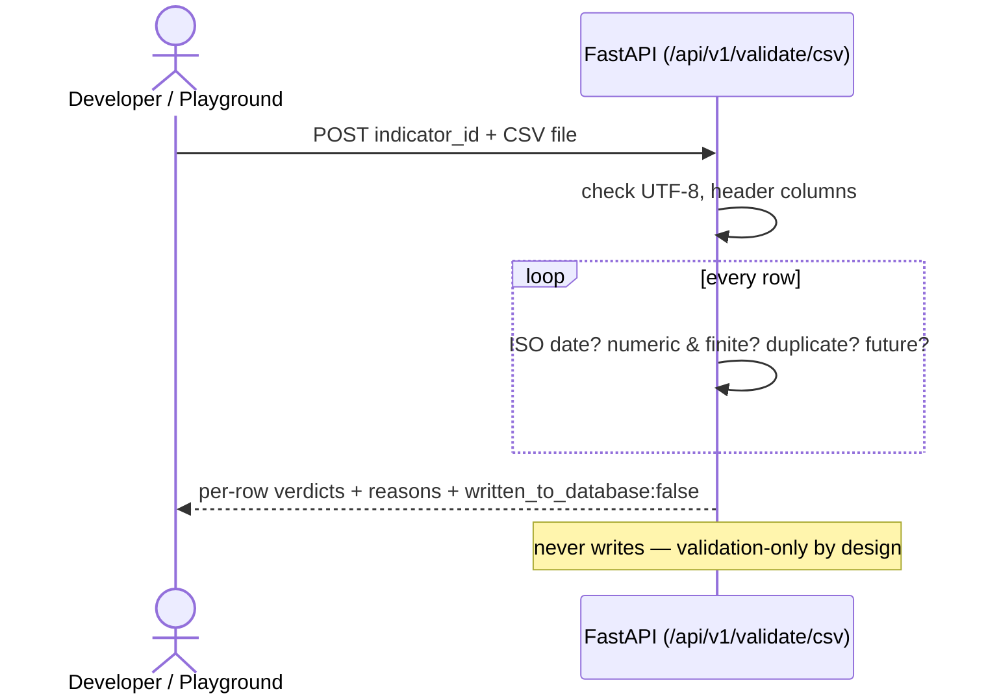
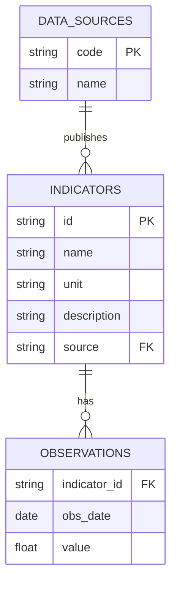

# DESIGN AND IMPLEMENTATION OF A WEB-BASED PUBLIC ECONOMIC DATA AGGREGATION AND ANALYTICS PLATFORM WITH AN OPEN API (NPEDATA)

> **Draft project report — fill the bracketed placeholders `[ ]` and reformat to your
> department's exact style guide (font, spacing, margins, chapter numbering, referencing
> style) before submission. Diagrams are embedded as rendered images (sources included in docs/figures and as
> Mermaid in this file). Nothing here is fabricated about the system; verify the
> external citations against the actual sources and format them per your school's guide.**

---

## FRONT MATTER

### Title Page
DESIGN AND IMPLEMENTATION OF A WEB-BASED PUBLIC ECONOMIC DATA AGGREGATION AND ANALYTICS PLATFORM WITH AN OPEN API (NPEDATA)

BY

TAOHEED ABDULMANAN OLAOSEBIKAN

22/10267

A PROJECT SUBMITTED TO THE DEPARTMENT OF

COMPUTER SCIENCE, COLLEGE OF SCIENCE AND INFORMATION

SCIENCE (COSIS), CALEB UNIVERSITY, LAGOS

IN PARTIAL FULFILLMENT OF THE REQUIREMENTS

FOR THE AWARD OF B.Sc. DEGREE

IN COMPUTER SCIENCE.

[MONTH] 2026

### Declaration
I declare that this project was written by me:

TAOHEED ABDULMANAN OLAOSEBIKAN _______________________

Student's Name — Signature & Date

### Certification
I certify that this project is ready for departmental and college presentation:

DR. ODUROYE _______________________

Head of Department's Name — Signature & Date

MISS ILORI DEBORAH _______________________

Supervisor's Name — Signature & Date

### Dedication
`[Your dedication.]`

### Acknowledgements
`[Acknowledge God, supervisor, family, friends, department.]`

### Abstract
Nigeria's official economic data is published by several institutions — the Central Bank
of Nigeria (CBN), the National Bureau of Statistics (NBS), and the World Bank — in
fragmented formats (PDF bulletins, spreadsheets and disparate web portals) that are
difficult for students, researchers, developers and the public to access, compare and
consume programmatically. This project designed and implemented **NPEDATA**, a web-based
platform that aggregates public Nigerian economic data into a single standardised
database, presents it through an interactive analytical dashboard, and exposes it through
a **free, open REST API** requiring no authentication. The system was built as a
seven-stage pipeline (collection, validation, standardisation, storage, analytics, API and
presentation) using an iterative prototyping methodology. The backend was implemented in
Python with the FastAPI framework and a Supabase (PostgreSQL) database; the frontend is a
static dashboard built with HTML, CSS and vanilla JavaScript using Chart.js for
visualisation. The API implements hypermedia controls at Richardson Maturity Model Level 3
(HATEOAS). The resulting platform holds **122 indicators** and approximately **12,100
observations** spanning 1960–2026, including exchange rates, inflation, GDP, monetary
policy rate, foreign reserves, multi-currency rates and CBN balance-sheet data. The system
was tested through unit tests, functional testing and web accessibility audits. The work
demonstrates that fragmented national economic data can be consolidated into an accessible,
correct and programmatically consumable resource using free and open-source tools.

**Keywords:** data aggregation, open data, REST API, HATEOAS, economic analytics, Nigeria,
FastAPI, data visualisation.

### Table of Contents
*(Generate automatically in your word processor once formatted.)*
Chapter One — Introduction · Chapter Two — Literature Review · Chapter Three — System
Analysis and Design · Chapter Four — System Implementation and Testing · Chapter Five —
Summary, Conclusion and Recommendations · References · Appendices.

### List of Figures
- Figure 3.1 Seven-stage system architecture
- Figure 3.1b Deployment view
- Figure 3.2 Use-case diagram
- Figure 3.3 Data-flow diagram (Level 0 / Level 1)
- Figure 3.4 Entity-relationship diagram
- Figure 3.5 Sequence diagram — loading an indicator page
- Figure 3.6 Sequence diagram — validating a CSV through the Open API
- Figures 4.1–4.13 System screenshots (deployed system)

### List of Tables
- Table 1.1 Data coverage summary
- Table 2.1 Comparison of related systems
- Table 2.2 Feature-level gap analysis
- Table 3.0 Methodology comparison
- Table 3.0b Weaknesses of the existing workflow
- Table 3.0c Existing vs proposed system
- Table 3.1 Functional requirements
- Table 3.1b Non-functional requirements with measurable targets
- Table 3.1c Use-case descriptions
- Table 3.2 Database schema (core tables)
- Table 3.2b Data dictionary
- Table 4.1 Test cases and results
- Table 5.1 Achievement of objectives

---

## CHAPTER ONE — INTRODUCTION

### 1.1 Background to the Study
Economic data is a public good. Decisions by students, academic researchers, journalists,
software developers and ordinary citizens increasingly depend on timely access to reliable
figures such as the inflation rate, the naira–dollar exchange rate, gross domestic product
(GDP) and foreign reserves. In Nigeria, this data is produced by credible institutions —
principally the Central Bank of Nigeria (CBN) and the National Bureau of Statistics (NBS),
supplemented by international bodies such as the World Bank — but it is **scattered** across
many locations and **published in formats designed for reading, not for computation**:
PDF statistical bulletins, individual Excel downloads, and web tables that differ in
structure from one indicator to the next.

The consequence is a high "friction cost" to using the data. A researcher who wants to
study, for example, the relationship between the 2023 foreign-exchange reform and the
subsequent inflation surge must locate two different datasets from two different portals,
reconcile their date formats and units, and manually align them before any analysis can
begin. A developer who wishes to build an application on top of this data has no single,
documented programming interface to call. This project addresses that gap by consolidating,
standardising and re-publishing the data through both a human-facing dashboard and a
machine-facing open Application Programming Interface (API).

### 1.2 Statement of the Problem
Public Nigerian economic data suffers from the following problems:
1. **Fragmentation** — indicators are spread across multiple institutional websites and
   documents with no common access point.
2. **Non-machine-readable formats** — much of the data is locked in PDFs and inconsistent
   spreadsheets, making programmatic use difficult.
3. **Inconsistent structure and units** — different indicators use different date
   granularities (daily, monthly, quarterly, annual) and units (naira thousands, naira
   millions, percentages, USD billions), with no unified schema.
4. **Absence of an open API** — there is no free, documented, authentication-free interface
   through which developers and researchers can retrieve this data programmatically.
5. **Limited analytical presentation** — the raw sources present tables and figures but
   little interactive, comparative or explanatory visualisation for non-expert users.

### 1.3 Aim and Objectives
**Aim:** To design and implement a web-based platform that aggregates public Nigerian
economic data into a single standardised store and makes it accessible through an
interactive analytics dashboard and a free open API.

**Objectives:** The specific objectives are to:
1. Collect public economic indicators from the CBN, NBS and World Bank and ingest them into
   a single repository.
2. Design a unified relational data model that standardises indicators, sources and
   observations regardless of frequency or unit.
3. Implement server-side analytics (period change, year-on-year comparison, trend and
   correlation) over the stored data.
4. Develop a free, documented REST API — with hypermedia controls (HATEOAS) — that requires
   no authentication.
5. Build an interactive web dashboard that visualises the indicators with clear,
   truthful, explanatory charts.
6. Test and evaluate the platform for correctness, usability and accessibility.

### 1.4 Scope of the Study
The project covers the aggregation, standardisation, storage, analysis, API exposure and
visualisation of a defined set of Nigerian public economic indicators. The current dataset
comprises **122 indicators** and approximately **12,100 observations** across the domains
summarised in Table 1.1. The dataset is a controlled case study; the architecture supports
continuing updates through CSV and API ingestion. The project does **not** attempt
automated real-time data collection, does not use artificial intelligence or machine
learning, and is not positioned as official national infrastructure.

**Table 1.1 — Data coverage summary**

| Domain | Frequency | Range | Source |
|---|---|---|---|
| Exchange rate (NGN/USD) | Monthly | 2020–2026 | CBN |
| Multi-currency (11 currencies, buy/central/sell) | Monthly | 2020–2026 | CBN |
| NFEM daily interbank rates | Daily | 2024–2026 (348 sessions) | CBN |
| Monetary Policy Rate | Per MPC meeting | 2020–2025 | CBN |
| Foreign reserves (gross/liquid/blocked) | Monthly | 2020–2026 | CBN |
| CBN balance sheet | Monthly | 2005–2023 | CBN |
| Annual financial statement | Annual | 1960–2012 | CBN |
| Currency in circulation | Monthly | 2002–2024 | CBN |
| Inflation (headline/food/core) | Monthly | 2003–2026 | NBS |
| GDP growth | Quarterly | 2020–2024 | NBS |
| Real GDP by sector (47 sectors) | Quarterly/Annual | 1981–2024 | NBS |
| Nominal GDP (USD) | Annual | 2020–2024 | World Bank |

### 1.5 Significance of the Study
The platform lowers the cost of accessing Nigerian economic data for four groups:
**students and researchers** gain a single, comparable, downloadable dataset; **developers**
gain a free open API to build upon; **journalists and the public** gain clear, explanatory
visualisations; and the **discipline of open data in Nigeria** gains a demonstrable,
reproducible reference implementation built entirely from free and open-source tools.

### 1.6 Limitations of the Study
1. Data collection is currently **manual** (downloaded from published sources and ingested),
   not an automated live feed.
2. Figures are **not real-time**; they are as current as the most recent ingested snapshot.
3. Coverage is bounded by what the sources publish (e.g. the CBN annual financial statement
   series ends in 2012).
4. Analytics are **classical statistics** (correlation, ordinary-least-squares trend and
   forecast); no machine learning is employed.
5. The project was developed and maintained by a single student within an academic
   timeframe.

### 1.7 Definition of Terms
- **Aggregation:** collecting data from multiple sources into one place.
- **API (Application Programming Interface):** a defined way for programs to request and
  exchange data.
- **REST:** an architectural style for web APIs using standard HTTP methods and resources.
- **HATEOAS:** *Hypermedia as the Engine of Application State* — REST responses that embed
  links guiding the client to related resources.
- **CBN / NBS:** Central Bank of Nigeria / National Bureau of Statistics.
- **NFEM:** Nigerian Foreign Exchange Market.
- **MPR:** Monetary Policy Rate — the CBN's benchmark interest rate.
- **Indicator / Observation:** an indicator is a measured series (e.g. inflation); an
  observation is a single value of that series on a date.

---

## CHAPTER TWO — LITERATURE REVIEW

### 2.1 Introduction
This chapter situates the project in its intellectual and practical context. It reviews the
concepts the platform is built on (open data, aggregation and standardisation, data
quality, REST and hypermedia, honest visualisation, and the classical statistics used by
the analytics layer); states the theoretical framework adopted; reviews the systems that
publish economic data today — international and Nigerian — and analyses the gap between
them; and reviews the enabling technologies from which the implementation stack was chosen.
The chapter closes with the specific, evidenced gaps that Chapter Three's design answers.

### 2.2 Conceptual Review

**2.2.1 Open data and open government data.** Open data is data that anyone can access,
use, modify and share for any purpose, subject at most to attribution (Open Knowledge
Foundation, n.d.). For *government* data, widely cited principles hold that public data
should be complete, primary, timely, accessible, **machine-processable**, non-discriminatory,
non-proprietary and licence-free (Open Government Working Group, 2007). Two of these
principles do the heaviest work in this project's context: *machine-processability* (a PDF
table is technically "published" but practically closed to computation) and
*accessibility* (data behind fragmented portals carries a real access cost even when it is
nominally free). The economic argument for open data is that it converts a cost centre
(publication) into public value, because every downstream user — researcher, journalist,
start-up — no longer repeats the same cleaning work. That argument is precisely the
motivation established by the Nigerian scenario in §3.3.

**2.2.2 Data aggregation, standardisation and tidy data.** Aggregation — gathering series
from disparate sources — is only useful when paired with **standardisation** into a common
structure. This project's storage design follows the "tidy data" principle (Wickham, 2014):
one observation per row, one variable per column, with metadata (unit, source, frequency)
separated from values. The practical force of the principle is that series of *any*
frequency — daily NFEM fixings, monthly CPI, quarterly GDP, the 1960–2012 annual financial
statement — can coexist in one relational table and be queried, compared and analysed by
one engine. The alternative (one bespoke table per dataset, mirroring each source file's
layout) is exactly the fragmentation the project set out to remove, reproduced inside the
database. The relational model itself (Codd, 1970) supplies the integrity machinery the
pipeline relies on: typed columns, foreign keys from observations to indicator metadata,
and a uniqueness constraint that makes duplicate ingestion impossible at the storage layer.

**2.2.3 Data quality.** Data-quality literature commonly assesses datasets along dimensions
of accuracy, completeness, consistency, timeliness and validity. Three of these dimensions
materially shaped this project. *Consistency*: the same institution publishes related
series in different units (the CBN's monthly balance sheet in thousands of naira; its
annual statement in millions), so a platform that merges them must carry unit metadata or
it will silently mislead — a defect class Chapter Four documents finding and fixing.
*Accuracy/validity*: aggregation multiplies the opportunities for error, which is why the
design elevates validation to a first-class pipeline stage (and, unusually, exposes it as a
public service). *Completeness*: no source is complete — series start and stop (services-
sector GDP, for instance, ends earlier than its siblings) — so honest presentation requires
stating coverage rather than papering over it.

**2.2.4 Web APIs, REST and the Richardson Maturity Model.** Representational State
Transfer (REST), introduced by Fielding (2000), is the dominant architectural style for
web APIs: data is modelled as *resources* addressed by URLs and manipulated with standard
HTTP verbs. The **Richardson Maturity Model** (Richardson & Ruby, 2007; Fowler, 2010)
grades REST maturity in three levels: Level 1 introduces distinct resources; Level 2 uses
HTTP verbs and status codes properly; Level 3 — **HATEOAS** (Hypermedia As The Engine Of
Application State) — embeds links in every response so a client can *discover* related
actions instead of hard-coding URLs. Level 3 is rarely implemented in practice, yet it is
disproportionately valuable for an *open* API whose consumers are strangers: the API
becomes self-describing, navigable from its root without documentation. For non-JSON
representations, the equivalent mechanism is the standard Link header (Nottingham, 2017).
This project implements Level 3 end-to-end and — unusually — demonstrates it interactively
(the HATEOAS Explorer of Chapter Four).

**2.2.5 Honest data visualisation.** The visualisation literature is, at its core, a
literature about *not misleading people*. Tufte (1983) argued for maximising the share of
ink that carries data and against decoration that distorts; a long line of practice
criticism identifies **dual-axis charts** as a special hazard, because two independent
y-scales let a designer manufacture or exaggerate correlation by sliding the scales.
Anscombe (1973) demonstrated, with four datasets sharing identical summary statistics but
wildly different shapes, why summary numbers must be accompanied by plots — and why plots
must be trustworthy. These findings become concrete design rules in this project: no dual
axes anywhere (different scales are shown as aligned panels or standardised z-scores);
axes are never truncated to dramatise; units are always stated; and every chart carries a
plain-language reading aid, because a correct chart that a non-expert cannot read is only
half honest.

**2.2.6 Statistical foundations of the analytics layer.** The platform's analytics are
deliberately classical. The **Pearson product-moment correlation coefficient** measures
linear association between paired series; its significance is assessed with a two-tailed
Student-t test, computed via the regularised incomplete beta function (Press et al., 2007).
**Ordinary least squares** supplies trend estimation, reported with the coefficient of
determination R². Two well-known cautions from the statistics literature are engineered
into the product rather than left in a footnote: correlation is not causation, and two
series that both trend over time will correlate spuriously (Granger & Newbold, 1974) — the
platform therefore re-computes correlations on first differences and warns the user when
the detrended association collapses. Statistical *significance* is likewise separated from
*strength* in the interface, because a weak correlation can be highly significant in a
large sample and users routinely conflate the two.

### 2.3 Theoretical Framework
Two established frameworks organise the design and the evaluation of this project:

1. **The FAIR data principles** — data should be **F**indable, **A**ccessible,
   **I**nteroperable and **R**eusable (Wilkinson et al., 2016). FAIR provides the yardstick
   for the *data* side of the platform: findability is served by one catalogue of 122
   indicators with searchable metadata; accessibility by a free dashboard and a
   no-authentication API; interoperability by one tidy schema with ISO-8601 dates and
   stated units; reusability by CSV export, citation generation, provenance fields and a
   reproducible seed snapshot.
2. **The Richardson Maturity Model** (§2.2.4) provides the yardstick for the *interface*
   side: the Open API is designed to, and verifiably does, operate at Level 3.

Together they frame the thesis of the project: fragmentation is not solved by another
website but by making the data itself FAIR and its interface hypermedia-driven.

### 2.4 Review of Related Systems
**FRED (Federal Reserve Economic Data, St. Louis Fed).** The reference point for what a
national economic-data platform can be: hundreds of thousands of series, a documented API,
charting, downloads and citations. Its relevance to Nigeria, however, is thin — Nigerian
coverage is limited to coarse international aggregates. FRED demonstrates the *category*
this project belongs to, while underlining that no Nigerian equivalent exists.

**World Bank Open Data.** Genuinely open, with a long-standing public API and standardised
indicator codes — this project both reviews it and *consumes* it (nominal GDP). Its
limitation is granularity: mostly annual, country-level aggregates, published with a lag.
It cannot answer intra-year questions (monthly inflation dynamics, daily FX behaviour)
that domestic sources cover.

**IMF Data.** Authoritative macroeconomic and financial statistics with programmatic
access, but like the World Bank it is oriented to cross-country aggregates rather than the
granular domestic series (NFEM daily fixings, CBN balance-sheet lines) this project carries.

**Our World in Data.** Not an API platform but the strongest available model of
*explanatory* data publication: every chart embedded in plain-language narrative, with
sources and methods disclosed. Its influence on this project is visible in the
storytelling pattern (what happened / why it matters / how to read it) attached to every
indicator page. Nigerian macroeconomic coverage is, again, limited to international
aggregates.

**Trading Economics and Statista.** Broad commercial aggregators with polished interfaces.
Both are largely paywalled, and their Nigerian series ultimately derive from the same CBN
and NBS publications. They demonstrate commercial demand for exactly the aggregation this
project performs — while their pricing model is itself part of the access problem for the
Nigerian students and journalists this project targets.

**Central Bank of Nigeria (CBN) publications.** The authoritative source for monetary and
financial data — and the clearest illustration of the machine-readability gap: statistics
are published across web pages, PDF bulletins and per-topic Excel files, with layouts and
units that vary between documents and no public API (§3.3 details the workflow this forces
on users).

**National Bureau of Statistics (NBS).** The authoritative source for CPI and GDP.
Publications are report-oriented (PDF with accompanying tables); series are periodically
rebased; and there is no unified programmatic interface for the indicators this project
covers.

**data.gov.ng and Nigerian open-data initiatives.** Nigeria has an official open-data
portal and has participated in international open-government initiatives; civic-technology
organisations (notably BudgIT, which visualises public budgets) demonstrate a domestic
ecosystem hungry for usable public data. These efforts, however, centre on budgets,
spending and static dataset publication rather than continuously usable, API-accessible
*economic time series* — the specific niche this project occupies.

### 2.5 Gap Analysis
**Table 2.2 — Feature-level gap analysis**

| Capability | FRED | World Bank | Trading Econ. | CBN | NBS | **NPEDATA** |
|---|---|---|---|---|---|---|
| Granular Nigerian series (daily/monthly) | No | No | Partial | Source | Source | **Yes (aggregated)** |
| Free, no-authentication API | Key req. | Yes | No | No | No | **Yes** |
| Hypermedia (HATEOAS L3) API | No | No | No | — | — | **Yes** |
| One standardised schema across sources | Yes | Yes | Yes | No | No | **Yes** |
| Correlation with significance (R², p) | No | No | No | — | — | **Yes** |
| Spurious-correlation warnings | No | No | No | — | — | **Yes** |
| Plain-language interpretation per series | No | Partial | No | No | No | **Yes** |
| Public validation-as-a-service | No | No | No | — | — | **Yes** |
| Citable exports (CSV/PNG/APA) | Yes | Yes | Partial | No | No | **Yes** |

The pattern is consistent: the systems with excellent access lack granular Nigerian data;
the systems with the Nigerian data lack machine access; and **no reviewed system, at any
scale, combines statistical honesty aids (significance, spurious-correlation detection)
with plain-language interpretation**. That combination — not any single feature — is the
gap NPEDATA fills.

### 2.6 Review of Enabling Technologies
- **API framework — FastAPI** (chosen) over Flask and Django REST Framework: automatic
  OpenAPI/Swagger documentation, Pydantic request validation (the ingestion layer's type
  checks come largely free), and async support, at a fraction of Django's footprint. An
  auto-documented API is not a convenience here but part of the product, since the API *is*
  a deliverable.
- **Database — PostgreSQL via Supabase** (chosen) over MySQL, MongoDB and Firebase: the
  data is inherently relational (sources → indicators → observations) with integrity
  constraints doing real work, which argues against document stores; Supabase adds a
  managed free tier, an auto-generated REST layer with row-level security (letting the
  dashboard read the database directly and safely), and standard PostgreSQL underneath —
  no lock-in.
- **Visualisation — Chart.js v4** (chosen) over D3.js and commercial libraries: D3 offers
  unlimited control at a steep cost in code volume for standard chart types; commercial
  options conflict with the open ethos. Chart.js's plugin system proved sufficient for the
  project's honesty-driven customisations (annotations, crosshairs, end-labels).
- **Frontend approach — static HTML/CSS/vanilla JavaScript** (chosen) over React/Vue:
  no build step, free static hosting, full view-source auditability, and a deliberate
  mitigation (a single shared library) for the approach's known drift weakness — assessed
  quantitatively in §4.9.
- **Hosting — GitHub Pages + Render + Supabase**: an entirely free, reproducible deployment
  whose trade-offs (cold starts) are measured and mitigated rather than hidden (§4.9).
- **Machine-consumer interfaces — MCP and llms.txt**: the Model Context Protocol allows AI
  assistants to call the API as tools, and llms.txt provides machine-readable platform
  discovery — extending "open" beyond human developers to automated consumers.

### 2.7 Summary
The review establishes four propositions that carry into the design chapter: (1) open,
machine-processable economic data is valuable and under-supplied in Nigeria, where the
authoritative sources publish for reading rather than computation; (2) mature conceptual
machinery exists to fix this — tidy data for standardisation, FAIR for openness, REST
Level 3 for the interface — and simply needs disciplined application; (3) the visualisation
and statistics literature supplies concrete honesty rules (no dual axes, significance
separated from strength, detrending checks) that can be engineered into a product rather
than left as caveats; and (4) no existing system, international or Nigerian, combines
granular Nigerian coverage, open machine access and built-in statistical honesty. Chapter
Three designs the system that does.

---

## CHAPTER THREE — SYSTEM ANALYSIS AND DESIGN

### 3.1 Introduction
This chapter presents the methodology adopted for the project and justifies it against the
alternatives; analyses how Nigerian public economic data is obtained today (the existing
system) using a concrete, realistic scenario; specifies the proposed system and its
requirements; and then develops the design in detail — architecture, use cases, data flow,
database design and data dictionary, API design, core algorithms, input/output design,
security and integrity design, and user-interface design. Throughout, design decisions are
tied back to the specific realities of the Nigerian data landscape identified in Chapters
One and Two, rather than treated as abstract choices.

### 3.2 Research and Development Methodology
An **iterative and incremental prototyping** methodology was adopted. The system was built
in successive increments — first the data model and ingestion scripts, then the Open API,
then the dashboard pages, then the analytics engine, and finally the refinement passes
(visualisation honesty, accessibility, stakeholder views) — with each increment reviewed,
validated against the stored data, and corrected before the next began.

**Justification against the alternatives.** Three candidate methodologies were considered:

**Table 3.0 — Methodology comparison**

| Methodology | Strength | Why it was unsuitable here |
|---|---|---|
| Waterfall | Strong documentation discipline; predictable phases | Assumes requirements are fully known up-front. The structure, units and quirks of CBN/NBS publications only became clear *during* ingestion (e.g. the CBN balance sheet is published in ₦'000 but its annual statement in ₦ millions) — a frozen upfront specification would have been wrong. |
| Scrum/agile (team-oriented) | Responsive to change; strong feedback cadence | Designed around a multi-person team with roles (product owner, scrum master); ceremony overhead is wasted on a single-developer academic project. |
| **Iterative prototyping (chosen)** | Working software early; each cycle absorbs what the previous one taught | Fits a solo developer, evolving data sources, and a supervisor-feedback loop; every iteration ended with a *data-truthfulness check* — re-verifying that what the screens claimed matched what the database contained. |

The distinctive feature of the process was that **verification was part of every iteration,
not a final phase**: after each increment, the figures displayed by the frontend were
cross-checked against the database, and discrepancies (documented in Chapter Four) were
fixed before new work began. This is why the methodology chapter and the testing chapter of
this report are tightly connected.

### 3.3 Analysis of the Existing System
"The existing system" is not a single piece of software — it is the *manual workflow* a
Nigerian data user must follow today, across the publishing practices of the three
institutions concerned:

- **The Central Bank of Nigeria (CBN)** publishes its exchange rates, money and credit
  statistics and its Statistical Bulletin through its website, largely as **PDF documents
  and per-topic Excel downloads**. Different datasets live on different pages, with
  different layouts, different date formats, and units that change between publications
  (thousands of naira in one table, millions in another). There is no public API.
- **The National Bureau of Statistics (NBS)** publishes the monthly Consumer Price Index
  and quarterly GDP reports as **PDF reports with accompanying spreadsheet tables**. Sector
  GDP tables run to dozens of columns, are periodically rebased, and are formatted for
  reading rather than for computation. There is likewise no public API for these series.
- **The World Bank** offers a proper API for its indicators, but its Nigerian coverage is
  coarse (mostly annual national aggregates), so it cannot substitute for the domestic
  sources.

**A concrete scenario (the contextual test case used throughout this report).** Consider a
final-year economics student in Lagos who wants to answer a genuinely topical question:
*"How did the June 2023 foreign-exchange unification reform relate to the 2023–2024
inflation surge?"* Under the existing system she must: (1) locate the CBN's exchange-rate
statistics page and download the monthly rates; (2) separately locate the NBS CPI report
archive and extract headline inflation month by month; (3) reconcile the two by hand —
different date formats, different file layouts; (4) align them in a spreadsheet and compute
a correlation herself, with no guidance on whether the result is statistically meaningful;
and (5) repeat all of it whenever a new month is published. In practice this is **hours to
days of work before analysis can even begin**, it is error-prone at every manual step, and
it is completely out of reach of a journalist on deadline, a secondary-school teacher, or a
software developer who simply wants the numbers in a program.

**Table 3.0b — Weaknesses of the existing workflow**

| # | Weakness | Consequence |
|---|---|---|
| 1 | Data scattered across institutions and pages | High search cost; no single point of access |
| 2 | PDF/spreadsheet formats designed for reading | Not machine-readable; manual re-typing and extraction |
| 3 | Inconsistent date formats, layouts and units | Reconciliation errors; silent unit mistakes (₦'000 vs ₦m) |
| 4 | No public API at CBN/NBS | Programmatic and third-party use effectively impossible |
| 5 | No built-in analysis or interpretation | Non-experts cannot judge trends or correlation reliability |
| 6 | Work is repeated by every user, every month | Nationally duplicated effort; no shared cleaned dataset |

### 3.4 Analysis of the Proposed System
The proposed system, NPEDATA, replaces that manual workflow with a maintained pipeline and
two access paths — an interactive dashboard for people and a free Open API for programs.

**The same scenario, replayed on NPEDATA.** The same student opens the *Compare Indicators*
page, selects *Headline Inflation* and *Exchange Rate NGN/USD*, and presses Compare. In
under a minute she has: both series date-aligned automatically; a single honest chart
(z-score standardised, not a misleading dual axis); the Pearson correlation **with its R²
and statistical-significance p-value**; a warning if the relationship is likely a shared
trend rather than a real association; the full paired data table; and a citable CSV export.
If she wants a document, the *Briefing Studio* composes a cited, print-ready brief of the
same indicators. What previously took days of error-prone preparation now takes minutes,
with the statistical caveats supplied rather than left to chance.

**Table 3.0c — Existing vs proposed system**

| Dimension | Existing workflow | NPEDATA |
|---|---|---|
| Access | Many sites, many files | One dashboard + one API |
| Format | PDF/Excel for reading | Standardised machine-readable series |
| Units/dates | Inconsistent, error-prone | One schema: ISO dates, stated units |
| Programmatic use | None (CBN/NBS) | Free REST API, HATEOAS Level 3, no key |
| Analysis | Do-it-yourself | Built-in stats with significance + honesty guards |
| Interpretation | None | Plain-language storytelling per indicator |
| Cost & repetition | Every user repeats the work | Cleaned once, shared by all |

### 3.5 System Requirements
Requirements were gathered from the scenario analysis in §3.3, the project objectives in
Chapter One, and supervisor feedback across iterations. They are stated per stakeholder
group where relevant.

**Table 3.1 — Functional requirements**

| ID | Requirement | Primary stakeholder |
|---|---|---|
| FR1 | Ingest indicators and observations from CSV/Excel source files into the database | Maintainer |
| FR2 | Validate incoming data (ISO dates, numeric finite values, duplicates, future dates) before storage | Maintainer / data quality |
| FR3 | Standardise all series — any frequency, any unit — into one observations schema | All |
| FR4 | Serve every indicator's series through documented REST endpoints, no authentication | Developers |
| FR5 | Embed hypermedia controls (`_links`, RFC 8288 `Link` header) so the API is navigable from the root (HATEOAS Level 3) | Developers |
| FR6 | Provide per-indicator analytics for the full catalogue: latest, period change, year-on-year, range, mean, volatility, OLS trend with R² and p-value, illustrative forecast | Researchers |
| FR7 | Provide cross-indicator comparison with Pearson r, R², significance p-value, and reliability warnings (short overlap, mixed frequency, shared-trend/detrended check) | Researchers |
| FR8 | Display interactive charts with plain-language storytelling (what happened / why it matters / how to read it) | Public / students |
| FR9 | Allow date-range filtering, range presets (1Y/3Y/5Y/All), and event-context markers on charts | All |
| FR10 | Export any indicator as CSV; download any chart as an attributed image; generate an APA citation | Researchers / students |
| FR11 | Offer two reading depths — plain-language Reader view and statistics-rich Analyst view — from one codebase | All |
| FR12 | Compose a cited, print-ready multi-indicator briefing, shareable as a regenerating link | Journalists / policymakers |
| FR13 | Expose the validation layer as a public service returning per-row verdicts, guaranteed never to write | Developers / demonstration |
| FR14 | Provide embeddable live chart widgets for third-party sites | Publishers |
| FR15 | Provide machine-readable platform discovery for AI agents (llms.txt; MCP server) | AI agents |

**Table 3.1b — Non-functional requirements (with measurable targets)**

| ID | Requirement | Target | Achieved (evidence in Ch. 4) |
|---|---|---|---|
| NFR1 | Correctness | Every displayed figure matches the stored data exactly | Systematic audit; defects found were fixed and documented |
| NFR2 | Accessibility | WCAG 2.1 AA contrast (≥ 4.5:1) | Lighthouse accessibility 100/100 |
| NFR3 | Performance | Interactive charts on consumer hardware; API responses in low seconds when warm | Warm endpoints ≈0.7–3 s; repeat reads cached to ≈1 s |
| NFR4 | Availability | Publicly hosted, free to access | GitHub Pages + Render + Supabase, all free tiers |
| NFR5 | Honesty | No misleading visual encodings; uncertainty stated | Single-axis policy, significance reporting, warning system |
| NFR6 | Portability/reproducibility | Rebuildable from the repository alone | Seed snapshot + setup.sql + pinned dependencies |
| NFR7 | Robustness | Malformed input never corrupts data or crashes the API | Adversarial test suite (incl. NaN/∞, 5,000-row floods) passes |

**Hardware and software requirements.** Development: a standard laptop, Python 3.10+, a
modern browser, internet access. Deployment: GitHub Pages (static frontend), Render
(FastAPI service), Supabase (managed PostgreSQL). End users need only a browser — including
on mobile; API consumers need any HTTP client.

### 3.6 System Architecture
The system is organised as a seven-stage pipeline (Figure 3.1).

**Figure 3.1 — Seven-stage architecture**




**What each stage does in this specific project:**
1. **Collect** — source files are obtained from the three institutions' published outputs
   (CBN statistical pages, NBS CPI/GDP report tables, World Bank indicators) as CSV/Excel.
2. **Validate** — loader scripts type-check every row, normalise dates to ISO 8601, and
   reject malformed records; during the build this stage caught and removed **1,435
   duplicate records** introduced by repeated ETL runs, reducing 13,535 raw rows to the
   12,100 clean observations in production — evidence that the stage does real work.
3. **Standardise** — every series, whether daily NFEM rates or the 1960–2012 annual
   financial statement, is reduced to the same `(indicator_id, obs_date, value)` shape,
   with unit and source held as metadata.
4. **Store** — Supabase-hosted PostgreSQL with a uniqueness constraint preventing
   re-duplication; public read access is gated by row-level security.
5. **Analyse** — classical statistics (descriptives, OLS trend, Pearson correlation with a
   Student-t significance test) computed in the API and, for interactive pages, in the
   browser from the same data.
6. **API** — FastAPI service exposing the catalogue as versioned REST with hypermedia
   controls; ingestion endpoints are demo-safe by default.
7. **Present** — the static dashboard, which deliberately reads the database's REST layer
   directly so the primary user experience does not depend on the API host being awake.

**Figure 3.1b — Deployment view**



The two data paths are intentional: the dashboard's independence from the API host is an
availability decision (assessed further in §4.9).

### 3.7 System Design

**3.7.1 Use-case design (Figure 3.2)**




**Table 3.1c — Use-case descriptions (three representative cases in full)**

**UC-1: Interpret an indicator (Public/Student).**
*Precondition:* none — public site. *Main flow:* (1) user opens an indicator page, e.g.
Inflation; (2) system fetches the series and renders the headline stat, the plain-language
story blocks, and the chart with event markers; (3) user narrows the window with a range
preset; (4) optionally flips the navbar dial to *Analyst*, revealing the statistical panel
(range, mean, σ, OLS trend with R² and p-value). *Postcondition:* none (read-only).
*Alternative flow:* data unavailable → a labelled error state with retry, never a blank chart.

**UC-2: Test a correlation hypothesis (Researcher).**
*Precondition:* none. *Main flow:* (1) researcher opens Compare Indicators and selects any
two of the 122 indicators; (2) system date-aligns the two series on their common
observations; (3) system computes Pearson r, R², and a two-tailed p-value, and plots both
series z-score-standardised on one axis; (4) system runs the reliability guards — if the
overlap is short, the frequencies differ, or the detrended (month-to-month change)
correlation collapses relative to the level correlation, a visible warning explains the
caveat; (5) researcher exports the paired table as CSV or copies the citation.
*Postcondition:* none. *Alternative flow:* no overlapping dates → explanatory notice, no
correlation shown.

**UC-3: Validate a dataset via the API (Developer).**
*Precondition:* developer has a CSV with `obs_date,value` columns. *Main flow:* (1) client
POSTs the file with a target `indicator_id` to `/api/v1/validate/csv` (or uses the Pipeline
Playground UI); (2) system checks the header, then judges every row — ISO date, numeric and
finite value, no in-file duplicate date, no future date; (3) system returns a per-row
verdict report with reasons and normalised values, plus `written_to_database: false`.
*Postcondition:* **no state change ever** — the endpoint is validation-only by design.
*Alternative flows:* unknown indicator → 404 listing valid ids; non-UTF-8 file or missing
columns → 400 with the specific message.

**3.7.2 Data-flow and interaction design.** At Level 0, external sources supply raw data to
the NPEDATA process, which stores standardised observations and returns charts, JSON and
CSV to users. At Level 1 the process decomposes into *Ingest → Validate → Store → Query →
Analyse → Serve*. Two representative interactions are shown as sequence diagrams.

**Figure 3.5 — Sequence: loading an indicator page**




**Figure 3.6 — Sequence: validating a CSV through the Open API**




**3.7.3 Database design (Figure 3.4 — ERD)**




**Table 3.2 — Database schema (core tables)**

| Table | Key columns | Purpose |
|---|---|---|
| `data_sources` | code, name | The publishing institutions (CBN, NBS, World Bank) |
| `indicators` | id, name, unit, description, source | Metadata for each series |
| `observations` | indicator_id, obs_date, value | One value per indicator per date (tidy/long form) |

The long/tidy `observations` table lets indicators of any frequency or unit coexist in one
structure — the key standardisation decision of the project.

**Table 3.2b — Data dictionary**

*Table `data_sources`*
| Field | Type | Constraints | Description | Example |
|---|---|---|---|---|
| code | text | PK | Short institution code | `CBN` |
| name | text | not null | Full institution name | Central Bank of Nigeria |

*Table `indicators`*
| Field | Type | Constraints | Description | Example |
|---|---|---|---|---|
| id | text | PK, snake_case | Stable series identifier | `exchange_rate` |
| name | text | not null | Human-readable name | Exchange Rate NGN/USD |
| unit | text | not null | Unit **as stored** (critical — see note) | Naira per USD |
| description | text | — | What the series measures | … |
| source | text | FK → data_sources.code | Publishing institution | `CBN` |

*Table `observations`*
| Field | Type | Constraints | Description | Example |
|---|---|---|---|---|
| indicator_id | text | FK → indicators.id; unique with obs_date | Which series | `inflation` |
| obs_date | date | ISO 8601; unique with indicator_id | Observation date | 2024-12-01 |
| value | numeric | not null, finite | The observation, in the indicator's stored unit | 34.80 |
| source | text | — | Provenance tag for the row | `NBS` |

*Unit note (a genuine design lesson of this project):* stored units differ by series — the
CBN monthly balance sheet is in ₦'000, its annual statement in ₦ millions, GDP sectors in
₦ billions. The presentation layer therefore carries a single scale-aware formatter so
values are always displayed honestly (e.g. ₦81.04T); Chapter Four documents the defects
this discipline caught.

**3.7.4 API design.** The API is versioned under `/api/v1/` and returns JSON with an
embedded `_links` object (HATEOAS). Representative endpoints include `/summary`, per-indicator
series endpoints (`/gdp`, `/inflation`, `/exchange-rate`, `/fx-reserves`, `/nfem`,
`/multicurrency`, …), `/analytics/{indicator_id}`, `/coverage`, `/export/{indicator_id}`
(CSV, with an RFC 8288 `Link` header), and `/validate/csv` (the validation layer as a
service). Four design rules govern every endpoint: (1) **versioned paths** so future changes
cannot break consumers; (2) **hypermedia everywhere** — every JSON response includes
`_links` (self, index, docs, related resources, per-indicator analytics/export), making the
whole API navigable from the root; (3) **no authentication, open CORS** — the mission is
access; (4) **writes are demo-safe by default** — ingestion validates and normalises but
persists nothing unless the server-side `ALLOW_DATA_WRITES` flag *and* an explicit
`commit=true` are both set.

**3.7.5 Algorithm design.** The three core computations, as implemented:

*Validation (per CSV row):*
```
for each row (r = 2, 3, …):
    problems ← []
    if obs_date does not parse as YYYY-MM-DD:        problems += "ISO date required"
    if value does not parse as a number:             problems += "numeric required"
    else if value is NaN or ±Infinity:               problems += "finite number required"
    if obs_date parsed:
        if obs_date > today:                         problems += "future date"
        if obs_date already seen in this file:       problems += "duplicate date"
    emit {row, status: valid|rejected, reasons, normalized}
never write; return counts + verdicts
```

*Pearson correlation with significance:*
```
align the two series on common dates → x[], y[] (n pairs)
r ← Σ(xᵢ−x̄)(yᵢ−ȳ) / √(Σ(xᵢ−x̄)² · Σ(yᵢ−ȳ)²)
t² ← r²(n−2)/(1−r²)
p ← I_{(n−2)/((n−2)+t²)}((n−2)/2, 1/2)        # regularised incomplete beta (two-tailed)
report r, R² = r², p; warn if n < 8, frequencies differ,
or |r_detrended| (on month-to-month changes) ≪ |r|
```

*OLS trend and illustrative forecast:*
```
slope ← Σ(i−ī)(vᵢ−v̄) / Σ(i−ī)²   over index i = 0…n−1
intercept ← v̄ − slope·ī
trend line ← slope·i + intercept; extrapolate k periods, labelled "illustrative only"
```

**3.7.6 Input and output design.** *Inputs:* date-range pickers (From/To) on every data
page; range-preset chips (1Y/3Y/5Y/All); grouped indicator selectors driven by the live
catalogue (single-select for profiles, multi-select for briefings); a currency-converter
amount field; CSV upload/paste in the Playground; URL query parameters (`?from=&to=&view=`,
`?ids=`) so any composed view is shareable and regenerable. All inputs are validated
client-side and, for the API, server-side. *Outputs:* interactive charts with plain-language
captions; statistic tiles; sortable data tables; CSV downloads; attributed PNG chart
exports; APA citations; the print-ready briefing document; and machine outputs (JSON with
`_links`, the llms.txt discovery file).

**3.7.7 Security and data-integrity design.** The system is public-read by design, so the
security question is *integrity*, not secrecy: (1) the browser-side database credential is
a **public anonymous key gated by PostgreSQL row-level security** — read-only; it cannot
modify data, so shipping it client-side is safe and intentional; (2) **all write paths are
demo-safe by default** (`ALLOW_DATA_WRITES=false`), and the public validation endpoint is
*incapable* of writing; (3) a **uniqueness constraint** on (indicator_id, obs_date)
prevents duplicate ingestion at the database level; (4) user-supplied content echoed by the
frontend (e.g. Playground verdicts) is HTML-escaped, and adversarial inputs — script tags,
NaN/Infinity, 5,000-row floods — are part of the test suite; (5) real secrets (service
keys) exist only as server-side environment variables, never in the repository.

**3.7.8 User-interface design.** The dashboard uses a dark "Lagos Noir" visual theme with a
consistent per-indicator storytelling pattern — a headline statistic, three short
explanatory blocks (*what happened / why it matters / how to read it*), the chart(s), and a
data table — plus a "markets-terminal" chart treatment (range selectors, hover crosshair,
end-of-line value tags, event markers). Two design policies are treated as requirements
rather than aesthetics: **honest encoding** (no dual y-axes — different scales are shown as
aligned panels or z-scores; no data-censoring transforms; units always stated) and
**layered depth** — the Reader/Analyst dial serves the general public and researchers from
the same pages instead of forking the interface per audience. Accessibility (WCAG 2.1 AA
contrast, keyboard focus, aria labelling, reduced-motion support) is a design constraint
throughout.

---

## CHAPTER FOUR — SYSTEM IMPLEMENTATION AND TESTING

### 4.1 Introduction
This chapter describes how the design was implemented, the tools used, and how the system
was tested and evaluated.

### 4.2 Development Tools and Technologies
- **Backend:** Python 3, FastAPI, Uvicorn (ASGI server), `supabase-py`.
- **Database:** Supabase (managed PostgreSQL), accessed with row-level security.
- **Frontend:** HTML5, CSS3, vanilla JavaScript, Chart.js v4 (with annotation and zoom
  plugins).
- **Hosting/DevOps:** GitHub (version control), GitHub Actions (CI/deploy), GitHub Pages
  (dashboard), Render (API).
- **Testing:** Pytest, browser-based functional testing, Lighthouse accessibility audits.

### 4.3 Implementation of the Pipeline
1. **Collection.** Source data was obtained from CBN, NBS and World Bank publications and
   arranged into CSV/Excel inputs; loader scripts (`project/etl/`, `project/database/seed/`)
   read these into the database. A reproducible seed snapshot (`observations.csv`, ~12,100
   rows) allows the whole dataset to be recreated.
2. **Validation.** Ingestion validates each row's types and dates and normalises fields
   before any write; invalid rows are rejected with clear errors.
3. **Standardisation.** All series are reduced to the common `(indicator_id, obs_date,
   value)` observation form with indicator metadata (unit, source, frequency) held
   separately.
4. **Storage.** Data resides in three PostgreSQL tables on Supabase; the anon key is public
   and read-only via row-level security.
5. **Analytics.** The API computes latest value, period and year-on-year change, trend
   direction, a simple ordinary-least-squares forecast, and Pearson correlation (e.g.
   inflation vs exchange rate). The compare/analytics pages replicate correlation
   client-side in JavaScript.
6. **API.** FastAPI exposes the versioned endpoints, auto-generates OpenAPI/Swagger docs at
   `/docs`, and adds HATEOAS `_links` to every response. The server runs with proxy headers
   in production so hypermedia links honour HTTPS.
7. **Presentation.** The static dashboard fetches data (directly from Supabase for the
   charts) and renders it with Chart.js, applying the storytelling and terminal-chart
   patterns.

### 4.4 Key Implementation Highlights
- A **single canonical `main.py`** consolidates the API; credentials are read from the
  environment with safe fallbacks.
- **Unit correctness** was treated as a first-class concern: raw balance-sheet values
  (stored in naira thousands) and financial-statement values (naira millions) are converted
  and clearly labelled (e.g. naira trillions) in the UI, avoiding misleading axes.
- **Reusable charting utilities** (`shared.js`) provide the takeaway stat, range selector,
  crosshair and end-of-line label components used consistently across pages.

### 4.5 Analytical Methods and Their Limitations
The analytics are computed transparently in the browser, directly from the aggregated
data, and cover the full catalogue of indicators. The methods are deliberately classical
and explainable — no black-box models — so any result can be reproduced and checked. This
reflects a guiding principle of the project: to be **correct and honest over impressive**,
and to state plainly when a result is unreliable.

**Methods implemented:**
1. **Descriptive statistics** — latest value, period and year-on-year change, minimum and
   maximum with their dates, mean, standard deviation (as a volatility measure) and the
   coefficient of variation.
2. **Trend estimation** — Ordinary Least Squares (OLS) linear regression, reporting the
   slope, the coefficient of determination (R²) and the correlation of the series with time.
3. **Correlation analysis** — the Pearson product-moment correlation coefficient (r) on two
   series' date-aligned observations, reported together with R² (the share of variance
   explained) and a two-tailed statistical-significance p-value derived from the Student-t
   distribution (via the regularised incomplete beta function).
4. **Standardisation** — z-score normalisation (standard deviations from each series' own
   mean), so two indicators measured in different units can be compared on a single, honest
   axis rather than a misleading dual axis.
5. **Trend-robustness (spurious-correlation) check** — the detrended, first-difference
   correlation is compared with the level correlation to flag relationships that are driven
   mainly by a shared trend rather than a direct association.
6. **Forecasting** — linear extrapolation of the OLS trend a few periods ahead, presented
   explicitly as illustrative only.
7. **Reliability guards** — automatic warnings for correlations computed over very few
   overlapping observations, or between series of different reporting frequency.

**Acknowledged limitations of the analytical layer:**
1. **Not real-time.** Figures are a manually-ingested snapshot; collection is manual, not an
   automated live pipeline.
2. **No seasonal adjustment.** Monthly and quarterly series are presented as reported.
3. **Simple forecast.** The forecast is a straight-line OLS extrapolation without a
   confidence/prediction interval; no ARIMA, exponential-smoothing or other time-series
   model is used.
4. **Association, not causation.** The platform measures correlation only; it performs no
   causality testing (e.g. Granger causality) or lead/lag cross-correlation analysis.
5. **Short or mixed-frequency comparisons are weaker.** These are flagged to the user but
   remain available.
6. **Coverage is bounded by the sources** — some series end earlier than others (for
   example, the annual financial statement ends in 2012).

These limitations are presented deliberately: a smaller, correct and trustworthy platform is
preferred over a larger one that overstates its capabilities, and each item is a candidate
for the future work discussed in Chapter Five.

### 4.6 System Screenshots
The figures below are actual captures of the deployed system.


### 4.7 Testing and Validation
The platform was validated through several complementary strands, combining automated tests,
independent statistical validation, and systematic data auditing.

**1. Automated unit testing (Pytest).** The Open API is covered by a suite of **16 unit
tests** in `tests/test_main.py`, exercising the read endpoints, the demo-safe ingestion path,
and — importantly — asserting the presence and correctness of the HATEOAS `_links` blocks
that make the API Level 3. All 16 tests pass.

**2. Statistical validation.** Because the analytics report inferential statistics, the
underlying mathematics was validated independently of the user interface:
- the correlation-significance function (a two-tailed Student-t p-value computed via the
  regularised incomplete beta function) was checked against known reference cases — for
  example, r = 0.70 over n = 75 yields p ≈ 4 × 10⁻¹², while r = 0.20 over n = 20 yields
  p ≈ 0.40 (correctly *not* significant);
- the scale-aware value formatter was unit-tested across every unit type in the catalogue
  (percentages, exchange rates, USD billions, and the naira thousands/millions/billions
  scales), confirming for instance that CBN total assets render as ₦81.04T rather than a raw
  or mislabelled figure;
- the analytics engine was exercised against deliberately awkward real series — a daily
  series (NFEM), a series containing negative values (government deposits), a sparse
  four-point series (AED rates), a count series, and a series whose coverage ends early
  (services GDP) — confirming correct output and no crashes on these edge cases.

**3. Data-truthfulness auditing.** Every chart's stated figures, ranges and units were
cross-checked against the stored data. This systematic audit found and corrected genuine
defects, including: a data-censoring routine that silently capped some balance-sheet series
(hiding the gold revaluation and understating bankers' deposits); unit mislabels that
mis-scaled monetary values by a factor of a thousand; a chart titled an "inverse
relationship" that the data showed to be a weak *positive* one (r ≈ 0.33); and a sector
comparison that inadvertently placed figures from different years side by side. Each defect
was verified against the original source figures and corrected.

**4. Functional and visual verification.** Every dashboard page was loaded against the live
database and inspected — including through automated screenshots — to confirm that charts,
date filters, indicator comparisons, table sorting and CSV downloads behave correctly, and
that the responsive layout holds across screen widths.

**5. Accessibility testing.** Colour contrast and related criteria were checked against the
WCAG 2.1 AA standard (contrast ratio ≥ 4.5:1) using Lighthouse audits; contrast defects
found during development were corrected.

**6. API testing.** Endpoints were exercised manually through the browser, the
auto-generated Swagger UI at `/docs`, and `curl`, confirming correct payloads, CSV export
with the RFC 8288 `Link` header, and the demo-safe behaviour of the ingestion endpoints.

**Table 4.1 — Representative test cases**

| # | Test | Expected | Result |
|---|---|---|---|
| 1 | `GET /api/v1/summary` | 5 headline indicators + `_links` | Pass |
| 2 | `GET /api/v1/analytics/inflation` | latest, change, trend, forecast | Pass |
| 3 | `GET /api/v1/export/exchange_rate` | CSV + RFC 8288 `Link` header | Pass |
| 4 | `POST /api/v1/ingest/csv` (demo mode) | validated, not written to DB | Pass |
| 5 | Full Pytest suite | 16 / 16 tests pass | Pass |
| 6 | Correlation p-value vs known cases | matches reference values | Pass |
| 7 | Value formatter across all unit types | correct scale and symbol | Pass |
| 8 | Analytics engine on edge-case series | no crash, correct output | Pass |
| 9 | Chart figures vs stored data | exact match, correct units | Pass (after fixes) |
| 10 | Accessibility contrast | ≥ 4.5:1 (WCAG 2.1 AA) | Pass |

### 4.8 Results and Discussion
The implemented platform successfully aggregates 122 indicators and ~12,100 observations
into one queryable store, serves them through a documented open API with hypermedia
controls, and presents them through an accessible analytical dashboard. Testing confirmed
that the API behaves as specified and that the visualisations are both correct and
clearly explained. The unit-correctness work in particular removed a class of misleading
displays, aligning the presentation with the objective of truthful analytics.

---

### 4.9 Technology-Stack Assessment
The stack was re-evaluated at the end of implementation against the question: *is any
technology choice limiting the platform?* The assessment was evidence-based, using the
measurements gathered during stress testing rather than opinion.

**Choices that proved themselves (kept deliberately):**
- **Static HTML/CSS/vanilla JavaScript frontend (no framework, no build step).** At this
  scale it delivered a 100/100 Lighthouse accessibility score, zero build/dependency
  maintenance, free hosting, and complete auditability — any panelist can View-Source the
  entire implementation. The known weakness of the approach (duplicated code drifting apart
  across pages) was addressed architecturally with a single shared library (`shared.js`)
  carrying all chart, analytics and UI logic, so a fix in one place applies everywhere.
- **FastAPI + Supabase (PostgreSQL).** Handled every stress-test scenario (including a
  5,000-row adversarial CSV) with 17/17 live endpoints passing; the relational
  tidy-observations model absorbed daily, monthly, quarterly and annual series in one schema.

**Measured limitations, and what was done about each:**
1. **Free-tier API cold starts (~30 s).** Render's free tier sleeps after idle. Mitigated
   three ways: a scheduled keep-alive workflow pings the service every 10 minutes; every
   API-dependent page shows an explicit "server waking" state instead of appearing broken;
   and the dashboard itself is architecturally independent of the API (it reads the
   database's REST layer directly), so the primary user experience cannot be taken down by
   the API host.
2. **Repeated-query latency.** The multi-currency endpoint (33 series) measured ~5.4 s per
   request because every call repeated 33 database round-trips. A size-capped, 5-minute-TTL
   in-process cache was added at the data-access layer — appropriate because the dataset
   changes only at ingestion time — cutting repeat responses to well under a second and
   reducing database load. This is the standard first scaling step (caching) applied inside
   the existing stack rather than replacing it.
3. **PostgREST row-window limits.** Bulk reads return at most ~1,000 rows per request; the
   coverage heatmap therefore fetches the full 12,100-observation dataset with paged
   parallel requests. Acceptable at this scale; a server-side aggregate endpoint is the
   documented next step if the dataset grows.

**Scaling path (if requirements outgrow the stack):** the layers are decoupled, so each can
be upgraded independently without a rewrite — the database is already PostgreSQL (scales to
a paid tier unchanged); the API is containerisable FastAPI (moves to an always-on host,
gaining zero-cold-start); and because all data access goes through the documented Open API
or the database's REST layer, the frontend could be rebuilt in any framework without
touching the backend. The conclusion of the assessment is that the stack is not the
limiting factor at the platform's current scope; where friction was measured, it was
engineered around within the stack, and the upgrade path for each layer is documented.

## CHAPTER FIVE — SUMMARY, CONCLUSION AND RECOMMENDATIONS

### 5.1 Summary
This project set out to solve the fragmentation and inaccessibility of public Nigerian
economic data. It designed and implemented NPEDATA, a seven-stage platform that collects,
validates, standardises, stores, analyses, and publishes economic indicators through both a
dashboard and a free open API. All stated objectives were met: the data was aggregated into
a unified model; analytics were implemented; a HATEOAS-compliant API and an accessible,
explanatory dashboard were delivered; and the system was tested for correctness and
accessibility.

**Table 5.1 — Achievement of objectives**

| # | Objective (Ch. 1) | Delivered evidence |
|---|---|---|
| 1 | Collect indicators from CBN, NBS, World Bank | 122 indicators, ~12,100 observations; reproducible seed snapshot |
| 2 | Unified standardised data model | One tidy observations schema holding daily-to-annual series; data dictionary §3.7.3 |
| 3 | Server-side analytics | Descriptives, YoY, OLS trend, correlation with R²/p-value; TTL-cached API |
| 4 | Free documented HATEOAS API | Versioned endpoints, _links throughout, RFC 8288 on CSV; interactive Explorer |
| 5 | Clear, truthful dashboard | Storytelling pattern, single-axis policy, Reader/Analyst dial, WCAG AA 100/100 |
| 6 | Test and evaluate | 24-test suite, statistical validation, adversarial stress test, live sweeps (§4.7) |

### 5.2 Conclusion
The work demonstrates that Nigeria's scattered, non-machine-readable public economic data
can be consolidated into a single, correct, and programmatically consumable resource using
only free and open-source tools. In doing so it lowers the barrier to using this data for
students, researchers, developers and the public, and provides a reproducible reference for
open-data practice in the Nigerian context.

### 5.3 Recommendations and Future Work
1. **Automate collection** with scheduled scrapers/connectors to the source portals to
   reduce manual effort and improve freshness.
2. **Expand coverage** to more indicators, sub-national (state-level) data, and longer
   historical series.
3. **Add authentication tiers and rate limiting** for heavier API consumers.
4. **Introduce richer analytics** (seasonality, more forecasting methods) while retaining
   transparency.
5. **Provide client SDKs** (e.g. Python/JavaScript) to further ease API adoption.
6. **Formalise data-quality workflows** (automated validation dashboards, provenance).

### 5.4 Contribution to Knowledge
The project contributes a working, reproducible, open reference implementation of a unified
Nigerian public-economic-data platform with a HATEOAS-level open API — an artefact that did
not previously exist in freely accessible form — and a demonstration that such a platform is
achievable with free tooling.

---

## REFERENCES
*(Sample list — verify each source and reformat to your department's citation style, e.g.
APA 7th. Add the specific works your report actually cites.)*

- Anscombe, F. J. (1973). Graphs in statistical analysis. *The American Statistician, 27*(1), 17–21.
- BudgIT. (n.d.). *BudgIT — making public data meaningful*. https://www.budgit.org
- Codd, E. F. (1970). A relational model of data for large shared data banks. *Communications of the ACM, 13*(6), 377–387.
- Federal Reserve Bank of St. Louis. (n.d.). *FRED — Federal Reserve Economic Data*. https://fred.stlouisfed.org
- Fielding, R. T. (2000). *Architectural Styles and the Design of Network-based Software
  Architectures* (Doctoral dissertation). University of California, Irvine.
- Richardson, L., & Ruby, S. (2007). *RESTful Web Services*. O'Reilly Media.
- Fowler, M. (2010). *Richardson Maturity Model*. martinfowler.com.
- Central Bank of Nigeria. (n.d.). *Statistics Database*. https://www.cbn.gov.ng
- National Bureau of Statistics. (n.d.). *NBS Data Portal*. https://www.nigerianstat.gov.ng
- World Bank. (n.d.). *World Bank Open Data*. https://data.worldbank.org
- FastAPI. (n.d.). *FastAPI Documentation*. https://fastapi.tiangolo.com
- PostgreSQL Global Development Group. (n.d.). *PostgreSQL Documentation*.
  https://www.postgresql.org/docs
- Chart.js. (n.d.). *Chart.js Documentation*. https://www.chartjs.org/docs
- Granger, C. W. J., & Newbold, P. (1974). Spurious regressions in econometrics. *Journal of Econometrics, 2*(2), 111–120.
- International Monetary Fund. (n.d.). *IMF Data*. https://data.imf.org
- Nottingham, M. (2017). *Web Linking* (RFC 8288). Internet Engineering Task Force.
- Open Government Working Group. (2007). *Eight principles of open government data*. https://opengovdata.org
- Open Knowledge Foundation. (n.d.). *The Open Definition*. https://opendefinition.org
- Our World in Data. (n.d.). *Our World in Data*. https://ourworldindata.org
- Press, W. H., Teukolsky, S. A., Vetterling, W. T., & Flannery, B. P. (2007). *Numerical Recipes: The Art of Scientific Computing* (3rd ed.). Cambridge University Press.
- Tufte, E. R. (1983). *The Visual Display of Quantitative Information*. Graphics Press.
- Wickham, H. (2014). Tidy data. *Journal of Statistical Software, 59*(10), 1–23.
- Wilkinson, M. D., Dumontier, M., Aalbersberg, I. J., et al. (2016). The FAIR Guiding Principles for scientific data management and stewardship. *Scientific Data, 3*, 160018.

---

## APPENDICES
- **Appendix A — Sample API response** (showing the `_links` HATEOAS block).
- **Appendix B — Selected source code** (data model, an endpoint, the analytics function).
- **Appendix C — Full list of endpoints** (see project `README.md`).
- **Appendix D — Screenshots** (full set referenced in Chapter Four).
- **Appendix E — Repository & live links:**
  - Source: https://github.com/ANTD-CR7/nigerian-dashboard
  - Dashboard: https://antd-cr7.github.io/nigerian-dashboard/
  - API: https://npedata-api.onrender.com (docs at `/docs`)
