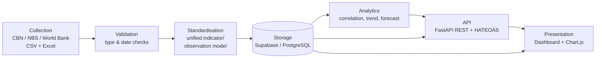
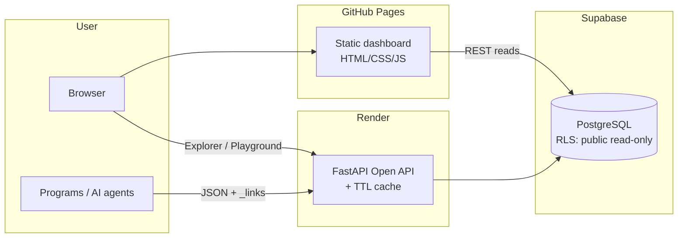
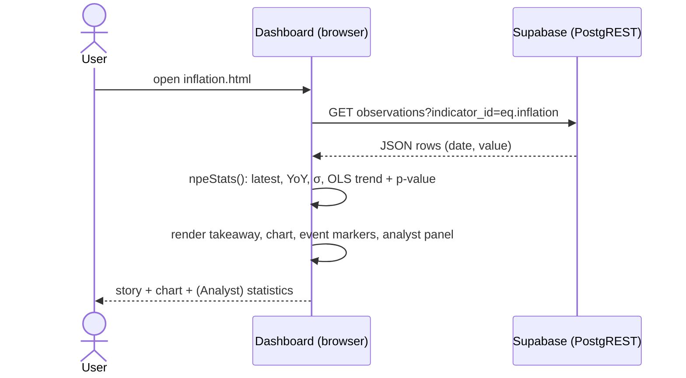
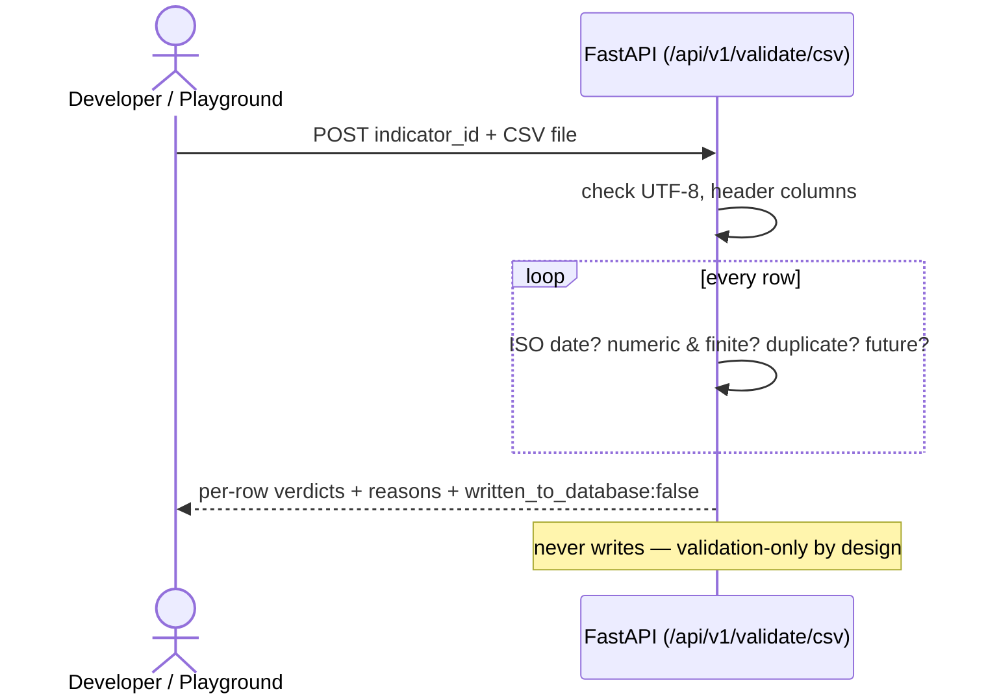
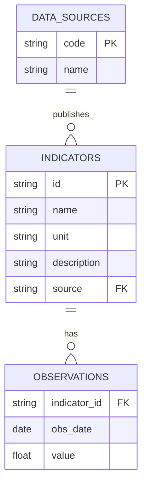

# DESIGN AND DEVELOPMENT OF A NIGERIAN PUBLIC ECONOMIC DATA AGGREGATION AND ANALYTICS PLATFORM WITH OPEN API ACCESS: A 2020–2026 CASE STUDY

> **Draft project report — fill the bracketed placeholders `[ ]` and reformat to your
> department's exact style guide (font, spacing, margins, chapter numbering, referencing
> style) before submission. Diagrams are embedded as rendered images (sources included in docs/figures and as
> Mermaid in this file). Nothing here is fabricated about the system; verify the
> external citations against the actual sources and format them per your school's guide.**

---

## FRONT MATTER

### Title Page
DESIGN AND DEVELOPMENT OF A NIGERIAN PUBLIC ECONOMIC DATA AGGREGATION AND ANALYTICS PLATFORM WITH OPEN API ACCESS: A 2020–2026 CASE STUDY

BY

TAOHEED ABDULMANAN OLAOSEBIKAN

22/10267

A PROJECT SUBMITTED TO THE DEPARTMENT OF

COMPUTER SCIENCE, COLLEGE OF SCIENCE AND INFORMATION

SCIENCE (COSIS), CALEB UNIVERSITY, LAGOS

IN PARTIAL FULFILLMENT OF THE REQUIREMENTS

FOR THE AWARD OF B.Sc. DEGREE

IN COMPUTER SCIENCE.

JULY 2026

### Declaration
I declare that this project was written by me:

TAOHEED ABDULMANAN OLAOSEBIKAN _______________________

Student's Name — Signature & Date

### Certification
I certify that this project is ready for departmental and college presentation:

DR. ODUROYE _______________________

Head of Department's Name — Signature & Date

MISS ILORI DEBORAH _______________________

Supervisor's Name — Signature & Date

### Dedication
I dedicate this project first to Almighty Allah, for His blessing and grace over its
completion and over every part of the process. I also dedicate it to my supervisor, Miss
Ilori Deborah; to my Head of Department, Dr. Oduroye, for his calmness and advice; and to Dr.
Pappy Jae, for the time and correction he committed to guiding me. Finally, I dedicate this
project to my father, Lamidi Taoheed Ayankojo, and my mother, Lamidi Wakilat Idowu; to my
sisters, Taoheed Naheemat and Taoheed Zainab; and to my brothers, Taoheed Abdulrasheed, Lasisi
David and Ayowole Abraham.

### Acknowledgements
I acknowledge my uncle, Lasisi Adedoyin, and my aunty, Lasisi Kehinde, and the whole Lasisi
family, for their support. I thank my level adviser, Dr. Ajilore; my aunties Alaba and Lara;
and my relative, Hakeem "The Law" Mujidat. I thank Caleb University's Master's Chapel and
Counselling Department; my roommates Michael Keston, Sam Odetayo, Kunle Fasanya, Korede and
Mayowa; and my friends Salako Priscilia, Muogho Matilda, Mosunmola, Oreoluwa, Mojisola,
Adewale, Mohammed, Abdul Azeez, Timileyin, Nogho Precious and Monica Divine. I am grateful to
my tutor, Silas Bankole, and to Lasisi Hammed.

I further acknowledge Moses D Great, Scholar Steve, Akintunde Praise, Jedidiah, Chosen,
Venture, Caviar Humphrey, Ife, Katule, Benji, hypeman CallMeAjay, Akintunde Raph, Moweta Sean,
Osas, BMAX Ugochukwu, RXN Charmy, RXN Dave, Tobi, Tumise, Dipson, Oluwaseyi, Animashaun
Abimbola, Machinery FX, Al Ameen, Joker, King Richard, Nico Stonz, Akinmulaye Blessing,
Akinmulaye Elizabeth, Michael Ani, Henry, Deon, Iteoluwa, Vicman, Pappy Media, Nathan Kelly,
Njoku Sunday, Osebor and Rashford.

I also acknowledge Fidelity Bank for the internship experience that shaped this project, and
Mr Basit; the Lagos State Ministry of Science and Technology for the exposure it gave me, and
Mr Bravo and Mr Sam for their guidance on networking; Ola Bello ("Mildey"); Prince Imona ("Wall
Street Boi"); Pastor Yomi; and Alfa Sultan.

Beyond those who guided me directly, this project was shaped by the discipline and example of
Ayodeji Ibrahim Balogun (Wizkid) and Cristiano Ronaldo; by the nation-building examples of
Olusegun Obasanjo, Obafemi Awolowo and MKO Abiola; and by the thinking of Isaac Newton, Warren
Buffett, Charlie Munger (mental models), Michael Bloomberg, Peter Thiel, Stanley Druckenmiller,
Jamie Dimon and Baltasar Gracián. I acknowledge the Federal Republic of Nigeria — may Allah
bless Nigeria — and its policymakers, and the financial journalists whose coverage informed
this work: Aruoture Oddiri, Reuben Abati and Rufai Oseni of Arise TV; and President Asiwaju
Bola Ahmed Adekunle Tinubu, GCFR, for the reminder that anything is possible once you say it,
accept where you stand, and contend with reality.

Finally, to every student of the Federal Republic of Nigeria working to understand this
economy — and to myself, Taoheed Abdulmanan Olaosebikan — this project is for you too.

### Abstract
Nigeria's official economic data is published by several institutions — the Central Bank
of Nigeria (CBN), the National Bureau of Statistics (NBS), and the World Bank — in
fragmented formats (PDF bulletins, spreadsheets and disparate web portals) that are
difficult for students, researchers, developers and the public to access, compare and
consume programmatically. This project designed and implemented **NPEDATA**, a web-based
platform that aggregates public Nigerian economic data into a single standardised
database, presents it through an interactive analytical dashboard, and exposes it through
a **free, open REST API** requiring no authentication. The system was built as a
seven-stage pipeline (collection, validation, standardisation, storage, analytics, API and
presentation) using an iterative prototyping methodology. The backend was implemented in
Python with the FastAPI framework and a Supabase (PostgreSQL) database; the frontend is a
static dashboard built with HTML, CSS and vanilla JavaScript using Chart.js for
visualisation. The API implements hypermedia controls at Richardson Maturity Model Level 3
(HATEOAS). The resulting platform holds **122 indicators** and approximately **12,100
observations** spanning 1960–2026, including exchange rates, inflation, GDP, monetary
policy rate, foreign reserves, multi-currency rates and CBN balance-sheet data. The system
was tested through unit tests, functional testing and web accessibility audits. The work
demonstrates that fragmented national economic data can be consolidated into an accessible,
correct and programmatically consumable resource using free and open-source tools.

**Keywords:** data aggregation, open data, REST API, HATEOAS, economic analytics, Nigeria,
FastAPI, data visualisation.

### Table of Contents

### List of Figures
- Figure 3.1 Seven-stage system architecture
- Figure 3.1b Deployment view
- Figure 3.2 Use-case diagram
- Figure 3.3 Data-flow diagram (Level 0 / Level 1)
- Figure 3.4 Entity-relationship diagram
- Figure 3.5 Sequence diagram — loading an indicator page
- Figure 3.6 Sequence diagram — validating a CSV through the Open API
- Figures 4.1–4.13 System screenshots (deployed system)
- Figure 4.14 Correlation Matrix — 12 headline indicators, computed live
- Figure 4.15 Reform Impact — before/after June 2023 averages

### List of Tables
- Table 1.1 Data coverage summary
- Table 2.1 Comparison of related systems
- Table 2.2 Feature-level gap analysis
- Table 3.0 Methodology comparison
- Table 3.0b Weaknesses of the existing workflow
- Table 3.0c Existing vs proposed system
- Table 3.1 Functional requirements
- Table 3.1b Non-functional requirements with measurable targets
- Table 3.1c Use-case descriptions
- Table 3.2 Database schema (core tables)
- Table 3.2b Data dictionary
- Table 4.1 Test cases and results
- Table 5.1 Achievement of objectives

---

## CHAPTER ONE — INTRODUCTION

### 1.1 Background to the Study
The honest starting point for this project was ambition rather than convenience. I wanted to
build something closer to a Nigerian Bloomberg — or, closer still in spirit to how Palantir
approaches the same underlying problem, one place that integrates what different government
agencies already know instead of leaving it locked inside each of them separately. The
frustration behind that was real and kept recurring: every time I wanted to look at more
than one piece of Nigeria's public data at once, I ended up dealing with a different federal
agency, a different website, a different format, as if the country's own economic story were
being told in disconnected fragments by institutions that had never spoken to each other.
That fragmentation isn't unique to economic data either — the same pattern shows up across
Nigerian government institutions generally — but economic indicators were where I could
actually do something about it as a student.

When I looked for something that already solved this, the closest examples were Bloomberg
Terminal and platforms like it — genuinely excellent, and built for people who can afford a
monthly subscription most Nigerian students, developers and analysts simply cannot. There
was no free, open equivalent for someone in my position: a student with no corporate budget,
wanting to work with the country's own public data the way an analyst at a bank could.

That gap is what this project set out to close, though I should be upfront that the version
I originally envisioned was larger than what follows in this report. Given how long a
Bloomberg-scale platform would realistically take to build properly, my supervisor scaled
the project down to a defined, achievable case study, and Chapter Three's design reflects
that narrower scope rather than the full ambition I started with (§1.4 states the resulting
scope precisely). What survives from the original idea is the underlying principle: one
standardised store and one honest interface, built to be extended later rather than treated
as a finished national system. The data already exists inside these institutions; what's
missing, as far as I can tell, is the will to publish it in a form the public can actually
use without paying for it or fighting the format it arrived in.

My internships at Fidelity Bank and the Lagos State Ministry of Science and Technology are
where I actually learned to think about this properly — not the specific economic figures,
but how real systems are put together: why a documented API matters, why redundancy and
backups aren't optional extras, why networking has to be designed rather than bolted on
afterward. This project is where I tried to apply that thinking to a problem I'd wanted to
solve for a while before I had the tools to attempt it.

### 1.2 Statement of the Problem
Narrowed down, the problems with how this data currently reaches the public are:
1. It is fragmented — spread across multiple institutional sites and documents with no
   common access point.
2. It is not machine-readable — much of it is locked inside PDFs and inconsistently laid
   out spreadsheets, so every reuse starts with manual extraction.
3. Its structure and units are inconsistent from one indicator to the next: some series are
   daily, others monthly, quarterly or annual, and units range across naira thousands,
   naira millions, plain percentages and USD billions with no unified schema tying them
   together.
4. There is no open API — nothing free, documented and authentication-free that a
   developer or researcher can query programmatically.
5. Presentation is minimal. Where a chart exists at all, it rarely goes beyond a single
   static figure, with little of the comparison or plain-language explanation a
   non-specialist reader would need.

### 1.3 Aim and Objectives
**Aim:** To design and develop a web-based platform that aggregates Nigeria's public
economic data into a single standardised store and makes it accessible through both an
interactive analytics dashboard and a free open API.

**Objectives:** Specifically, to:
1. Collect public economic indicators from the CBN, NBS and World Bank and ingest them into
   one repository.
2. Design a unified relational data model that standardises indicators, sources and
   observations regardless of frequency or unit.
3. Implement server-side analytics — period change, year-on-year comparison, trend and
   correlation — over the stored data.
4. Build a free, documented REST API with hypermedia controls (HATEOAS) that requires no
   authentication.
5. Build an interactive web dashboard that presents the indicators through clear, honest,
   explanatory charts.
6. Test and evaluate the finished platform for correctness, usability and accessibility.

### 1.4 Scope of the Study
As §1.1 explains, this is a deliberately scaled-down version of a larger original ambition,
agreed with my supervisor given the time available to complete it properly. What it
actually covers is collection, standardisation, storage, analysis, API exposure and
visualisation for a defined set of Nigerian public economic indicators — currently 122
indicators and roughly 12,100 observations, spread across the domains listed in Table 1.1.
This is deliberately a controlled case study rather than a claim to cover everything Nigeria
publishes; the architecture is built to keep accepting more data through CSV or API
ingestion as it becomes available. It is also worth being upfront about what the project is
not: it does not attempt automated real-time collection, it does not use artificial
intelligence or machine learning anywhere in its analytics, and it is not positioned as
official government or national infrastructure — it is a student-built reference
implementation, and I have tried not to oversell it as more than that.

**Table 1.1 — Data coverage summary**

| Domain | Frequency | Range | Source |
|---|---|---|---|
| Exchange rate (NGN/USD) | Monthly | 2020–2026 | CBN |
| Multi-currency (11 currencies, buy/central/sell) | Monthly | 2020–2026 | CBN |
| NFEM daily interbank rates | Daily | 2024–2026 (348 sessions) | CBN |
| Monetary Policy Rate | Per MPC meeting | 2020–2025 | CBN |
| Foreign reserves (gross/liquid/blocked) | Monthly | 2020–2026 | CBN |
| CBN balance sheet | Monthly | 2005–2023 | CBN |
| Annual financial statement | Annual | 1960–2012 | CBN |
| Currency in circulation | Monthly | 2002–2024 | CBN |
| Inflation (headline/food/core) | Monthly | 2003–2026 | NBS |
| GDP growth | Quarterly | 2020–2024 | NBS |
| Real GDP by sector (47 sectors) | Quarterly/Annual | 1981–2024 | NBS |
| Nominal GDP (USD) | Annual | 2020–2024 | World Bank |

### 1.5 Significance of the Study
Four groups benefit from this, each in a different way. Students and researchers get one
comparable, downloadable dataset instead of five disconnected ones. Developers get a free
API they can build on without having to ask anyone's permission first. Journalists and the
general public get charts that try to explain what a number means rather than just stating
it. And more broadly, I'd like to think that a working, reproducible platform built entirely
from free and open-source tools is itself a small argument for what open Nigerian data could
look like, if the institutions that hold it chose to publish it this way themselves.

### 1.6 Limitations of the Study
None of this is presented as a finished, production-grade national system, and it would be
dishonest to pretend otherwise:
1. Data collection is manual — I download and ingest the published source files myself;
   there is no live automated feed yet.
2. Figures are therefore only as current as the most recent snapshot I ingested, not
   real-time.
3. Coverage stops wherever the sources stop — the CBN's annual financial statement series,
   for instance, ends in 2012, and no amount of engineering on my part extends it.
4. The analytics are classical statistics — correlation, OLS trend and forecast — not
   machine learning, and that was a deliberate choice rather than an oversight (§2.3
   explains why).
5. This was built and maintained by one student inside an academic timeframe, which
   realistically bounds how much of the roadmap in Chapter Five could be attempted here.

### 1.7 Definition of Terms
- **Aggregation:** collecting data from multiple sources into one place.
- **API (Application Programming Interface):** a defined way for programs to request and
  exchange data.
- **REST:** an architectural style for web APIs using standard HTTP methods and resources.
- **HATEOAS:** *Hypermedia as the Engine of Application State* — REST responses that embed
  links guiding the client to related resources.
- **CBN / NBS:** Central Bank of Nigeria / National Bureau of Statistics.
- **NFEM:** Nigerian Foreign Exchange Market.
- **MPR:** Monetary Policy Rate — the CBN's benchmark interest rate.
- **Indicator / Observation:** an indicator is a measured series (e.g. inflation); an
  observation is a single value of that series on a date.

---

## CHAPTER TWO — LITERATURE REVIEW

### 2.1 Introduction
Before settling on the design in Chapter Three, I wanted to be sure the problem was real
and not just a personal annoyance, and that the solution I had in mind wasn't reinventing
something that already existed. This chapter is that groundwork. It works through the ideas
the platform rests on — open data, aggregation and standardisation, data quality, REST and
hypermedia, honest visualisation, and the classical statistics behind the analytics layer —
then states the theoretical framework I adopted, reviews the systems already publishing
economic data (both international and Nigerian) to see where they fall short, and closes
with the technology choices the implementation is built from. By the end of it, the gaps
that Chapter Three's design has to answer should be concrete rather than assumed.

### 2.2 Conceptual Review

**2.2.1 Open data and open government data.** Open data is data anyone can access, use,
modify and share for any purpose, at most subject to attribution (Open Knowledge
Foundation, n.d.). For government data specifically, the widely cited principles hold that
it should be complete, primary, timely, accessible, machine-processable, non-discriminatory,
non-proprietary and licence-free (Open Government Working Group, 2007). Two of those do
most of the work here. Machine-processability matters because a PDF table is technically
"published" while being practically closed to computation. Accessibility matters because
data spread across fragmented portals carries a real cost to reach even when it is
nominally free. The economic case for open data, in short, is that it turns publication
from a cost centre into public value — every downstream user, researcher, journalist or
start-up, stops repeating the same cleaning work someone before them already did. That is
essentially the same argument the Nigerian scenario in §3.3 makes, just stated more
formally.

**2.2.2 Data aggregation, standardisation and tidy data.** Gathering series from disparate
sources is only useful once they are standardised into a common structure, and for that I
leaned on the "tidy data" principle (Wickham, 2014): one observation per row, one variable
per column, with metadata such as unit, source and frequency kept separate from the values
themselves. What this buys in practice is that series of any frequency at all — daily NFEM
fixings, monthly CPI, quarterly GDP, even the CBN's 1960–2012 annual financial statement —
can sit in one relational table and be queried by the same engine. The alternative, a
bespoke table per dataset mirroring each source file's own layout, would just reproduce the
fragmentation this project is trying to remove, only now inside the database instead of
across it. The relational model itself (Codd, 1970) is what makes that safe: typed columns,
foreign keys tying observations back to indicator metadata, and a uniqueness constraint
that makes duplicate ingestion structurally impossible rather than merely discouraged.

**2.2.3 Data quality.** The data-quality literature usually judges datasets against
accuracy, completeness, consistency, timeliness and validity, and three of those mattered a
great deal here. On consistency: the same institution often publishes related series in
different units — the CBN's monthly balance sheet in thousands of naira, its annual
statement in millions — so a platform merging them has to carry that unit metadata
explicitly, or it will silently mislead. Chapter Four documents a case where exactly this
went wrong before it was caught. On accuracy and validity: aggregation multiplies the
places an error can creep in, which is why validation became a first-class pipeline stage
rather than an afterthought, and why it is unusually exposed as a public service anyone can
try. On completeness: no source is complete — services-sector GDP, for instance, simply
ends earlier than its sibling series — and I decided the honest response was to state that
coverage plainly rather than paper over it.

**2.2.4 Web APIs, REST and the Richardson Maturity Model.** Representational State
Transfer (REST), introduced by Fielding (2000), remains the dominant architectural style
for web APIs: data as resources addressed by URLs, manipulated with standard HTTP verbs.
The Richardson Maturity Model (Richardson & Ruby, 2007; Fowler, 2010) grades how far an API
actually goes with that idea, across three levels. Level 1 introduces distinct resources;
Level 2 uses HTTP verbs and status codes properly; Level 3, HATEOAS (Hypermedia As The
Engine Of Application State), embeds links in every response so a client can discover
related actions instead of hard-coding URLs. Very few APIs bother reaching Level 3, but it
is disproportionately useful for an open API whose consumers are strangers, because the API
ends up describing itself — navigable from the root with no documentation required. For
non-JSON responses the equivalent mechanism is the standard Link header (Nottingham, 2017).
I implemented Level 3 end-to-end here, and unusually, built an interactive way to see it
work (the HATEOAS Explorer in Chapter Four) rather than just asserting it in a spec.

**2.2.5 Honest data visualisation.** At its core, the visualisation literature is a
literature about not misleading people. Tufte (1983) argued for maximising the share of ink
that actually carries data and against decoration that distorts it, and a long line of
practitioner criticism singles out dual-axis charts as a particular hazard, since two
independent y-scales let a designer manufacture or exaggerate a correlation just by sliding
one scale. Anscombe (1973) made the underlying point unavoidable with four datasets that
share identical summary statistics but look nothing alike plotted — summary numbers need a
trustworthy plot alongside them, not instead of one. I turned these into concrete rules
rather than good intentions: no dual axes anywhere on the platform (different scales become
aligned panels or standardised z-scores instead), axes are never truncated for drama, units
are always stated, and every chart carries a plain-language note, because a technically
correct chart that a non-expert can't read is only half honest.

**2.2.6 Statistical foundations of the analytics layer.** The analytics on this platform
are deliberately classical rather than fashionable. The Pearson product-moment correlation
coefficient measures linear association between paired series, and its significance is
assessed with a two-tailed Student-t test computed via the regularised incomplete beta
function (Press et al., 2007). Ordinary least squares supplies the trend line, reported
alongside R². Two cautions that the statistics literature usually leaves as footnotes are
instead built into the product itself: correlation is not causation, and two series that
both simply trend over time will correlate even when nothing connects them (Granger &
Newbold, 1974), so the platform recomputes correlation on first differences and warns the
user when that detrended figure collapses relative to the headline one. Significance is
also kept visually separate from strength, because it's an easy pair of ideas to conflate —
a weak correlation can still be highly significant in a large enough sample, and the
interface tries not to let that nuance get lost.

### 2.3 Theoretical Framework
I organised both the design and the evaluation of this project around two established
frameworks rather than inventing my own criteria as I went.

The first is the FAIR data principles: data should be Findable, Accessible, Interoperable
and Reusable (Wilkinson et al., 2016). FAIR is the yardstick for the data side of the
platform specifically. Findability is served by one catalogue of 122 indicators with
searchable metadata; accessibility by a free dashboard and a no-authentication API;
interoperability by one tidy schema with ISO-8601 dates and stated units throughout;
reusability by CSV export, citation generation, provenance fields and a reproducible seed
snapshot.

The second is the Richardson Maturity Model from §2.2.4, which does the equivalent job for
the interface side: the Open API was designed to reach Level 3, and Chapter Four verifies
that it actually does rather than just claiming it.

Between the two, the underlying thesis of the project is really quite simple: fragmentation
isn't solved by building yet another website, it's solved by making the data itself FAIR
and making its interface hypermedia-driven.

### 2.4 Review of Related Systems
**FRED (Federal Reserve Economic Data, St. Louis Fed).** This is the reference point for
what a national economic-data platform can look like: hundreds of thousands of series, a
documented API, charting, downloads, citations, all of it. Its relevance to Nigeria is thin
though, since Nigerian coverage is limited to coarse international aggregates. What FRED
really demonstrates is the category this project belongs to, while underlining that no
Nigerian equivalent of it exists yet.

**World Bank Open Data.** Genuinely open, with a long-standing public API and standardised
indicator codes, and this project both reviews it and consumes it directly for nominal GDP.
Its limitation is granularity — mostly annual, country-level aggregates, published with a
lag — so it simply cannot answer intra-year questions like monthly inflation dynamics or
daily FX behaviour, which is exactly where the domestic sources have to take over.

**IMF Data.** Authoritative macroeconomic and financial statistics with programmatic
access, but like the World Bank it's oriented toward cross-country aggregates rather than
the granular domestic series (NFEM daily fixings, individual CBN balance-sheet lines) this
project carries.

**Our World in Data.** Not an API platform, but probably the strongest model available of
explanatory data publication: every chart sits inside plain-language narrative, with
sources and methods disclosed alongside it. I borrowed its storytelling pattern — what
happened, why it matters, how to read it — for every indicator page on this platform.
Nigerian macroeconomic coverage there is, again, limited to international aggregates.

**Trading Economics and Statista.** Broad commercial aggregators with polished interfaces,
both largely paywalled, and both ultimately re-selling the same CBN and NBS publications
underneath. If anything they're proof that commercial demand exists for exactly the kind of
aggregation this project performs — it's just that their pricing model becomes part of the
access problem for the students and journalists this project is actually aimed at.

**Central Bank of Nigeria (CBN) publications.** The authoritative source for monetary and
financial data, and honestly the clearest illustration of the machine-readability gap this
whole project responds to: statistics spread across web pages, PDF bulletins and per-topic
Excel files, with layouts and units that vary between documents and no public API in sight
(§3.3 walks through the workflow this forces on anyone trying to use it).

**National Bureau of Statistics (NBS).** The authoritative source for CPI and GDP.
Publications are report-oriented — PDF with accompanying tables — series get rebased
periodically, and there's no unified programmatic interface for any of the indicators this
project covers.

**data.gov.ng and Nigerian open-data initiatives.** Nigeria does have an official open-data
portal and has taken part in international open-government initiatives, and civic-tech
organisations — BudgIT in particular, which visualises public budgets — show there's a real
domestic appetite for usable public data. But these efforts centre on budgets, spending and
static dataset publication rather than continuously usable, API-accessible economic time
series, which is the specific niche this project sits in.

**Why hasn't the Federal Government already built this?** It's a fair question, and I don't
think the honest answer is a technical one. Nigeria has had an official e-Government
Interoperability Framework since 2018, setting out exactly how ministries, departments and
agencies are supposed to exchange data with each other (National Information Technology
Development Agency [NITDA], 2018), and adoption has still lagged badly enough that, as of
2026, government databases as fundamental as the National Identity Management Commission's
NIN registry and the CBN's own BVN system still don't talk to each other (Eleanya, 2026).
The reasons people who actually work on this problem give are institutional, not
technological: agencies tend to see the data they hold as a source of value and influence,
and sharing it can feel like giving that up, while different agencies also classify and
manage the same kind of information differently, which makes harmonising it harder than it
needs to be (Eleanya, 2026). BudgIT's own analysis is blunter still, arguing that Nigeria's
fragmented systems persist "not because of an engineering failure" but because fragmentation
is useful to whoever benefits from the resulting opacity, and that fixing it is a governance
choice before it is a technical one (Anintah, n.d.). I can't resolve that governance problem
with a final-year project, and I'm not going to pretend otherwise. What a project like this
*can* do is remove the technical excuse: it shows that one student, with no budget and no
institutional authority, can stand up a working, standardised, publicly queryable version of
this data using entirely free tools inside an academic year. If that's achievable at this
scale, the claim that unifying Nigeria's economic data is somehow infeasible doesn't really
hold up — what's missing is the will to do it, not the means.

**Is this a legislative problem, then, or an institutional one?** Genuinely both, and the
honest answer doesn't simplify neatly. There is a real legislative gap: Nigeria's Freedom of
Information Act has legally mandated proactive publication of exactly this kind of public
data since 2011, yet a six-organisation civil-society audit — including BudgIT and the
International Centre for Investigative Reporting — found that of 250 federal MDAs surveyed,
153 still scored below a basic compliance benchmark in 2022 alone (Ogunyale & Osho, 2023).
That is not a case of no rule existing; it is a case of a rule existing and being routinely
ignored, which points to enforcement rather than legislation as the deeper gap. Nigeria has
closed an analogous gap before, though. The 2019 data-protection framework (the NDPR) relied
on NITDA — a technology-development agency with no actual legal power to penalise anyone —
to police compliance, and when the Nigeria Data Protection Act replaced it in 2023, it
created an independent regulator, the Nigeria Data Protection Commission, with real
investigative and fining powers (Falore & Jidda, 2026). No equivalent body exists yet for
government-data interoperability specifically: Ne-GIF is guidance, not law, and ignoring it
carries no consequence, the same way ignoring the FOI Act mostly hasn't. If there is a
legislative fix available here, on this evidence it probably isn't another framework
document — Nigeria already has one of those — but a body with the same enforcement teeth the
NDPC was given, empowered specifically to make interoperability mandatory rather than merely
recommended.

### 2.5 Gap Analysis
**Table 2.2 — Feature-level gap analysis**

| Capability | FRED | World Bank | Trading Econ. | CBN | NBS | **NPEDATA** |
|---|---|---|---|---|---|---|
| Granular Nigerian series (daily/monthly) | No | No | Partial | Source | Source | **Yes (aggregated)** |
| Free, no-authentication API | Key req. | Yes | No | No | No | **Yes** |
| Hypermedia (HATEOAS L3) API | No | No | No | — | — | **Yes** |
| One standardised schema across sources | Yes | Yes | Yes | No | No | **Yes** |
| Correlation with significance (R², p) | No | No | No | — | — | **Yes** |
| Spurious-correlation warnings | No | No | No | — | — | **Yes** |
| Plain-language interpretation per series | No | Partial | No | No | No | **Yes** |
| Public validation-as-a-service | No | No | No | — | — | **Yes** |
| Citable exports (CSV/PNG/APA) | Yes | Yes | Partial | No | No | **Yes** |

A pattern falls out of this fairly clearly once it's laid out in a table: the systems with
excellent access lack granular Nigerian data, and the systems that actually have the
Nigerian data lack machine access. More specifically, none of the systems I reviewed, at
any scale, combine statistical honesty features — significance testing, spurious-
correlation detection — with plain-language interpretation for a non-expert reader. It's
that combination, not any one feature on its own, that this project is really filling.

### 2.6 Review of Enabling Technologies
Choosing the stack meant weighing a few real alternatives rather than defaulting to
whatever was familiar, so I'll set out what I picked and what I passed over for each layer.

For the **API framework**, I went with FastAPI over Flask and Django REST Framework. It
gives automatic OpenAPI/Swagger documentation and Pydantic request validation almost for
free — which matters more than it might sound, since the ingestion layer's type checks ride
on the same validation — plus async support, all at a fraction of Django's footprint. An
auto-documented API isn't just a nice-to-have here; the API is itself one of the two
deliverables, so documenting it well is part of the product, not an add-on.

For the **database**, PostgreSQL via Supabase, over MySQL, MongoDB and Firebase. The data
is inherently relational — sources feed indicators feed observations — and integrity
constraints are doing real work in that chain, which argues against a document store from
the start. Supabase adds a managed free tier and an auto-generated REST layer with
row-level security on top, which is what lets the dashboard read the database directly and
safely without a hand-rolled API in between, while still just being standard PostgreSQL
underneath if I ever needed to move off it.

For **visualisation**, Chart.js v4 over D3.js and the commercial options. D3 gives
unlimited control but at a steep cost in code volume for what are, mostly, standard chart
types here; the commercial libraries conflict with the project's open ethos on principle.
Chart.js's plugin system turned out to be enough for the honesty-driven customisations the
project actually needed — annotations, crosshairs, end-of-line labels.

For the **frontend**, static HTML, CSS and vanilla JavaScript over React or Vue. No build
step, free static hosting, and full view-source auditability — anyone can open the page
source and see exactly what's running, which fits an "open" project better than a bundled
framework output would. The known weakness of this approach, code drifting apart across
pages, gets a deliberate mitigation (one shared library) that I assess quantitatively later,
in §4.9.

For **hosting**, GitHub Pages, Render and Supabase together, which is an entirely free and
reproducible deployment. It does have a real trade-off — the free-tier API has cold starts —
and rather than hide that, §4.9 measures it and shows what was done about it.

Finally, for **machine-consumer interfaces**, I added support for MCP and llms.txt. The
Model Context Protocol lets AI assistants call the API as tools, and llms.txt gives
machine-readable platform discovery — which extends "open" a step further than just human
developers, to automated consumers too.

### 2.7 Summary
Pulling this chapter together, four things carry forward into the design in Chapter Three.
First, open, machine-processable economic data is genuinely under-supplied in Nigeria,
because the authoritative sources publish for reading rather than for computation. Second,
the conceptual tools to fix that already exist and are mature — tidy data for
standardisation, FAIR for openness, REST Level 3 for the interface — so the task was
disciplined application rather than invention. Third, the visualisation and statistics
literature gives concrete honesty rules (no dual axes, significance kept separate from
strength, a detrending check on correlations) that can be built directly into a product
instead of left as caveats in a footnote. And fourth, nothing I reviewed, Nigerian or
international, combines granular Nigerian coverage, open machine access and built-in
statistical honesty in one place. Chapter Three sets out to design the system that does.

---

## CHAPTER THREE — SYSTEM ANALYSIS AND DESIGN

### 3.1 Introduction
This chapter is where the problem stated in Chapter One and the review in Chapter Two turn
into an actual design. It sets out the methodology I followed and why I picked it over the
alternatives, works through how Nigerian public economic data is obtained today using a
concrete scenario rather than an abstract description, specifies what the proposed system
and its requirements actually are, and then develops the design in detail — architecture,
use cases, data flow, database design and data dictionary, API design, core algorithms,
input/output design, security, and the user interface. I've tried throughout to tie each
decision back to a specific reality of the Nigerian data landscape rather than presenting it
as a choice made in the abstract, because very few of them were.

### 3.2 Research and Development Methodology
I built this system iteratively and incrementally rather than planning it all up front. The
data model and ingestion scripts came first, then the Open API, then the dashboard pages,
then the analytics engine, and finally a set of refinement passes on visualisation honesty,
accessibility and the different stakeholder views. Each increment was reviewed and checked
against the stored data before I let myself move to the next one.

**Why not something else.** I did weigh two other candidate approaches before settling on
this one.

**Table 3.0 — Methodology comparison**

| Methodology | Strength | Why it was unsuitable here |
|---|---|---|
| Waterfall | Strong documentation discipline; predictable phases | Assumes requirements are fully known up front, and mine weren't — the structure, units and quirks of CBN/NBS publications only became clear once I was actually ingesting them (the CBN balance sheet, for instance, is published in ₦'000 while its annual statement uses ₦ millions). A frozen upfront specification would simply have been wrong by the second week. |
| Scrum/agile (team-oriented) | Responsive to change; strong feedback cadence | Built around a multi-person team with defined roles — product owner, scrum master, and so on. Running that ceremony solo would have been overhead for its own sake. |
| **Iterative prototyping (chosen)** | Working software early; each cycle absorbs what the previous one taught | Fit a solo developer, data sources that kept revealing new quirks, and a supervisor-feedback loop naturally. Every iteration ended with what I came to think of as a data-truthfulness check — going back and re-verifying that what the screens claimed actually matched what the database held. |

The one habit I kept through the whole process was treating verification as part of every
iteration rather than something saved for the end: after each increment, I cross-checked
the figures the frontend displayed against the database itself, and fixed whatever
discrepancies turned up (Chapter Four documents several of these) before starting the next
piece of work. That's really why this chapter and the testing chapter end up so closely
tied together.

### 3.3 Analysis of the Existing System
By "the existing system" I don't mean a piece of software — there isn't one. I mean the
manual workflow anyone using Nigerian public economic data has to follow today, shaped by
how three institutions each publish their numbers:

- **The Central Bank of Nigeria (CBN)** publishes exchange rates, money and credit
  statistics and its Statistical Bulletin through its website, mostly as PDF documents and
  per-topic Excel downloads. Different datasets sit on different pages, with different
  layouts, different date formats, and units that change between publications — thousands
  of naira in one table, millions in the next. There is no public API.
- **The National Bureau of Statistics (NBS)** publishes the monthly Consumer Price Index
  and quarterly GDP reports as PDF reports with spreadsheet tables attached. The sector-GDP
  tables alone run to dozens of columns, get rebased periodically, and are laid out for
  reading rather than for computation. Again, no public API.
- **The World Bank** does offer a proper API for its indicators, but its Nigerian coverage
  is coarse — mostly annual, national-level aggregates — so it can't stand in for the
  domestic sources on anything that needs monthly or daily granularity.

**A concrete scenario, the one I kept coming back to while designing this.** Picture a
final-year economics student in Lagos trying to answer a question that's genuinely being
argued about: how did the June 2023 foreign-exchange unification relate to the inflation
surge that followed it? Under the existing system, she has to find the CBN's exchange-rate
page and download the monthly rates, separately find the NBS CPI report archive and pull out
headline inflation month by month, reconcile the two by hand across different date formats
and file layouts, align them in a spreadsheet and compute a correlation herself with no real
guidance on whether the result even means anything statistically, and then repeat the whole
exercise every time a new month is published. In practice that's hours, sometimes days, of
preparation before the actual analysis can start, every manual step is a chance to introduce
an error, and the whole exercise is simply out of reach for a journalist on a deadline, a
secondary-school teacher, or a developer who just wants the numbers inside a program.

**Table 3.0b — Weaknesses of the existing workflow**

| # | Weakness | Consequence |
|---|---|---|
| 1 | Data scattered across institutions and pages | High search cost; no single point of access |
| 2 | PDF/spreadsheet formats designed for reading | Not machine-readable; manual re-typing and extraction |
| 3 | Inconsistent date formats, layouts and units | Reconciliation errors; silent unit mistakes (₦'000 vs ₦m) |
| 4 | No public API at CBN/NBS | Programmatic and third-party use effectively impossible |
| 5 | No built-in analysis or interpretation | Non-experts cannot judge trends or correlation reliability |
| 6 | Work is repeated by every user, every month | Nationally duplicated effort; no shared cleaned dataset |

### 3.4 Analysis of the Proposed System
NPEDATA replaces that manual workflow with a maintained pipeline behind two access paths —
an interactive dashboard for people, and a free Open API for programs.

**The same scenario, replayed on NPEDATA.** The same student now opens the Compare
Indicators page, picks Headline Inflation and Exchange Rate NGN/USD, and clicks Compare. In
under a minute she has both series date-aligned automatically, a single honest chart
(z-score standardised rather than a misleading dual axis), the Pearson correlation together
with its R² and statistical-significance p-value, a warning if the relationship looks like a
shared trend rather than a real association, the full paired data table, and a citable CSV
export. If she wants a document out of it, Briefing Studio composes a cited, print-ready
brief of the same indicators. And because this specific question — how the reform relates
to what followed — is one people genuinely argue about rather than just study, the dedicated
Reform Impact page answers it directly: every headline indicator is split into a
before-June-2023 average and an after-June-2023 average, computed live from the same
database, with neither side of the argument favoured in how it's presented. A critic of the
reform and a supporter of it can both point to real numbers on that one page (§4.6, Figure
4.15). What used to take days of error-prone preparation now takes minutes, the statistical
caveats are supplied rather than left to chance, and the platform itself doesn't take a side
in the argument its numbers get used for.

**Table 3.0c — Existing vs proposed system**

| Dimension | Existing workflow | NPEDATA |
|---|---|---|
| Access | Many sites, many files | One dashboard + one API |
| Format | PDF/Excel for reading | Standardised machine-readable series |
| Units/dates | Inconsistent, error-prone | One schema: ISO dates, stated units |
| Programmatic use | None (CBN/NBS) | Free REST API, HATEOAS Level 3, no key |
| Analysis | Do-it-yourself | Built-in stats with significance + honesty guards |
| Interpretation | None | Plain-language storytelling per indicator |
| Cost & repetition | Every user repeats the work | Cleaned once, shared by all |

### 3.5 System Requirements
Requirements were gathered from the scenario analysis in §3.3, the project objectives in
Chapter One, and supervisor feedback across iterations. They are stated per stakeholder
group where relevant.

**Table 3.1 — Functional requirements**

| ID | Requirement | Primary stakeholder |
|---|---|---|
| FR1 | Ingest indicators and observations from CSV/Excel source files into the database | Maintainer |
| FR2 | Validate incoming data (ISO dates, numeric finite values, duplicates, future dates) before storage | Maintainer / data quality |
| FR3 | Standardise all series — any frequency, any unit — into one observations schema | All |
| FR4 | Serve every indicator's series through documented REST endpoints, no authentication | Developers |
| FR5 | Embed hypermedia controls (`_links`, RFC 8288 `Link` header) so the API is navigable from the root (HATEOAS Level 3) | Developers |
| FR6 | Provide per-indicator analytics for the full catalogue: latest, period change, year-on-year, range, mean, volatility, OLS trend with R² and p-value, illustrative forecast | Researchers |
| FR7 | Provide cross-indicator comparison with Pearson r, R², significance p-value, and reliability warnings (short overlap, mixed frequency, shared-trend/detrended check) | Researchers |
| FR8 | Display interactive charts with plain-language storytelling (what happened / why it matters / how to read it) | Public / students |
| FR9 | Allow date-range filtering, range presets (1Y/3Y/5Y/All), and event-context markers on charts | All |
| FR10 | Export any indicator as CSV; download any chart as an attributed image; generate an APA citation | Researchers / students |
| FR11 | Offer two reading depths — plain-language Reader view and statistics-rich Analyst view — from one codebase | All |
| FR12 | Compose a cited, print-ready multi-indicator briefing, shareable as a regenerating link | Journalists / policymakers |
| FR13 | Expose the validation layer as a public service returning per-row verdicts, guaranteed never to write | Developers / demonstration |
| FR14 | Provide embeddable live chart widgets for third-party sites | Publishers |
| FR15 | Provide machine-readable platform discovery for AI agents (llms.txt; MCP server) | AI agents |

**Table 3.1b — Non-functional requirements (with measurable targets)**

| ID | Requirement | Target | Achieved (evidence in Ch. 4) |
|---|---|---|---|
| NFR1 | Correctness | Every displayed figure matches the stored data exactly | Systematic audit; defects found were fixed and documented |
| NFR2 | Accessibility | WCAG 2.1 AA contrast (≥ 4.5:1) | Lighthouse accessibility 100/100 |
| NFR3 | Performance | Interactive charts on consumer hardware; API responses in low seconds when warm | Warm endpoints ≈0.7–3 s; repeat reads cached to ≈1 s |
| NFR4 | Availability | Publicly hosted, free to access | GitHub Pages + Render + Supabase, all free tiers |
| NFR5 | Honesty | No misleading visual encodings; uncertainty stated | Single-axis policy, significance reporting, warning system |
| NFR6 | Portability/reproducibility | Rebuildable from the repository alone | Seed snapshot + setup.sql + pinned dependencies |
| NFR7 | Robustness | Malformed input never corrupts data or crashes the API | Adversarial test suite (incl. NaN/∞, 5,000-row floods) passes |

**Hardware and software requirements.** Development: a standard laptop, Python 3.10+, a
modern browser, internet access. Deployment: GitHub Pages (static frontend), Render
(FastAPI service), Supabase (managed PostgreSQL). End users need only a browser — including
on mobile; API consumers need any HTTP client.

### 3.6 System Architecture
The system is organised as a seven-stage pipeline (Figure 3.1).

**Figure 3.1 — Seven-stage architecture**




**What each stage does in this specific project:**
1. **Collect** — source files are obtained from the three institutions' published outputs
   (CBN statistical pages, NBS CPI/GDP report tables, World Bank indicators) as CSV/Excel.
2. **Validate** — loader scripts type-check every row, normalise dates to ISO 8601, and
   reject malformed records; during the build this stage caught and removed **1,435
   duplicate records** introduced by repeated ETL runs, reducing 13,535 raw rows to the
   12,100 clean observations in production — evidence that the stage does real work.
3. **Standardise** — every series, whether daily NFEM rates or the 1960–2012 annual
   financial statement, is reduced to the same `(indicator_id, obs_date, value)` shape,
   with unit and source held as metadata.
4. **Store** — Supabase-hosted PostgreSQL with a uniqueness constraint preventing
   re-duplication; public read access is gated by row-level security.
5. **Analyse** — classical statistics (descriptives, OLS trend, Pearson correlation with a
   Student-t significance test) computed in the API and, for interactive pages, in the
   browser from the same data.
6. **API** — FastAPI service exposing the catalogue as versioned REST with hypermedia
   controls; ingestion endpoints are demo-safe by default.
7. **Present** — the static dashboard, which deliberately reads the database's REST layer
   directly so the primary user experience does not depend on the API host being awake.

**Figure 3.1b — Deployment view**



The two data paths are intentional: the dashboard's independence from the API host is an
availability decision (assessed further in §4.9).

### 3.7 System Design

**3.7.1 Use-case design (Figure 3.2)**


**Table 3.1c — Use-case descriptions (three representative cases in full)**

**UC-1: Interpret an indicator (Public/Student).**
*Precondition:* none — public site. *Main flow:* (1) user opens an indicator page, e.g.
Inflation; (2) system fetches the series and renders the headline stat, the plain-language
story blocks, and the chart with event markers; (3) user narrows the window with a range
preset; (4) optionally flips the navbar dial to *Analyst*, revealing the statistical panel
(range, mean, σ, OLS trend with R² and p-value). *Postcondition:* none (read-only).
*Alternative flow:* data unavailable → a labelled error state with retry, never a blank chart.

**UC-2: Test a correlation hypothesis (Researcher).**
*Precondition:* none. *Main flow:* (1) researcher opens Compare Indicators and selects any
two of the 122 indicators; (2) system date-aligns the two series on their common
observations; (3) system computes Pearson r, R², and a two-tailed p-value, and plots both
series z-score-standardised on one axis; (4) system runs the reliability guards — if the
overlap is short, the frequencies differ, or the detrended (month-to-month change)
correlation collapses relative to the level correlation, a visible warning explains the
caveat; (5) researcher exports the paired table as CSV or copies the citation.
*Postcondition:* none. *Alternative flow:* no overlapping dates → explanatory notice, no
correlation shown.

**UC-3: Validate a dataset via the API (Developer).**
*Precondition:* developer has a CSV with `obs_date,value` columns. *Main flow:* (1) client
POSTs the file with a target `indicator_id` to `/api/v1/validate/csv` (or uses the Pipeline
Playground UI); (2) system checks the header, then judges every row — ISO date, numeric and
finite value, no in-file duplicate date, no future date; (3) system returns a per-row
verdict report with reasons and normalised values, plus `written_to_database: false`.
*Postcondition:* **no state change ever** — the endpoint is validation-only by design.
*Alternative flows:* unknown indicator → 404 listing valid ids; non-UTF-8 file or missing
columns → 400 with the specific message.

**3.7.2 Data-flow and interaction design.** At Level 0, external sources supply raw data to
the NPEDATA process, which stores standardised observations and returns charts, JSON and
CSV to users. At Level 1 the process decomposes into *Ingest → Validate → Store → Query →
Analyse → Serve*. Two representative interactions are shown as sequence diagrams.

**Figure 3.5 — Sequence: loading an indicator page**




**Figure 3.6 — Sequence: validating a CSV through the Open API**




**3.7.3 Database design (Figure 3.4 — ERD)**




**Table 3.2 — Database schema (core tables)**

| Table | Key columns | Purpose |
|---|---|---|
| `data_sources` | code, name | The publishing institutions (CBN, NBS, World Bank) |
| `indicators` | id, name, unit, description, source | Metadata for each series |
| `observations` | indicator_id, obs_date, value | One value per indicator per date (tidy/long form) |

The long/tidy `observations` table lets indicators of any frequency or unit coexist in one
structure — the key standardisation decision of the project.

**Table 3.2b — Data dictionary**

*Table `data_sources`*
| Field | Type | Constraints | Description | Example |
|---|---|---|---|---|
| code | text | PK | Short institution code | `CBN` |
| name | text | not null | Full institution name | Central Bank of Nigeria |

*Table `indicators`*
| Field | Type | Constraints | Description | Example |
|---|---|---|---|---|
| id | text | PK, snake_case | Stable series identifier | `exchange_rate` |
| name | text | not null | Human-readable name | Exchange Rate NGN/USD |
| unit | text | not null | Unit **as stored** (critical — see note) | Naira per USD |
| description | text | — | What the series measures | … |
| source | text | FK → data_sources.code | Publishing institution | `CBN` |

*Table `observations`*
| Field | Type | Constraints | Description | Example |
|---|---|---|---|---|
| indicator_id | text | FK → indicators.id; unique with obs_date | Which series | `inflation` |
| obs_date | date | ISO 8601; unique with indicator_id | Observation date | 2024-12-01 |
| value | numeric | not null, finite | The observation, in the indicator's stored unit | 34.80 |
| source | text | — | Provenance tag for the row | `NBS` |

*Unit note (a genuine design lesson of this project):* stored units differ by series — the
CBN monthly balance sheet is in ₦'000, its annual statement in ₦ millions, GDP sectors in
₦ billions. The presentation layer therefore carries a single scale-aware formatter so
values are always displayed honestly (e.g. ₦81.04T); Chapter Four documents the defects
this discipline caught.

**3.7.4 API design.** The API is versioned under `/api/v1/` and returns JSON with an
embedded `_links` object (HATEOAS). Representative endpoints include `/summary`, per-indicator
series endpoints (`/gdp`, `/inflation`, `/exchange-rate`, `/fx-reserves`, `/nfem`,
`/multicurrency`, …), `/analytics/{indicator_id}`, `/coverage`, `/export/{indicator_id}`
(CSV, with an RFC 8288 `Link` header), and `/validate/csv` (the validation layer as a
service). Four design rules govern every endpoint: (1) **versioned paths** so future changes
cannot break consumers; (2) **hypermedia everywhere** — every JSON response includes
`_links` (self, index, docs, related resources, per-indicator analytics/export), making the
whole API navigable from the root; (3) **no authentication, open CORS** — the mission is
access; (4) **writes are demo-safe by default** — ingestion validates and normalises but
persists nothing unless the server-side `ALLOW_DATA_WRITES` flag *and* an explicit
`commit=true` are both set.

**3.7.5 Algorithm design.** The three core computations, as implemented:

*Validation (per CSV row):*
```
for each row (r = 2, 3, …):
    problems ← []
    if obs_date does not parse as YYYY-MM-DD:        problems += "ISO date required"
    if value does not parse as a number:             problems += "numeric required"
    else if value is NaN or ±Infinity:               problems += "finite number required"
    if obs_date parsed:
        if obs_date > today:                         problems += "future date"
        if obs_date already seen in this file:       problems += "duplicate date"
    emit {row, status: valid|rejected, reasons, normalized}
never write; return counts + verdicts
```

*Pearson correlation with significance:*
```
align the two series on common dates → x[], y[] (n pairs)
r ← Σ(xᵢ−x̄)(yᵢ−ȳ) / √(Σ(xᵢ−x̄)² · Σ(yᵢ−ȳ)²)
t² ← r²(n−2)/(1−r²)
p ← I_{(n−2)/((n−2)+t²)}((n−2)/2, 1/2)        # regularised incomplete beta (two-tailed)
report r, R² = r², p; warn if n < 8, frequencies differ,
or |r_detrended| (on month-to-month changes) ≪ |r|
```

*OLS trend and illustrative forecast:*
```
slope ← Σ(i−ī)(vᵢ−v̄) / Σ(i−ī)²   over index i = 0…n−1
intercept ← v̄ − slope·ī
trend line ← slope·i + intercept; extrapolate k periods, labelled "illustrative only"
```

**3.7.6 Input and output design.** *Inputs:* date-range pickers (From/To) on every data
page; range-preset chips (1Y/3Y/5Y/All); grouped indicator selectors driven by the live
catalogue (single-select for profiles, multi-select for briefings); a currency-converter
amount field; CSV upload/paste in the Playground; URL query parameters (`?from=&to=&view=`,
`?ids=`) so any composed view is shareable and regenerable. All inputs are validated
client-side and, for the API, server-side. *Outputs:* interactive charts with plain-language
captions; statistic tiles; sortable data tables; CSV downloads; attributed PNG chart
exports; APA citations; the print-ready briefing document; and machine outputs (JSON with
`_links`, the llms.txt discovery file).

**3.7.7 Security and data-integrity design.** Because the system is public-read by design,
the interesting security question here isn't secrecy, it's integrity — making sure nothing
gets corrupted or duplicated, not keeping anything hidden. The browser-side database
credential is a public anonymous key gated by PostgreSQL row-level security, so it's
read-only by construction; it simply cannot modify data, which is what makes shipping it
client-side safe rather than reckless. Every write path is demo-safe by default
(`ALLOW_DATA_WRITES=false`), and the public validation endpoint is structurally incapable of
writing at all, not merely configured not to. A uniqueness constraint on `(indicator_id,
obs_date)` stops duplicate ingestion at the database level regardless of what the
application code does. Anything user-supplied that gets echoed back by the frontend, such as
Playground verdicts, is HTML-escaped, and I added adversarial inputs — script tags,
NaN/Infinity, a 5,000-row flood — to the test suite specifically to make sure those paths
hold up. Real secrets, the service keys, only ever exist as server-side environment
variables and never touch the repository.

**3.7.8 User-interface design.** The dashboard uses a dark "Lagos Noir" theme with the same
storytelling pattern repeated on every indicator page — a headline statistic, three short
blocks covering what happened, why it matters and how to read the chart, the chart itself,
and a data table underneath — plus a "markets-terminal" treatment on the charts themselves:
range selectors, a hover crosshair, end-of-line value tags, event markers. Two things here
are treated as requirements rather than aesthetic preference. One is honest encoding: no
dual y-axes anywhere (different scales become aligned panels or z-scores instead), no
data-censoring transforms, units always stated plainly. The other is what I've been calling
layered depth — the Reader/Analyst dial lets the general public and a researcher use the
same page rather than forking the interface into two separate products for two separate
audiences. Accessibility (WCAG 2.1 AA contrast, keyboard focus, aria labelling, reduced-
motion support) was a constraint I held to throughout, not a pass I did at the end.

---

## CHAPTER FOUR — SYSTEM IMPLEMENTATION AND TESTING

### 4.1 Introduction
Chapter Three set out what I intended to build. This chapter is the account of actually
building it — the tools I used, how the seven-stage pipeline came together in practice, the
places where implementation forced a decision the design hadn't anticipated, and how I
tested and evaluated what came out the other end.

### 4.2 Development Tools and Technologies
- **Backend:** Python 3, FastAPI, Uvicorn (ASGI server), `supabase-py`.
- **Database:** Supabase (managed PostgreSQL), accessed with row-level security.
- **Frontend:** HTML5, CSS3, vanilla JavaScript, Chart.js v4 (with annotation and zoom
  plugins).
- **Hosting/DevOps:** GitHub (version control), GitHub Actions (CI/deploy), GitHub Pages
  (dashboard), Render (API).
- **Testing:** Pytest, browser-based functional testing, Lighthouse accessibility audits.

### 4.3 Implementation of the Pipeline
1. **Collection.** Source data was obtained from CBN, NBS and World Bank publications and
   arranged into CSV/Excel inputs; loader scripts (`project/etl/`, `project/database/seed/`)
   read these into the database. A reproducible seed snapshot (`observations.csv`, ~12,100
   rows) allows the whole dataset to be recreated.
2. **Validation.** Ingestion validates each row's types and dates and normalises fields
   before any write; invalid rows are rejected with clear errors.
3. **Standardisation.** All series are reduced to the common `(indicator_id, obs_date,
   value)` observation form with indicator metadata (unit, source, frequency) held
   separately.
4. **Storage.** Data resides in three PostgreSQL tables on Supabase; the anon key is public
   and read-only via row-level security.
5. **Analytics.** The API computes latest value, period and year-on-year change, trend
   direction, a simple ordinary-least-squares forecast, and Pearson correlation (e.g.
   inflation vs exchange rate). The compare/analytics pages replicate correlation
   client-side in JavaScript.
6. **API.** FastAPI exposes the versioned endpoints, auto-generates OpenAPI/Swagger docs at
   `/docs`, and adds HATEOAS `_links` to every response. The server runs with proxy headers
   in production so hypermedia links honour HTTPS.
7. **Presentation.** The static dashboard fetches data (directly from Supabase for the
   charts) and renders it with Chart.js, applying the storytelling and terminal-chart
   patterns.

### 4.4 Key Implementation Highlights
A few decisions from the build are worth calling out on their own, since they weren't
obvious until I ran into the problem they solve.

The whole API consolidates into one canonical `main.py` rather than being scattered across
files that drift apart, with credentials read from the environment and safe fallbacks if
they're missing. Unit correctness turned into a first-class concern rather than a detail,
because raw balance-sheet values are stored in naira thousands while financial-statement
values are stored in naira millions — mixing those up anywhere in the UI would silently
misstate a figure by orders of magnitude, so both get converted and clearly labelled (naira
trillions, for instance) before they ever reach a chart. And the charting logic itself
(`shared.js`) is one shared, reusable set of utilities — the takeaway stat, the range
selector, the crosshair, the end-of-line labels — used the same way on every page, rather
than each page reinventing its own version.

### 4.5 Analytical Methods and Their Limitations
Every analytic on the platform is computed transparently in the browser, straight from the
aggregated data, across the full catalogue of indicators. I kept the methods deliberately
classical and explainable rather than reaching for anything resembling a black box, so that
any result a user sees can be reproduced and checked by hand if they want to. That's really
a guiding principle of the whole project: correct and honest matters more than impressive,
and where a result is unreliable, the platform says so rather than hiding it.

**Methods implemented:**
1. **Descriptive statistics** — latest value, period and year-on-year change, minimum and
   maximum with their dates, mean, standard deviation (as a volatility measure) and the
   coefficient of variation.
2. **Trend estimation** — Ordinary Least Squares (OLS) linear regression, reporting the
   slope, the coefficient of determination (R²) and the correlation of the series with time.
3. **Correlation analysis** — the Pearson product-moment correlation coefficient (r) on two
   series' date-aligned observations, reported together with R² (the share of variance
   explained) and a two-tailed statistical-significance p-value derived from the Student-t
   distribution (via the regularised incomplete beta function).
4. **Standardisation** — z-score normalisation (standard deviations from each series' own
   mean), so two indicators measured in different units can be compared on a single, honest
   axis rather than a misleading dual axis.
5. **Trend-robustness (spurious-correlation) check** — the detrended, first-difference
   correlation is compared with the level correlation to flag relationships that are driven
   mainly by a shared trend rather than a direct association.
6. **Forecasting** — linear extrapolation of the OLS trend a few periods ahead, presented
   explicitly as illustrative only.
7. **Reliability guards** — automatic warnings for correlations computed over very few
   overlapping observations, or between series of different reporting frequency.

**Acknowledged limitations of the analytical layer:**
1. **Not real-time.** Figures are a manually-ingested snapshot; collection is manual, not an
   automated live pipeline.
2. **No seasonal adjustment.** Monthly and quarterly series are presented as reported.
3. **Simple forecast.** The forecast is a straight-line OLS extrapolation without a
   confidence/prediction interval; no ARIMA, exponential-smoothing or other time-series
   model is used.
4. **Association, not causation.** The platform measures correlation only; it performs no
   causality testing (e.g. Granger causality) or lead/lag cross-correlation analysis.
5. **Short or mixed-frequency comparisons are weaker.** These are flagged to the user but
   remain available.
6. **Coverage is bounded by the sources** — some series end earlier than others (for
   example, the annual financial statement ends in 2012).

These limitations are presented deliberately: a smaller, correct and trustworthy platform is
preferred over a larger one that overstates its capabilities, and each item is a candidate
for the future work discussed in Chapter Five.

### 4.6 System Screenshots
The figures below are actual captures of the deployed system.


### 4.7 Testing and Validation
I validated the platform through several complementary strands rather than relying on any
one of them alone — automated tests, independent statistical validation, and a systematic
audit of the data itself.

**1. Automated unit testing (Pytest).** The Open API is covered by a suite of **16 unit
tests** in `tests/test_main.py`, exercising the read endpoints, the demo-safe ingestion path,
and — importantly — asserting the presence and correctness of the HATEOAS `_links` blocks
that make the API Level 3. All 16 tests pass.

**2. Statistical validation.** Because the analytics report inferential statistics, the
underlying mathematics was validated independently of the user interface:
- the correlation-significance function (a two-tailed Student-t p-value computed via the
  regularised incomplete beta function) was checked against known reference cases — for
  example, r = 0.70 over n = 75 yields p ≈ 4 × 10⁻¹², while r = 0.20 over n = 20 yields
  p ≈ 0.40 (correctly *not* significant);
- the scale-aware value formatter was unit-tested across every unit type in the catalogue
  (percentages, exchange rates, USD billions, and the naira thousands/millions/billions
  scales), confirming for instance that CBN total assets render as ₦81.04T rather than a raw
  or mislabelled figure;
- the analytics engine was exercised against deliberately awkward real series — a daily
  series (NFEM), a series containing negative values (government deposits), a sparse
  four-point series (AED rates), a count series, and a series whose coverage ends early
  (services GDP) — confirming correct output and no crashes on these edge cases.

**3. Data-truthfulness auditing.** I went through every chart's stated figures, ranges and
units and cross-checked them against the stored data, and this is the strand that actually
turned up real problems rather than confirming things were already fine. I found a
data-censoring routine that had been silently capping some balance-sheet series, hiding the
gold revaluation and understating bankers' deposits. I found unit mislabels that mis-scaled
monetary values by a factor of a thousand. I found a chart confidently titled an "inverse
relationship" that the data actually showed to be a weak positive one (r ≈ 0.33) — the exact
opposite of its own caption. And I found a sector comparison that had, without anyone
intending it, placed figures from two different years side by side as if they were
comparable. Each of these I traced back to the original source figures and corrected, and I've chosen to
document the process honestly here rather than pretend the first version was already right.

**4. Functional and visual verification.** Every dashboard page was loaded against the live
database and inspected — including through automated screenshots — to confirm that charts,
date filters, indicator comparisons, table sorting and CSV downloads behave correctly, and
that the responsive layout holds across screen widths.

**5. Accessibility testing.** Colour contrast and related criteria were checked against the
WCAG 2.1 AA standard (contrast ratio ≥ 4.5:1) using Lighthouse audits; contrast defects
found during development were corrected.

**6. API testing.** Endpoints were exercised manually through the browser, the
auto-generated Swagger UI at `/docs`, and `curl`, confirming correct payloads, CSV export
with the RFC 8288 `Link` header, and the demo-safe behaviour of the ingestion endpoints.

**Table 4.1 — Representative test cases**

| # | Test | Expected | Result |
|---|---|---|---|
| 1 | `GET /api/v1/summary` | 5 headline indicators + `_links` | Pass |
| 2 | `GET /api/v1/analytics/inflation` | latest, change, trend, forecast | Pass |
| 3 | `GET /api/v1/export/exchange_rate` | CSV + RFC 8288 `Link` header | Pass |
| 4 | `POST /api/v1/ingest/csv` (demo mode) | validated, not written to DB | Pass |
| 5 | Full Pytest suite | 16 / 16 tests pass | Pass |
| 6 | Correlation p-value vs known cases | matches reference values | Pass |
| 7 | Value formatter across all unit types | correct scale and symbol | Pass |
| 8 | Analytics engine on edge-case series | no crash, correct output | Pass |
| 9 | Chart figures vs stored data | exact match, correct units | Pass (after fixes) |
| 10 | Accessibility contrast | ≥ 4.5:1 (WCAG 2.1 AA) | Pass |

### 4.8 Results and Discussion
What came out of this is a platform that aggregates 122 indicators and roughly 12,100
observations into one queryable store, serves them through a documented open API with
hypermedia controls, and presents them through a dashboard I'd call genuinely accessible
rather than accessible-on-paper. Testing backed that up: the API behaves as specified, and
the visualisations turned out to be both correct and clearly explained once the
unit-correctness audit had done its work. That audit is, if I'm honest, the part of Chapter
Four I'd point to first — it's the difference between a platform that merely looks
trustworthy and one that actually is.

---

### 4.9 Technology-Stack Assessment
Once the build was largely done, I went back and re-evaluated the stack against a single
question: is any of these technology choices actually limiting the platform? I wanted this
to be evidence-based rather than a matter of taste, so the assessment below leans on the
measurements gathered during stress testing rather than on opinion.

**Choices that proved themselves (kept deliberately):**
- **Static HTML/CSS/vanilla JavaScript frontend (no framework, no build step).** At this
  scale it delivered a 100/100 Lighthouse accessibility score, zero build/dependency
  maintenance, free hosting, and complete auditability — any panelist can View-Source the
  entire implementation. The known weakness of the approach (duplicated code drifting apart
  across pages) was addressed architecturally with a single shared library (`shared.js`)
  carrying all chart, analytics and UI logic, so a fix in one place applies everywhere.
- **FastAPI + Supabase (PostgreSQL).** Handled every stress-test scenario (including a
  5,000-row adversarial CSV) with 17/17 live endpoints passing; the relational
  tidy-observations model absorbed daily, monthly, quarterly and annual series in one schema.

**Measured limitations, and what was done about each:**
1. **Free-tier API cold starts (~30 s).** Render's free tier sleeps after idle. Mitigated
   three ways: a scheduled keep-alive workflow pings the service every 10 minutes; every
   API-dependent page shows an explicit "server waking" state instead of appearing broken;
   and the dashboard itself is architecturally independent of the API (it reads the
   database's REST layer directly), so the primary user experience cannot be taken down by
   the API host.
2. **Repeated-query latency.** The multi-currency endpoint (33 series) measured ~5.4 s per
   request because every call repeated 33 database round-trips. A size-capped, 5-minute-TTL
   in-process cache was added at the data-access layer — appropriate because the dataset
   changes only at ingestion time — cutting repeat responses to well under a second and
   reducing database load. This is the standard first scaling step (caching) applied inside
   the existing stack rather than replacing it.
3. **PostgREST row-window limits.** Bulk reads return at most ~1,000 rows per request; the
   coverage heatmap therefore fetches the full 12,100-observation dataset with paged
   parallel requests. Acceptable at this scale; a server-side aggregate endpoint is the
   documented next step if the dataset grows.

**Scaling path (if requirements outgrow the stack):** the layers are decoupled, so each can
be upgraded independently without a rewrite — the database is already PostgreSQL (scales to
a paid tier unchanged); the API is containerisable FastAPI (moves to an always-on host,
gaining zero-cold-start); and because all data access goes through the documented Open API
or the database's REST layer, the frontend could be rebuilt in any framework without
touching the backend. The conclusion of the assessment is that the stack is not the
limiting factor at the platform's current scope; where friction was measured, it was
engineered around within the stack, and the upgrade path for each layer is documented.

## CHAPTER FIVE — SUMMARY, CONCLUSION AND RECOMMENDATIONS

### 5.1 Summary
I set out to do something about the fragmentation and inaccessibility of public Nigerian
economic data, and what came out of it is NPEDATA — a seven-stage platform that collects,
validates, standardises, stores, analyses and publishes economic indicators through both a
dashboard and a free open API. Looking back at the objectives in Chapter One, I'd say all
six were genuinely met rather than nominally ticked off: the data is aggregated into one
unified model, the analytics are implemented and working, the API is HATEOAS-compliant and
documented, the dashboard is accessible and explanatory rather than just decorative, and the
whole system has been tested for both correctness and accessibility, not just built and
assumed to be fine.

**Table 5.1 — Achievement of objectives**

| # | Objective (Ch. 1) | Delivered evidence |
|---|---|---|
| 1 | Collect indicators from CBN, NBS, World Bank | 122 indicators, ~12,100 observations; reproducible seed snapshot |
| 2 | Unified standardised data model | One tidy observations schema holding daily-to-annual series; data dictionary §3.7.3 |
| 3 | Server-side analytics | Descriptives, YoY, OLS trend, correlation with R²/p-value; TTL-cached API |
| 4 | Free documented HATEOAS API | Versioned endpoints, _links throughout, RFC 8288 on CSV; interactive Explorer |
| 5 | Clear, truthful dashboard | Storytelling pattern, single-axis policy, Reader/Analyst dial, WCAG AA 100/100 |
| 6 | Test and evaluate | 24-test suite, statistical validation, adversarial stress test, live sweeps (§4.7) |

### 5.2 Conclusion
If there's one thing this project demonstrates, it's that Nigeria's scattered,
non-machine-readable public economic data doesn't have to stay that way — it can be
consolidated into something correct and programmatically usable using nothing but free and
open-source tools, without needing a government contract or a commercial budget behind it.
Doing that lowers the barrier to using this data for students, researchers, developers and
the public, and I hope it stands as a reasonably honest reference for what open-data
practice could look like in a Nigerian context, warts and all — including the ones I've
documented rather than smoothed over in Chapter Four.

### 5.3 Recommendations and Future Work
None of this is finished, and I don't think an FYP of this scope should pretend otherwise.
If I were continuing the project, or if someone else picked it up, here is where I would
point them first:
1. **Automate collection**, with scheduled scrapers or connectors to the source portals, so
   freshness stops depending on me manually re-ingesting data.
2. **Expand coverage** — more indicators, state-level rather than only national data, and
   longer historical series where the sources allow it.
3. **Add authentication tiers and rate limiting** once there are API consumers heavy enough
   to need them.
4. **Introduce richer analytics**, such as seasonal adjustment or additional forecasting
   methods, without giving up the transparency the current classical approach has.
5. **Provide client SDKs** — a Python or JavaScript package would lower the remaining
   friction in adopting the API.
6. **Formalise the data-quality workflow** itself, with automated validation dashboards and
   clearer provenance tracking, rather than relying on the kind of manual audit described in
   §4.7.

None of those six items touch the deeper barrier discussed in §2.4 — the institutional
reluctance to share data that has kept CBN, NBS and other agencies from doing this
themselves. A student project cannot legislate that away, and I want to be honest that
nothing in this report fixes it. But if a reference implementation like this one gets used,
cited, or even just noticed, it becomes one small piece of evidence for the argument BudgIT
and others are already making: that unifying this data was always a governance choice, not
an engineering problem (Anintah, n.d.). That is, more than any single feature, the change
I would actually want this project to contribute to.

### 5.4 Contribution to Knowledge
What this project contributes, concretely, is a working, reproducible, openly licensed
reference implementation of a unified Nigerian public-economic-data platform with a
genuinely HATEOAS-level open API — something that, as far as I could establish in Chapter
Two's review, did not already exist in freely accessible form — along with a demonstration
that a platform like this is achievable with entirely free tooling, by one student, inside
one academic year.

---

## REFERENCES

- Anintah, C. (n.d.). *Interoperability is the anti-corruption reform Nigeria continues to overlook*. BudgIT Foundation. https://budgit.org/interoperability-is-the-anti-corruption-reform-nigeria-continues-to-overlook/
- Anscombe, F. J. (1973). Graphs in statistical analysis. *The American Statistician, 27*(1), 17–21.
- Falore, O., & Jidda, S. (2026, April 27). *Written policy, broken practice: The data protection gap*. Syntegral Legal Practice, via Mondaq. https://www.mondaq.com/nigeria/data-protection/1778574/written-policy-broken-practice-the-data-protection-gap
- BudgIT. (n.d.). *BudgIT — making public data meaningful*. https://www.budgit.org
- Codd, E. F. (1970). A relational model of data for large shared data banks. *Communications of the ACM, 13*(6), 377–387.
- Eleanya, F. (2026, June 17). *Why Nigeria's AI future depends on breaking government data silos*. TechCabal. https://techcabal.com/2026/06/17/why-nigerias-ai-future-depends-on-breaking-government-data-silos/
- Federal Reserve Bank of St. Louis. (n.d.). *FRED — Federal Reserve Economic Data*. https://fred.stlouisfed.org
- Fielding, R. T. (2000). *Architectural Styles and the Design of Network-based Software Architectures* (Doctoral dissertation). University of California, Irvine.
- Richardson, L., & Ruby, S. (2007). *RESTful Web Services*. O'Reilly Media.
- Fowler, M. (2010). *Richardson Maturity Model*. martinfowler.com.
- Central Bank of Nigeria. (n.d.). *Statistics Database*. https://www.cbn.gov.ng
- National Bureau of Statistics. (n.d.). *NBS Data Portal*. https://www.nigerianstat.gov.ng
- National Information Technology Development Agency. (2018). *Nigeria e-Government Interoperability Framework (Ne-GIF), Release V1.2*. https://nitda.gov.ng/wp-content/uploads/2020/11/Ne-GIFFinal1.pdf
- World Bank. (n.d.). *World Bank Open Data*. https://data.worldbank.org
- FastAPI. (n.d.). *FastAPI Documentation*. https://fastapi.tiangolo.com
- PostgreSQL Global Development Group. (n.d.). *PostgreSQL Documentation*. https://www.postgresql.org/docs
- Chart.js. (n.d.). *Chart.js Documentation*. https://www.chartjs.org/docs
- Granger, C. W. J., & Newbold, P. (1974). Spurious regressions in econometrics. *Journal of Econometrics, 2*(2), 111–120.
- International Monetary Fund. (n.d.). *IMF Data*. https://data.imf.org
- Nottingham, M. (2017). *Web Linking* (RFC 8288). Internet Engineering Task Force.
- Ogunyale, K., & Osho, G. (2023, September 24). *Over 150 MDAs flout Freedom of Information Act*. The International Centre for Investigative Reporting (ICIR). https://www.icirnigeria.org/over-150-mdas-flout-freedom-of-information-act/
- Open Government Working Group. (2007). *Eight principles of open government data*. https://opengovdata.org
- Open Knowledge Foundation. (n.d.). *The Open Definition*. https://opendefinition.org
- Our World in Data. (n.d.). *Our World in Data*. https://ourworldindata.org
- Press, W. H., Teukolsky, S. A., Vetterling, W. T., & Flannery, B. P. (2007). *Numerical Recipes: The Art of Scientific Computing* (3rd ed.). Cambridge University Press.
- Tufte, E. R. (1983). *The Visual Display of Quantitative Information*. Graphics Press.
- Wickham, H. (2014). Tidy data. *Journal of Statistical Software, 59*(10), 1–23.
- Wilkinson, M. D., Dumontier, M., Aalbersberg, I. J., et al. (2016). The FAIR Guiding Principles for scientific data management and stewardship. *Scientific Data, 3*, 160018.

---

## APPENDICES
- **Appendix A — Sample API response** (showing the `_links` HATEOAS block).
- **Appendix B — Selected source code** (data model, an endpoint, the analytics function).
- **Appendix C — Full list of endpoints** (see project `README.md`).
- **Appendix D — Screenshots** (full set referenced in Chapter Four).
- **Appendix E — Repository & live links:**
  - Source: https://github.com/ANTD-CR7/nigerian-dashboard
  - Dashboard: https://antd-cr7.github.io/nigerian-dashboard/
  - API: https://npedata-api.onrender.com (docs at `/docs`)
